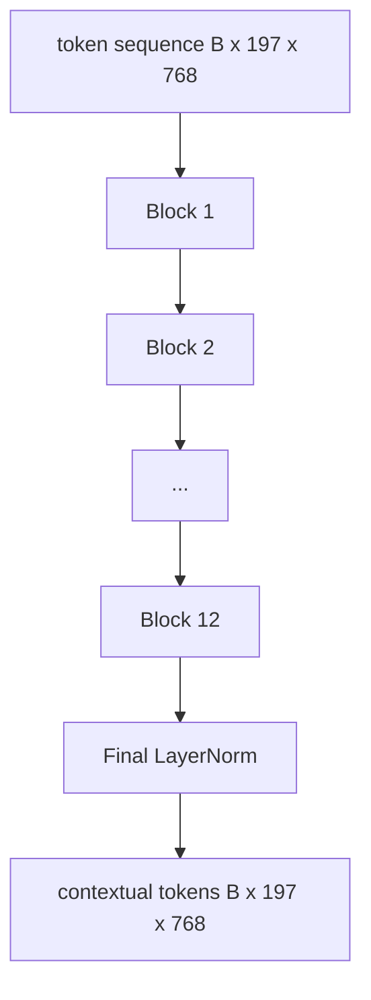
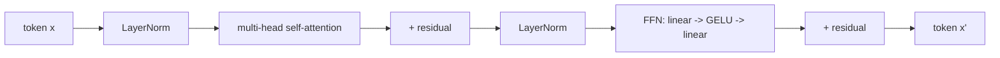

# Koder Transformera Wizyjnego

> Same łaty nie widzą. 12-warstwowy transformer pre-LN z 12 głowami uwagi zamienia sekwencję tokenów łat w sekwencję kontekstowych tokenów, a token CLS agreguje cechy całego obrazu w swoim końcowym stanie ukrytym. Ta lekcja jest maszynownią każdego nowoczesnego modelu język-widzenie.

**Typ:** Build
**Języki:** Python
**Wymagania wstępne:** Faza 19, lekcje 30-37 (Track B foundations)
**Czas:** ~90 minut

## Cele dydaktyczne

- Zaimplementować blok transformera pre-LN z wielogłową samo-uwagą i podwarstwą sieci feed-forward.
- Ułożyć 12 bloków z 12 głowami, tworząc koder ViT-Base.
- Podłączyć interfejs łat z lekcji 58 do kodera i uruchomić forward.
- Zweryfikować, że token CLS agreguje informacje z każdej łaty.

## Problem

Osadzanie łat produkuje sekwencję 197 tokenów, każdy wektor bez świadomości innych łat. Obraz kota potrzebuje, aby każda łata wiedziała, które łaty zawierają wąsy, które zawierają tło, a które zawierają oko. Transformer jest mechanizmem, który buduje tę świadomość, jedna warstwa uwagi na raz. Bez niego interfejs łat jest sprytnym tokenizatorem bez zrozumienia.

Standardowy przepis to dwanaście bloków głębokości, dwanaście głów szerokości, z pre-LayerNorm, aktywacją GELU i ekspansją feed-forward 4x. Ten przepis jest kręgosłupem CLIP ViT-L, SigLIP, DINOv2, rodziny Qwen-VL, InternVL i każdego innego kodera wizyjnego open-weight z lat 2025-2026. Przepis jest wystarczająco stabilny, że możesz przeczytać dowolny z tych artykułów i zakładać ten kształt bloku, chyba że wyraźnie mówią inaczej.

## Koncepcja





### Pre-LN vs post-LN

Oryginalny Transformer umieszczał LayerNorm po połączeniu resztkowym. Pre-LN (LayerNorm przed każdą podwarstwą) to wersja używana przez każdy nowoczesny model język-widzenie, ponieważ trenuje stabilnie bez sztuczek rozgrzewania współczynnika uczenia się. Różnica to jedna linia w forwardzie, a przepływ gradientu na głębokości 12+ to przepaść.

### Wielogłowa samo-uwaga

Każda głowa rzutuje wektor tokena na własną trójkę `(query, key, value)` o wymiarze `head_dim = hidden / num_heads`. Przy `hidden = 768` i `heads = 12`, każda głowa ma `dim = 64`. 12 głów uwagi działa równolegle, a następnie ich wyniki są konkatenowane z powrotem do wymiaru 768 i przechodzą przez projekcję wyjściową. Celem wielogłowości jest to, że jedna głowa może nauczyć się "zwróć uwagę na oko kota", podczas gdy inna uczy się "zwróć uwagę na gradient tła" bez interferencji.

### Dlaczego ekspansja feed-forward 4x

FFN przechodzi `hidden -> 4 * hidden -> hidden` z GELU w środku. Współczynnik 4 jest empiryczny i utrzymuje się w transformerach językowych i wizyjnych od 2017. Mniejszy (2x) niedopasowuje; większy (8x) nadmiernie dopasowuje przy stałym budżecie danych. MLP jest miejscem, w którym model przechowuje większość swoich wyuczonych faktów, a szerszy środek to miejsce, gdzie one siedzą.

| Komponent | Parametry w skali ViT-Base |
|-----------|----------------------------|
| Projekcja qkv na blok | `3 * 768 * 768 = 1.77M` |
| Projekcja wyjściowa na blok | `768 * 768 = 590K` |
| FFN na blok (4x ekspansja) | `2 * 768 * 4 * 768 = 4.72M` |
| LayerNorm na blok | `4 * 768 = 3K` |
| Razem na blok | około 7.1M |
| 12 bloków | około 85M |
| Plus interfejs | około 86M łącznie |

ViT-Base to koder o 86M parametrach. To mało jak na standardy 2026 (SigLIP-So400M to 400M, ViT Qwen-VL to 675M), ale architektura jest identyczna aż do szerokości i głębokości.

### Maska przyczynowa czy nie?

Transformery wizyjne są tylko-koderowe i dwukierunkowe: token `i` może zwracać uwagę na token `j` dla dowolnej pary. Brak maski. Uwaga krzyżowa po stronie dekodera w lekcji 61 będzie używać maski przyczynowej, ale wewnątrz kodera wizyjnego uwaga jest w pełni połączona.

### Czego uczy się token CLS

Token CLS zaczyna jako uczony parametr, nie ma własnej treści łaty i akumuluje informacje przez uwagę w każdym bloku. W ostatniej warstwie wiersz CLS jest wektorowym podsumowaniem całego obrazu; późniejsze głowy rzutują ten pojedynczy wektor na logity klas, osadzenia kontrastywne lub klucze uwagi krzyżowej dla dekodera tekstu.

## Zbuduj to

`code/main.py` implementuje:

- `MultiHeadSelfAttention`, z projekcjami `qkv` i wyjściową, matematyką uwagi scaled-dot-product i asercjami kształtu.
- `FeedForward`, MLP z ekspansją 4x i GELU.
- `Block`, blok pre-LN łączący uwagę i feed-forward z połączeniami resztkowymi.
- `ViT`, stos 12 bloków z końcowym LayerNorm.
- `VisionEncoder`, który łączy `VisionFrontEnd` z lekcji 58 ze stosem `ViT` i udostępnia `forward()` zwracający sekwencję kontekstową i spulowany wektor CLS.
- Demo uruchamiające zsyntetyzowany obraz testowy 224x224 przez pełny koder i wypisujące kształt wejścia, kształt wyjścia, liczbę parametrów i normę CLS w co drugiej warstwie.

Uruchom:

```bash
python3 code/main.py
```

Wynik: zestaw testowy jest kodowany do tensora `(1, 197, 768)`. Norma CLS rośnie w górę w miarę komponowania się warstw, a następnie stabilizuje się na końcowym LayerNorm. Łączna liczba parametrów to około 86M.

## Użyj tego

Koder zdefiniowany tutaj to, aż do szerokości i głębokości, ten sam stos bloków, który jest dostarczany wewnątrz każdego VLM open-weight w latach 2025-2026. Różnice dotyczą:

- **Szerokości i głębokości.** ViT-Large to `hidden=1024, depth=24, heads=16`; SigLIP So400M to `hidden=1152, depth=27, heads=16`. Ten sam blok.
- **Głowy pulującej.** CLS pooling (ta lekcja) vs średni pooling (SigLIP) vs pooling uwagowy (późniejsze VLM).
- **Obsługi pozycji.** Stała sinusoidalna (lekcja 58) vs uczona 1D vs ALiBi vs 2D RoPE. Matematyka bloku jest niezmieniona.
- **Tokenów rejestrowych.** DINOv2 dodaje 4 dodatkowe uczone tokeny. Jedna linia kodu.

Ten stos bloków jest podłożem. Następne lekcje (60-63) stoją na nim.

## Testy

`code/test_main.py` obejmuje:

- pojedynczy blok zachowuje kształt i jest niezmienny na rozmiar batcha wejścia
- wyniki uwagi sumują się do jedności wzdłuż osi klucza (kontrola poprawności softmax)
- ścieżki resztkowe są podłączone (zerowe wejście nadal produkuje niezerowe wyjście przez token CLS)
- forward 4-warstwowego stosu produkuje prawidłowy kształt
- gradienty płyną do projekcji łat z wyjścia CLS

Uruchom:

```bash
python3 -m unittest code/test_main.py
```

## Ćwiczenia

1. Dodaj tokeny rejestrowe (4 uczone wektory dodane po CLS) i uruchom ponownie. Porównaj gładkość map uwagi przez entropię rozkładu softmax na ostatniej warstwie.
2. Zamień pre-LN na post-LN i trenuj przez jedną epokę na syntetycznym klasyfikatorze kształtów. Obserwuj, który trenuje stabilnie bez rozgrzewki LR.
3. Zaimplementuj maskowanie przyczynowe jako argument `attn_mask`, aby ten sam blok mógł być ponownie użyty jako blok dekodera. Kształt maski to `(seq, seq)`, dolna-trójkątna.
4. Profiluj forward przy rozmiarach batcha 1, 8, 64 za pomocą `torch.profiler`. Warstwa MLP dominuje czas ścienny, nie uwaga.
5. Zastąp projekcje q-k-v jednej głowy uwagi adapterem LoRA niskiego rzędu, zamroź resztę i zweryfikuj, że gradient płynie tylko tam, gdzie oczekujesz.

## Kluczowe terminy

| Termin | Co to znaczy |
|--------|--------------|
| Pre-LN | LayerNorm zastosowany przed każdą podwarstwą zamiast po |
| Samo-uwaga | Każdy token zwraca uwagę na każdy inny token w tej samej sekwencji |
| Wielogłowość | Ukryty wymiar jest podzielony na `H` niezależnych głów uwagi |
| Ekspansja FFN | Warstwa feed-forward rozszerza się do `4 * hidden` przed skurczeniem |
| CLS pooling | Użyj końcowego stanu ukrytego pierwszego tokena jako podsumowania obrazu |

## Dalsza lektura

- An Image is Worth 16x16 Words (ViT, 2021) dla przepisu kodera.
- DINOv2 (2023) dla tokenów rejestrowych i celu samonadzorowanego pretrenowania.
- SigLIP (2023) dla wariantu średniego poolingu i sigmoidalnej straty kontrastywnej użytej w lekcji 62.