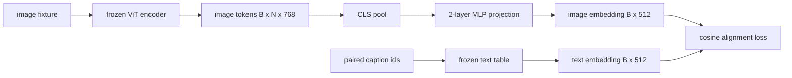

# Warstwa Projekcyjna do Wyrównania Modalności

> Koder wizyjny produkuje tokeny obrazu. Dekoder tekstu konsumuje tokeny tekstu. Te dwa żyją w różnych przestrzeniach wektorowych. Mały dwuwarstwowy MLP rzutuje tokeny obrazu do przestrzeni osadzania tekstu, a cosinusowa strata wyrównania względem sparowanego podpisu ciągnie obie przestrzenie do zgodności. Ta projekcja jest najmniejszym elementem modelu język-widzenie i tym, który ma największe znaczenie dla transferu.

**Typ:** Build
**Języki:** Python
**Wymagania wstępne:** Faza 19, lekcje 30-37 (Track B foundations)
**Czas:** ~90 minut

## Cele dydaktyczne

- Zbudować dwuwarstwowy MLP projekcyjny, który mapuje cechy obrazu do przestrzeni osadzania tekstu.
- Skonstruować zamockowaną tabelę osadzania tekstu (bez pretrenowanego tokenizatora, bez prawdziwego korpusu).
- Obliczyć cosinusową stratę wyrównania między rzutowanymi tokenami obrazu a sparowanym osadzeniem podpisu.
- Trenować samą projekcję z zamrożonym koderem wizyjnym i zamrożoną tabelą tekstu.

## Problem

Masz koder wizyjny (lekcje 58-59) produkujący tokeny o wymiarze `vision_hidden = 768`. Masz dekoder tekstu, który chcesz do niego dołączyć, z wymiarem osadzania `text_hidden = 512` (każda inna liczba jest równie prawdopodobna). Dekoder oczekuje tokenów w kształcie tekstu. Tokeny obrazu nie są w kształcie tekstu: żyją w bazie, której koder nauczył się podczas pretrenowania tylko wizyjnego, bez związku z wektorami słów dekodera.

Dwuwarstwowa projekcja MLP (liniowa, GELU, liniowa) wypełnia lukę. Jest wystarczająco mała (około `768 * 1024 + 1024 * 512 = 1.3M` parametrów), aby trenować w minutach na pojedynczym GPU, i jest jedynym elementem, który musi się uczyć podczas fazy wyrównania. Koder wizyjny pozostaje zamrożony. Tabela osadzania tekstu pozostaje zamrożona. Tylko projekcja się porusza. To jest przepis, który LLaVA dostarczyła w 2023, który BLIP-2 przeformułował jako Q-Former, a który każdy VLM open-weight od tego czasu przyjął w jakiejś formie.

## Koncepcja



### Pooling przed projekcją

Koder wizyjny emituje 197 tokenów. Strona tekstowa ma pojedyncze osadzenie na poziomie podpisu. Aby je wyrównać, potrzebujesz jednego wektora na poziomie obrazu na próbkę. CLS pooling jest najprostszy: weź pierwszy token z kodera i rzutuj go. Średni pooling po wszystkich 197 tokenach to inna opcja i jest tym, czego używa SigLIP. Każda z tych opcji sprowadza 197 wektorów do jednego.

### Dlaczego dwie warstwy, a nie jedna

Pojedyncza liniowa projekcja może obracać i przeskalowywać, ale nie może naprawić bazy, jeśli dwie przestrzenie mają niedopasowania krzywizny. GELU między dwiema liniowymi warstwami daje projekcji jedno nieliniowe zagięcie, które empirycznie wystarcza do wyrównania cech w stylu CLIP z osadzeniami modelu językowego. Głębsze projekcje (LLaVA-NeXT używało GLU; Qwen-VL używało stosu warstw uwagi) są rozszerzeniami; dwuwarstwowy MLP jest kanoniczną linią bazową i jest tym, co głowa projekcyjna Q-Former BLIP-2 dostarcza pod maską.

| Warstwa | Kształt | Parametry |
|---------|---------|-----------|
| fc1 | `(vision_hidden, projection_hidden)` | `768 * 1024 + 1024` |
| aktywacja | GELU | 0 |
| fc2 | `(projection_hidden, text_hidden)` | `1024 * 512 + 512` |

Około 1.3M parametrów dla głowy `768 -> 1024 -> 512`.

### Cosinusowa strata wyrównania

Wyrównanie nie oznacza `image_emb == text_emb`. Wyrównanie oznacza, że `image_emb` wskazuje w tym samym kierunku co `text_emb` we wspólnej przestrzeni. Strata cosinusowa to `1 - cos_sim(image, text)`, w zakresie od 0 (idealnie wyrównane) do 2 (przeciwne). Trenowanie sprowadza to do zera na parę. Lekcja 62 uogólnia do kontrastywnego batcha (InfoNCE), gdzie każdy obraz musi być bliżej własnego podpisu niż jakiegokolwiek innego podpisu w batchu; ta lekcja używa wersji na parę, aby dynamika była widoczna.

### Zamrożony koder to sztuczka

Koder wizyjny ma 86M parametrów. Tabela tekstu ma kolejne kilka milionów. Trenowanie wszystkich z mockowego korpusu nie wchodzi w grę. Zamrożenie obu oznacza, że 1.3M parametrów projekcji to jedyna zmieniająca się część, a kilkaset kroków na syntetycznych parach wystarcza, by obniżyć stratę. To jest dokładnie operacyjny kształt każdego VLM opartego na adapterze: ciężkie części pozostają zamrożone, lekki most trenuje.

## Zbuduj to

`code/main.py` implementuje:

- `MLPProjector(in_dim, hidden_dim, out_dim)`, dwuwarstwowy liniowy MLP z aktywacją GELU.
- `MockTextEmbedding(vocab_size, dim)`, zamrożona tabela osadzania z deterministyczną inicjalizacją z seeda.
- `make_pair(seed, vocab_size)`, która syntetyzuje jedną sparowaną próbkę (obraz, podpis). Podpisy to krótkie sekwencje ID; osadzenie podpisu jest średnio pulowane po osadzeniach tokenów.
- `cosine_alignment_loss(image_emb, text_emb)`, cel `1 - cos_sim` na parę.
- Pętlę trenowania uruchamiającą projekcję przez 200 kroków na 32 syntetycznych parach (cyklicznych), z zamrożonym koderem wizyjnym i tabelą tekstu, wypisującą stratę co 25 kroków.

Uruchom:

```bash
python3 code/main.py
```

Wynik: trenowanie raportuje spadek początkowej straty z około 1.07 do około 0.80 w ciągu 200 kroków, demonstrując, że sama projekcja może pociągnąć tokeny obrazu w kierunku przestrzeni tekstu. Końcowe podobieństwo cosinusowe na parę jest również wypisywane.

## Użyj tego

Ten sam wzorzec pojawia się w każdym VLM open-weight:

- **LLaVA 1.5.** Dwuwarstwowa projekcja MLP z GELU z ukrytego CLIP-ViT-L do wymiaru osadzania LLaMA. Zamrożony koder wizyjny, zamrożony LLM, trenuj tylko projekcję (potem odmroź LLM w drugim etapie).
- **BLIP-2.** Q-Former bierze 32 uczone tokeny zapytań przez uwagę krzyżową na tokenach obrazu, a następnie rzutuje do wymiaru osadzania LLM. Głowa projekcyjna na samym końcu Q-Former jest analogiem MLP z tej lekcji.
- **MiniGPT-4.** Pojedyncza liniowa projekcja z wyjścia BLIP-2 Q-Former do wymiaru osadzania Vicuna.
- **Qwen-VL.** Adapter uwagi krzyżowej z kilkoma warstwami, ale końcowy element to znowu projekcja do wymiaru osadzania LM.

Kształt się zmienia, ale rola jest identyczna: spuluj tokeny obrazu, rzutuj do wymiaru osadzania tekstu, trenuj samodzielnie.

## Testy

`code/test_main.py` obejmuje:

- kształt wyjścia projektora odpowiada skonfigurowanemu `out_dim`
- zamrożona tabela osadzania tekstu ma zero parametrów z `requires_grad`
- strata cosinusowa wynosi zero na identycznych wektorach i 2 na antyrównoległych wektorach
- gradient projektora płynie po jednym backwardzie
- pętla trenowania zmniejsza stratę między krokiem 0 a krokiem 200

Uruchom:

```bash
python3 -m unittest code/test_main.py
```

## Ćwiczenia

1. Zastąp CLS pooling średnim poolingiem po 196 tokenach łat i porównaj końcową stratę po 200 krokach. Średni pooling zwykle trenuje szybciej na danych syntetycznych; CLS jest bardziej wydajny próbkowo na naturalnych obrazach.
2. Dodaj uczony skalarny parametr temperatury do straty cosinusowej (`cos / tau`) i obserwuj, co się dzieje, gdy `tau` jest za małe (szum gradientu) lub za duże (strata plateau na wysokim poziomie).
3. Zamień dwuwarstwowy MLP na pojedynczą liniową warstwę i określ ilościowo lukę w stracie. Nieliniowość ma większe znaczenie na naturalnych cechach obrazu i mniejsze na syntetycznych.
4. Dodaj małą karę L2 na wagi projektora i obserwuj, jak oddziałuje z cosinusowym wyrównaniem (cosinus jest niezmienniczy na skalę, więc kara głównie zmniejsza nieużywane kierunki).
5. Utwórz trwałe wagi projektora, a następnie załaduj ponownie i uruchom wnioskowanie bez backwardu kodera wizyjnego, aby zweryfikować, że tylko projektor jest potrzebny w czasie wdrożenia.

## Kluczowe terminy

| Termin | Co to znaczy |
|--------|--------------|
| Wyrównanie modalności | Akt uczynienia osadzeń obrazu i tekstu porównywalnymi w jednej wspólnej przestrzeni |
| Głowa projekcyjna | Mały moduł mapujący jedną przestrzeń na drugą, zwykle 2-warstwowy MLP |
| Podobieństwo cosinusowe | Iloczyn skalarny podzielony przez iloczyn norm L2 |
| Zamrożony koder | Model wizyjny (lub tekstowy) ma wszystkie parametry z `requires_grad=False` |
| Mockowy korpus | Syntetyczne pary używane, aby trenowanie nie wymagało pobierania zbioru danych |

## Dalsza lektura

- Artykuł LLaVA dla dwuetapowego trenowania (projekcja, potem odmrożenie LM).
- Artykuł BLIP-2 dla Q-Former jako alternatywnej uczonej projekcji.
- Raport techniczny Qwen-VL dla adapterów uwagi krzyżowej jako głębszych głów projekcyjnych.