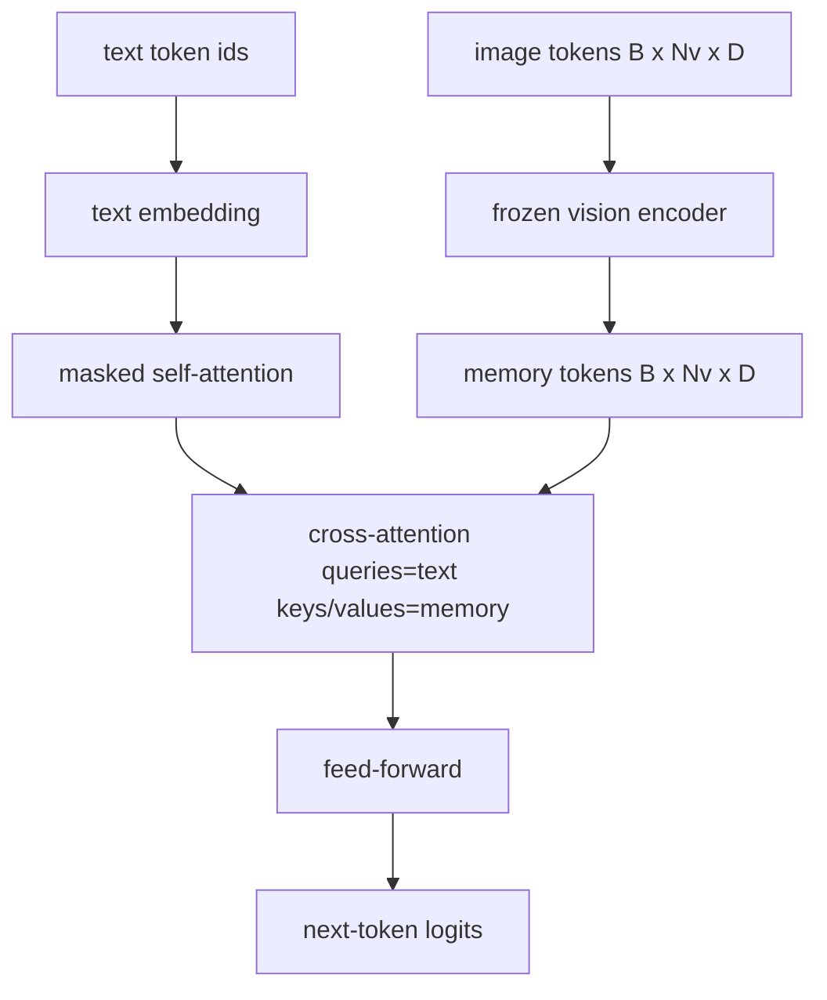
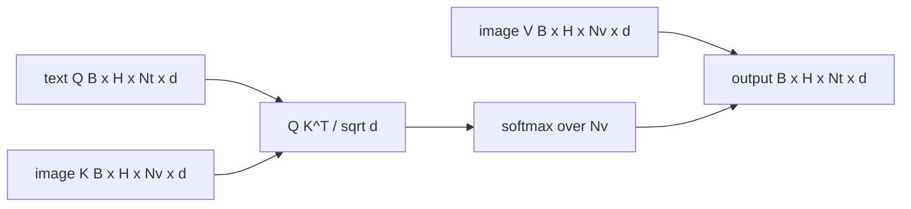

# Fuzja przez Uwagę Krzyżową

> Warstwa projekcyjna wyrównuje jeden wektor obrazu z jednym wektorem podpisu. Prawdziwy dekoder język-widzenie potrzebuje, aby każdy token tekstu zwracał uwagę na każdy token łaty, aby model mógł ugruntować każde słowo w regionie. Uwaga krzyżowa to sposób, w jaki to ugruntowanie się odbywa. Tekst zapytuje; klucze i wartości wizyjne odpowiadają. Ta lekcja buduje blok uwagi krzyżowej, przyczynową samo-uwagę tekstu i kształty masek, które utrzymują obie w legalności.

**Typ:** Build
**Języki:** Python
**Wymagania wstępne:** Faza 19, lekcje 30-37 (Track B foundations)
**Czas:** ~90 minut

## Cele dydaktyczne

- Zaimplementować wielogłową uwagę krzyżową, gdzie strumień zapytań to tekst, a strumień kluczy/wartości to wizja.
- Skomponować blok dekodera: przyczynowa samo-uwaga + uwaga krzyżowa + feed-forward.
- Uzyskać prawidłowe kształty masek: przyczynowa maska dla samo-uwagi, brak maski dla uwagi krzyżowej.
- Przeprowadzić forward z grupowanymi tokenami tekstu i stałą pulą tokenów obrazu.

## Problem

Konkatenacja tokenów obrazu i tokenów tekstu w jedną sekwencję to jedna opcja fuzji (wczesna fuzja, ścieżka obrana przez Chameleon i Emu3). Uwaga krzyżowa to druga (późna fuzja, ścieżka wprowadzona przez Flamingo i kopiowana przez każdy dekoder w kształcie Flamingo od tego czasu). W późnej fuzji dekoder tekstu działa na tokenach tylko-tekstowych i sięga do strumienia obrazu przez uwagę krzyżową w każdej warstwie.

Późna fuzja ma dwie zalety. Po pierwsze, strumień tekstu pozostaje czysty i model zachowuje umiejętności tylko-tekstowe. Po drugie, strumień obrazu jest obliczany raz na obraz i ponownie używany dla każdego kroku dekodowania, więc generowanie jest tanie nawet dla długich podpisów. Kosztem jest jedna dodatkowa podwarstwa uwagi na blok.

## Koncepcja





### Kształty masek

Dwie uwagi wewnątrz bloku dekodera potrzebują różnych masek:

| Uwaga | Długość zapytania | Długość klucza | Maska | Dlaczego |
|-------|-------------------|----------------|-------|----------|
| Samo-uwaga | `Nt` (tekst) | `Nt` (tekst) | Przyczynowa: dolna-trójkątna `(Nt, Nt)` | Tokeny tekstu nie mogą patrzeć w przód podczas autoregresji |
| Uwaga krzyżowa | `Nt` (tekst) | `Nv` (wizja) | Brak maski | Cały obraz jest widoczny dla każdej pozycji tekstu |

Lekcja zawiera jedną funkcję walidacji kształtu, aby pomyłka ich pomieszania ujawniła się jako `ValueError` zamiast cicho uszkodzonej krzywej straty.

### Dlaczego brak maski na uwadze krzyżowej

Obraz jest w pełni obserwowany przed wygenerowaniem jakiegokolwiek tekstu. Token `t` podpisu może zwracać uwagę na dowolną łatę obrazu; nie ma porządku czasowego na łatach obrazu. Niektóre warianty Flamingo dodają per-próbkowy wzorzec maskowania przy przeplataniu wielu obrazów i segmentów tekstu, ale dla pojedynczego obrazu plus podpisu, uwaga krzyżowa widzi wszystko.

### Buforowanie kluczy/wartości

Klucze i wartości obrazu są obliczane raz na początku dekodowania i przechowywane w pamięci podręcznej. Każdy nowy token tekstu używa pamięci podręcznej bez ponownego obliczania. To sprawia, że tworzenie podpisów jest szybkie podczas wnioskowania: ciężki ViT uruchamia się raz; uwaga krzyżowa ponownie używa jego kluczy i wartości dla każdego kroku. Lekcja udostępnia pamięć podręczną i testuje ścieżkę trafienia w pamięci podręcznej.

### Kompozycja bloku

Blok dekodera wykonuje: pre-LN -> samo-uwaga -> resztkowe -> pre-LN -> uwaga krzyżowa -> resztkowe -> pre-LN -> feed-forward -> resztkowe. Trzy podwarstwy, każda z własnym LayerNorm. Artykuł Flamingo dodał uczoną bramkę na uwadze krzyżowej, aby model mógł zrezygnować ze ścieżki obrazu kosztem stabilności trenowania; kanoniczna linia bazowa (użyta tutaj) nie ma bramki.

```python
class DecoderBlock:
  def forward(self, text_tokens, image_tokens, text_mask, cross_mask):
      text_tokens = text_tokens + self.self_attn(self.ln1(text_tokens),
                                                  mask=text_mask)
      text_tokens = text_tokens + self.cross_attn(self.ln2(text_tokens),
                                                   image_tokens,
                                                   mask=cross_mask)
      text_tokens = text_tokens + self.ffn(self.ln3(text_tokens))
      return text_tokens
```

## Zbuduj to

`code/main.py` implementuje:

- `CrossAttention(hidden, heads)`, wielogłową uwagę krzyżową z oddzielnymi projekcjami `q` i `kv`.
- `CausalSelfAttention(hidden, heads)`, maskowaną samo-uwagę ze standardowego dekodera.
- `DecoderBlock`, łączący trzy podwarstwy z pre-LN resztkowymi.
- `VisionLanguageDecoder`, czterowarstwowy dekoder zasilany przez mockowe wyjście kodera wizyjnego i małą tabelę osadzania tekstu.
- `causal_mask(length)` zwracający dolno-trójkątny tensor boolean `(length, length)`.
- Demo, które podaje batch dwóch sekwencji tekstowych o długości 10 z pamięcią obrazu o długości 197 i wypisuje kształt wyjścia, kształt maski samo-uwagi i normę wyjścia uwagi krzyżowej na pozycję.

Uruchom:

```bash
python3 code/main.py
```

Wynik: dekoder produkuje tensor logitów `(2, 10, text_vocab)`. Kształt maski to `(10, 10)`. Sprawdzenie ponownego użycia pamięci podręcznej KV potwierdza identyczne logity między ścieżkami z pamięcią podręczną i bez.

## Użyj tego

Uwaga krzyżowa pojawia się w dwóch produkcyjnych rodzinach:

- **Flamingo i IDEFICS.** Wstaw podwarstwę uwagi krzyżowej co K bloków modelu językowego, z zamrożonym LM. Adapter język-widzenie to blok uwagi krzyżowej plus jego bramka.
- **BLIP-2.** Q-Former używa uwagi krzyżowej z ustalonego zestawu 32 tokenów zapytań do cech obrazu, a następnie rzutuje zapytania do przestrzeni osadzania LM.

Kształt bloku w tej lekcji mapuje się bezpośrednio na oba. Dyscyplina maski (przyczynowa na sobie, brak na krzyżowej) jest taka sama.

## Testy

`code/test_main.py` obejmuje:

- maska przyczynowa jest dolno-trójkątna i odpowiada oczekiwanemu kształtowi boolean
- kształt wyjścia uwagi krzyżowej to `(B, Nt, hidden)` niezależnie od długości klucza
- ścieżka z pamięcią podręczną KV zgadza się ze ścieżką bez pamięci podręcznej z dokładnością do tolerancji zmiennoprzecinkowej
- niedopasowanie kształtu między strumieniem tekstu a obrazu podnosi wyraźny `ValueError`
- pełny forward dekodera produkuje prawidłowy kształt batcha i sekwencji

Uruchom:

```bash
python3 -m unittest code/test_main.py
```

## Ćwiczenia

1. Dodaj uczoną bramkę tanh do resztkowego uwagi krzyżowej (sztuczka Flamingo) i zweryfikuj, że trenowanie zbiega z bliskiej zeru początkowej bramki. Bramka zaczyna się od 0; model odzyskuje zachowanie tylko-tekstowe przed zmieszaniem strumienia obrazu.
2. Zaimplementuj przeplataną uwagę, gdzie ten sam dekoder konsumuje wiele obrazów plus wiele segmentów tekstu. Zbuduj per-próbkową maskę uwagi krzyżowej, która zapobiega, by segment tekstu 2 zwracał uwagę na obraz 1.
3. Profiluj warstwę uwagi krzyżowej vs samo-uwagi przy `Nt=64, Nv=576` (siatka 24x24 przy wyższej rozdzielczości). Koszt uwagi krzyżowej to `Nt * Nv` i dominuje przy wysokiej rozdzielczości obrazu.
4. Dodaj dropout po stronie zapytania na mapie uwagi krzyżowej i zmierz różnorodność podpisów w demo (wariancja próbki podpisu wzrasta z dropoutem w mapie krzyżowej).
5. Zamień warstwę uwagi krzyżowej na blok uwagi w stylu Q-Former, gdzie stała 32-tokenowa pula zapytań zwraca uwagę na cechy obrazu raz na warstwę.

## Kluczowe terminy

| Termin | Co to znaczy |
|--------|--------------|
| Późna fuzja | Tekst i wizja pozostają w oddzielnych strumieniach; uwaga krzyżowa łączy je w każdym bloku |
| Uwaga krzyżowa | Q pochodzi z jednego strumienia, K i V z innego |
| Maska przyczynowa | Dolno-trójkątna maska boolean zapobiegająca patrzeniu w przód podczas autoregresji |
| Pamięć podręczna KV | Klucze i wartości obrazu przechowywane raz i ponownie używane dla każdego kroku dekodowania |
| Tokeny pamięci | Zamrożone tokeny obrazu, do których sięga dekoder |

## Dalsza lektura

- Flamingo (2022) dla kanonicznego projektu późnej fuzji z bramkowaną uwagą krzyżową.
- BLIP-2 (2023) dla Q-Former, który jest blokiem uwagi krzyżowej przebranym za uczoną pulę zapytań.
- IDEFICS (2023) dla reprodukcji open-weight przepisu Flamingo.