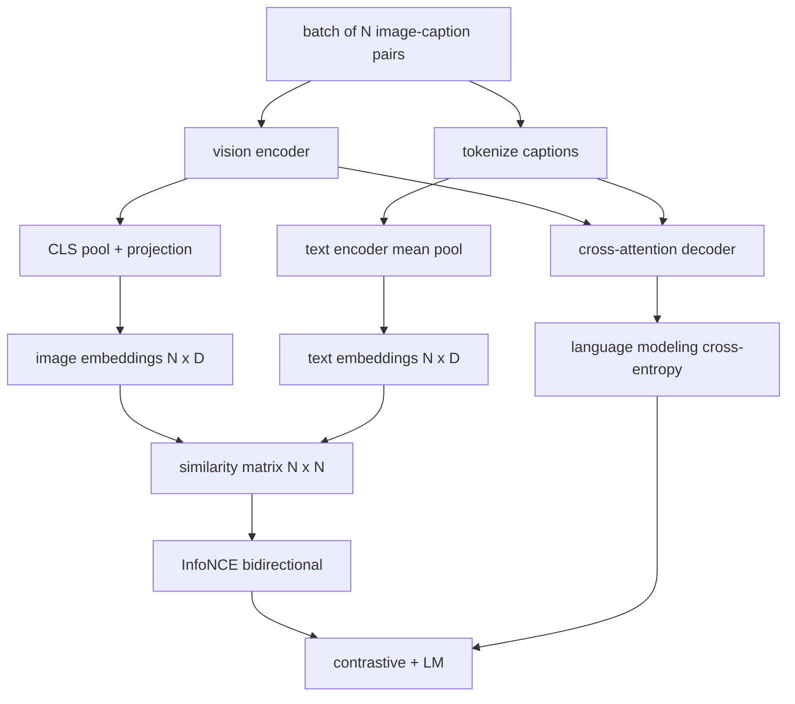

# Pretrenowanie Język-Widzenie

> Koder, projekcja i dekoder są podłączone. Teraz trenuj je razem. Dwa cele napędzają uczenie: kontrastywna strata obraz-tekst (InfoNCE), która przyciąga pasujące pary razem we wspólnej przestrzeni osadzania, oraz strata modelowania języka, która prosi dekoder o opisanie każdego obrazu. Połączone uczą sieć zarówno znajdować właściwy obraz dla podpisu, jak i pisać podpis dla obrazu.

**Typ:** Build
**Języki:** Python
**Wymagania wstępne:** Faza 19, lekcje 30-37 (Track B foundations)
**Czas:** ~90 minut

## Cele dydaktyczne

- Zaimplementować kontrastywną stratę InfoNCE na batchu par obraz-podpis.
- Połączyć stratę kontrastywną z autoregresyjną stratą modelowania języka.
- Zsyntetyzować mockowy korpus 200 par obraz-podpis bez pobierania prawdziwego zbioru danych.
- Uruchomić 50-krokową demonstracyjną pętlę trenowania i zaobserwować spadek obu strat.

## Problem

Model język-widzenie potrzebuje dwóch umiejętności. Musi rankingować: mając podpis, znaleźć właściwy obraz wśród wielu. Musi generować: mając obraz, napisać podpis. Pretrenowanie modelu na jednej umiejętności daje połowę systemu. CLIP opanował rankingowanie, ale nie może tworzyć podpisów. GPT-4V może tworzyć podpisy, ale używa oddzielnej głowy wyszukiwania do rankingowania. Pretrenowanie wielocelowe daje obie umiejętności w jednym przejściu.

InfoNCE obsługuje połowę rankingowania. Dla batcha N par, model traktuje N pasujących par jako pozytywne, a `N^2 - N` niepasujących par jako negatywne, a następnie uruchamia stratę entropii krzyżowej na wynikowej macierzy podobieństwa `(N, N)`. Strata LM obsługuje połowę generowania: standardowe przewidywanie następnego tokena warunkowane na obrazie. Obie straty są różniczkowalne i mogą dzielić wagi kodera, projektora i dekodera.

## Koncepcja



### InfoNCE w jednym akapicie

Ułóż N osadzeń obrazu jako wiersze i N osadzeń tekstu jako wiersze. Znormalizuj L2 oba. Oblicz macierz `N x N` `S = I T^T / tau`, gdzie `tau` to uczona temperatura. Elementy na diagonali to pasujące pary; elementy poza diagonalią to negatywy. Zastosuj entropię krzyżową z celem `argmax` biegnącym w dół diagonali: wiersz `i` powinien mieć najwyższy wpis w kolumnie `i`. Zrób to samo symetrycznie wzdłuż kolumn. Suma to średnia z dwóch. To jest strata CLIP w ośmiu liniach.

### Temperatura ma znaczenie

Temperatura `tau` kontroluje, jak ostry jest softmax. Zbyt mała (np. `tau = 0.01`) i gradient pochodzi tylko z najtrudniejszego negatywu, trenowanie jest głośne. Zbyt duża i softmax spłaszcza się, a gradient zanika. CLIP uczy `tau` jako parametr; demo tutaj robi to samo.

### Strata modelowania języka

Dekoder konsumuje tokeny pamięci obrazu przez uwagę krzyżową i przewiduje następny token tekstu na każdej pozycji. Strata to standardowa entropia krzyżowa z celem następnej pozycji. Pozycje dopełnienia są maskowane w stracie.

### Łączenie strat

`total = contrastive + lm_weight * lm`, gdzie `lm_weight` to skalar (często 1.0). Dwie straty dzielą gradienty do kodera i projekcji; tylko dekoder otrzymuje gradient straty LM. To jest wielozadaniowy przepis, którego wszystkie modele CoCa, BLIP i SigLIP używają z różnymi wagami.

| Komponent | Powierzchnia straty | Wpływa na |
|-----------|--------------------|-----------|
| InfoNCE | Rankingowanie par we wspólnej przestrzeni | Koder + projekcja + głowa tekstowa |
| LM | Przewidywanie tokenów warunkowane na obrazie | Koder + projekcja + dekoder |
| Połączona | Wielozadaniowa | Cały stos |

### Dlaczego 50 kroków wystarcza na demo

Mockowy korpus to syntetyczny zestaw 200 par z losowymi obrazami i losowymi ID podpisów. Po 50 krokach SGD z rozmiarem batcha 16, obie straty widocznie spadają, nawet jeśli bezwzględne wartości pozostają powyżej tego, co osiągnąłby model na prawdziwych danych. Celem demo jest potwierdzenie, że hydraulika gradientu działa end-to-end i że dodanie straty LM nie destabilizuje kontrastywnego celu.

## Zbuduj to

`code/main.py` implementuje:

- `MultimodalModel`, łączący mały koder ViT, projektor MLP, mały koder tekstowy (średni pooling po osadzonych ID) i dekoder uwagi krzyżowej z lekcji 61.
- `info_nce_loss(image_emb, text_emb, temperature)`, dwukierunkową kontrastywną stratę w stylu CLIP.
- `lm_loss(logits, target_ids, padding_id)`, maskowaną entropię krzyżową następnego tokena.
- `make_mock_corpus(seed, n_pairs)`, zwracającą 200 deterministycznych par (obraz, caption_ids).
- Pętlę trenowania uruchamiającą 50 kroków z rozmiarem batcha 16, optymalizatorem Adam i uczonym parametrem log-temperature. Obie straty są wypisywane co 5 kroków.

Uruchom:

```bash
python3 code/main.py
```

Wynik: strata kontrastywna spada z około `ln(16) = 2.77` w kierunku 2.4; strata LM spada z losowo-jednolitej linii bazowej `ln(512) ≈ 6.24` do około 4.7. Oba spadki dowodzą, że gradient jest poprawnie podłączony. Prawdziwe modele trenują przez miliony kroków; dynamika jest taka sama.

## Użyj tego

To ten sam przepis straty dostarczany w:

- **CLIP (2021).** Tylko kontrastywna obraz-tekst, z oddzielną sondą podpisu na zamrożonym koderze.
- **CoCa (2022).** Kontrastywna obraz-tekst plus strata LM podpisywania obrazu w jednym modelu. Dokładny wzór, który buduje ta lekcja.
- **BLIP (2022) i BLIP-2.** Kontrastywna plus LM plus głowa dopasowania obraz-tekst. Trzy straty połączone.
- **SigLIP (2023).** Zamienia InfoNCE na sigmoidalną stratę par; ta sama rola kontrastywna, inna postać funkcjonalna.
- **Rodzina LLaVA.** Dwuetapowe trenowanie, gdzie etap pierwszy to wyrównanie (cosinus na zamrożonym LM), a etap drugi dodaje stratę LM z odmrożonym LM. Lekcja 60 mapuje się na etap pierwszy; ta lekcja mapuje się na etap drugi.

## Testy

`code/test_main.py` obejmuje:

- strata InfoNCE jest symetryczna względem wierszy obraz/tekst
- strata InfoNCE zwraca 0, gdy macierz podobieństwa jest idealną diagonalą dużych liczb dodatnich
- strata LM poprawnie maskuje pozycje dopełnienia
- forward modelu produkuje obie straty bez błędów
- 5-krokowa pętla trenowania zmniejsza połączoną stratę

Uruchom:

```bash
python3 -m unittest code/test_main.py
```

## Ćwiczenia

1. Zastąp InfoNCE sigmoidalną stratą par w stylu SigLIP i porównaj zbieżność na mockowym korpusie.
2. Dodaj krok wydobywania trudnych negatywów: co drugi batch, wybierz najtrudniejszą parę poza diagonalią z poprzedniego batcha i dołącz ją. Trenuj i sprawdź, czy strata kontrastywna spada szybciej.
3. Dodaj binarną głowę dopasowania obraz-tekst na wierzchu wspólnego osadzania (prawda/fałsz: czy to pasuje?) dla trzeciej straty, odtwarzając trójgłowe ustawienie BLIP.
4. Zastąp mockowy korpus sekwencjami ID podpisów wyciągniętymi z łańcucha Markowa, którego macierz przejścia jest warunkowana na hashu obrazu. Strata podpisywania powinna spaść bardziej, ponieważ jest rzeczywisty sygnał do nauczenia.
5. Trenuj ten sam model z `lm_weight = 0` i ponownie z `lm_weight = 1`. Porównaj stratę kontrastywną; strata LM nie powinna regresować celu rankingowania.

## Kluczowe terminy

| Termin | Co to znaczy |
|--------|--------------|
| InfoNCE | Estymacja kontrastywna szumu: entropia krzyżowa na macierzy podobieństwa |
| Temperatura | Skalar kontrolujący, jak ostry jest kontrastywny softmax |
| Trudny negatyw | Para poza diagonalią, którą model znajduje mylącą, przydatna do próbkowania |
| Strata LM | Standardowa entropia krzyżowa następnego tokena po stronie podpisywania |
| Wspólna przestrzeń osadzania | Wspólna przestrzeń, w której żyją wektory obrazu i tekstu po projekcji |

## Dalsza lektura

- Artykuł CLIP dla oryginalnego kontrastywnego przepisu.
- Artykuł CoCa dla kontrastywnego plus podpisywania w jednym modelu.
- Artykuł SigLIP dla wariantu sigmoidalnej straty par i dlaczego skaluje się lepiej.