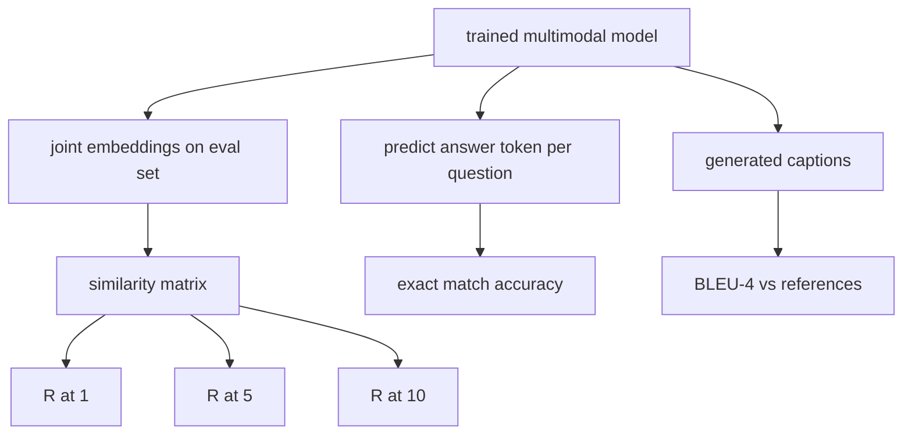

# Ewaluacja Multimodalna

> Trenowanie to połowa pętli. Druga połowa to pomiar. Ta lekcja buduje trzy powierzchnie ewaluacyjne z prymitywów: wyszukiwanie obraz-podpis raportowane jako R@1, R@5, R@10; wizualne odpowiadanie na pytania raportowane jako dokładność dopasowania; i podpisywanie obrazów raportowane jako BLEU-4. Każda metryka to funkcja na wyjściach modelu i syntetyczny zestaw ewaluacyjny, który działa w sekundach.

**Typ:** Build
**Języki:** Python
**Wymagania wstępne:** Faza 19, lekcje 58-62 (Track E foundations: encoder, transformer, projection, cross-attention fusion, pretraining)
**Czas:** ~90 minut

## Cele dydaktyczne

- Obliczyć Recall@K z macierzy podobieństwa między osadzeniami obrazu i podpisu.
- Obliczyć dokładność VQA dokładnego dopasowania z modelu, który mapuje pary (obraz, pytanie) na stały słownik odpowiedzi.
- Obliczyć BLEU-4 z wygenerowanych i referencyjnych sekwencji tokenów bez żadnej zewnętrznej biblioteki.
- Uruchomić wszystkie trzy ewaluacje na syntetycznym zestawie zbudowanym na wytrenowanym modelu z lekcji 62.

## Problem

Pokusa polega na uznaniu modelu multimodalnego za ukończony, gdy strata trenowania osiąga plateau. Strata trenowania mierzy dopasowanie do rozkładu trenowania; nie mierzy, czy model może rankingować pary w wstrzymanym batchu, odpowiedzieć na pytanie lub napisać podpis, który człowiek by zaakceptował. Trzy powierzchnie ewaluacyjne są standardowe:

- **Wyszukiwanie (R@1, R@5, R@10).** Zbuduj wspólne osadzenie dla zapytania podpisu; rankinguj każdy obraz w puli ewaluacyjnej według cosinusa; zgłoś, czy pasujący obraz ląduje w top 1, top 5, top 10. Symetryczna forma (obraz-do-tekstu) działa tak samo.
- **Wizualne odpowiadanie na pytania (dokładne dopasowanie).** Mając (obraz, pytanie), model wypisuje token odpowiedzi. Dokładne dopasowanie to jeden bit na próbkę: czy przewidywana odpowiedź równa się odpowiedzi referencyjnej? Średnia po zestawie ewaluacyjnym.
- **Podpisywanie (BLEU-4).** Wygeneruj podpis. Oblicz średnią geometryczną precyzji 1-gram przez 4-gram względem referencyjnych podpisów, z karą za zwięzłość. Wieloreferencyjność to standardowa forma (jeden obraz, kilka referencyjnych podpisów).

Każda metryka to cienka funkcja. Lekcja buduje je wszystkie w kodzie, aby matematyka była konkretna, a powierzchnia pozostawała pod twoją kontrolą. Prawdziwe zestawy ewaluacyjne (MS-COCO, VQA v2, GQA, OK-VQA) podłączają się do tych samych kształtów funkcji.

## Koncepcja



### Recall@K z macierzy podobieństwa

Zbuduj macierz podobieństwa cosinusowego `(N, N)` między osadzeniami obrazu i podpisu. Dla każdego wiersza posortuj kolumny według malejącego podobieństwa. Recall@K to ułamek wierszy, w których indeks kolumny diagonalnej leży w top K pozycjach. Symetryczny Recall@K (podpis-do-obrazu) jest obliczany na transponowanej macierzy. Obie liczby są raportowane. Dla ewaluacji N=100, R@1 = 0.6 oznacza, że 60 ze 100 podpisów odzyskało swój prawidłowy obraz jako najlepsze dopasowanie.

### VQA dokładne dopasowanie

Dla każdego (obraz, pytanie, odpowiedź), zakoduj obraz, osadź pytanie, połącz przez dekoder i odczytaj następny token. Przewidywane ID tokena jest porównywane z referencyjnym ID; poprawne, jeśli równe. Średnia po zestawie ewaluacyjnym. Prawdziwe zestawy danych VQA są dostarczane z wieloma odpowiedziami adnotowanymi przez ludzi na pytanie i używają formuły miękkiej dokładności (1.0 jeśli co najmniej 3 z 10 adnotatorów się zgadza, skalowane poniżej); lekcja używa dokładnego dopasowania pojedynczej odpowiedzi dla jasności.

### BLEU-4

```text
BLEU-4 = BP * exp(mean(log p1, log p2, log p3, log p4))
```

Gdzie `p_n` to zmodyfikowana precyzja n-gramów (przycięta liczba wygenerowanych n-gramów, które pojawiają się w dowolnej referencji, podzielona przez całkowitą liczbę wygenerowanych n-gramów), a `BP` to kara za zwięzłość:

```text
BP = 1                if generated length > reference length
   = exp(1 - r/g)     otherwise, where r is reference length and g is generated
```

Wygładzanie jest potrzebne dla małych próbek, gdzie niektóre `p_n` są zerowe. Implementacja używa Chen i Cherry "method 1" (dodaj 1 do licznika i mianownika dla każdego zerowego zliczenia), co jest najbezpieczniejszym domyślnym ustawieniem dla reżimów niskiego zliczania.

### Syntetyczny zestaw ewaluacyjny

50-próbkowy zestaw ewaluacyjny jest budowany w pamięci z tego samego wzorca mockowego korpusu użytego w lekcji 62, z wstrzymanym seedem. Trzy listy składają się na zestaw:

- `pairs`: 50 par (obraz, caption_ids) do wyszukiwania.
- `vqa`: 50 trójek (obraz, question_ids, answer_id).
- `caps`: 50 wpisów (obraz, [reference_caption_ids, ...]) z do 3 referencjami na obraz.

Zestaw jest deterministyczny z seeda i wstrzymany z korpusu trenowania, więc metryki są obliczane na danych, których model nigdy nie widział. Utrwalenie zestawu do JSON jest pozostawione jako ćwiczenie (patrz poniżej).

| Metryka | Zakres | Losowa linia bazowa (N=50) |
|---------|-------|---------------------------|
| R@1 | 0 do 1 | 0.02 (1 / N) |
| R@5 | 0 do 1 | 0.10 |
| R@10 | 0 do 1 | 0.20 |
| VQA EM | 0 do 1 | 1 / vocab |
| BLEU-4 | 0 do 1 | mały, ale niezerowy |

Dla 50-krokowego uruchomienia trenowania na danych syntetycznych metryki nie mają być wysokie; oczekuje się, że będą powyżej losowej linii bazowej, co sprawdza demo.

## Zbuduj to

`code/main.py` implementuje:

- `recall_at_k(sim_matrix, k)`, zwracający float w `[0, 1]` dla obu kierunków.
- `vqa_exact_match(predictions, references)`, zwracający średnią z równości `int`.
- `bleu4(generated, references, smoothing=True)`, z obsługą wielu referencji.
- `build_eval_suite(seed, n_samples, vocab_size, max_len)`, zwracający trzy deterministyczne listy ewaluacyjne.
- `evaluate(model, suite)`, który uruchamia wszystkie trzy metryki i zwraca `dict` liczb.
- Demo, które ładuje świeżo zainicjalizowany model multimodalny z lekcji 62, ewaluuje go, a następnie trenuje przez 50 kroków i ewaluuje ponownie, wypisując metryki przed/po.

Uruchom:

```bash
python3 code/main.py
```

Wynik: tabela metryk przed/po pokazuje poprawę wyszukiwania z bliskiego losowego w kierunku wyuczonego sygnału modelu, poprawę VQA powyżej losowej i poprawę BLEU-4 (syntetyczna struktura wystarcza do wzrostu precyzji 4-gramów).

## Użyj tego

Każda metryka mapuje się bezpośrednio na produkcyjny benchmark:

- **Wyszukiwanie.** MS-COCO 5K val, Flickr30K, ImageNet zero-shot to wszystko problemy R@K na tej samej macierzy podobieństwa. Zastąp syntetyczną ewaluację prawdziwymi plikami, a sygnatura funkcji pozostanie niezmieniona.
- **VQA.** VQA v2, GQA, OK-VQA używają tego samego kształtu dokładnego dopasowania (z soft-acc zamiast EM pojedynczej odpowiedzi dla VQA v2).
- **BLEU-4.** MS-COCO captioning, NoCaps, Flickr30K captioning wszystkie używają BLEU-4 plus CIDEr i METEOR. Dodanie CIDEr to jedna funkcja więcej.

Dla prawdziwych benchmarków zamień `build_eval_suite` na prawdziwy ładowacz i zachowaj ciała funkcji. Matematyka jest niezależna od benchmarku.

## Testy

`code/test_main.py` obejmuje:

- recall@k zwraca 1.0 na idealnej macierzy podobieństwa tożsamościowej i 0.0 na odwróconej dla k < N
- recall@k respektuje górną granicę `k <= N`
- bleu4 zwraca 1.0, gdy wygenerowane równa się dokładnie jednej z referencji
- bleu4 zwraca 0.0 na rozłącznym słownictwie
- vqa exact match równa się ułamkowi równych par
- build_eval_suite zwraca oczekiwaną liczbę par, elementów vqa i wpisów podpisów

Uruchom:

```bash
python3 -m unittest code/test_main.py
```

## Ćwiczenia

1. Dodaj CIDEr do metryk podpisywania. CIDEr używa ważenia TF-IDF na n-gramach, co nagradza informacyjne tokeny.
2. Zaimplementuj miękką dokładność VQA: wiele ludzkich odpowiedzi na pytanie, dokładność to `min(human_count / 3, 1)`, jeśli któreś pasuje. Odtwarza VQA v2.
3. Dodaj bezpieczny dla NaN wariant `bleu4`, który obsługuje puste wygenerowane sekwencje bez crasha.
4. Oblicz średni wzajemny ranking (MRR) obok R@K. MRR jest wrażliwy na to, gdzie poprawny element ląduje poza top K; R@K jest wrażliwy na to, czy ląduje w top K.
5. Uruchom ewaluację na modelu w pięciu punktach kontrolnych podczas trenowania (krok 0, 10, 20, 30, 40, 50) i wykreśl krzywą uczenia się. Potwierdź, że trajektorie metryk śledzą trajektorię straty.

## Kluczowe terminy

| Termin | Co to znaczy |
|--------|--------------|
| R@K | Ułamek zapytań, w których poprawne dopasowanie ląduje w top K wynikach |
| Dokładne dopasowanie | Najprostsze punktowanie VQA: przewidywana odpowiedź równa się referencji |
| BLEU-4 | Średnia geometryczna precyzji 1- do 4-gramów, z karą za zwięzłość |
| Wieloreferencyjność | Metryka podpisywania akceptuje kilka referencyjnych podpisów na obraz |
| Wstrzymany | Zestaw ewaluacyjny jest próbkowany z seeda rozłącznego z korpusem trenowania |

## Dalsza lektura

- Artykuł VQA v2 dla formuły miękkiej dokładności i statystyk zbioru danych.
- Artykuł CIDEr dla ważonego TF-IDF n-gramowego podpisywania.
- Oryginalny BLEU (Papineni i in., 2002) dla wariantów wygładzania.
- Skrypty ewaluacyjne podpisywania MS-COCO dla kanonicznej referencyjnej implementacji.