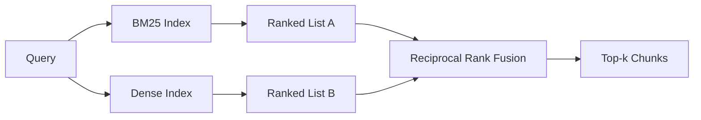

# Wyszukiwanie Hybrydowe z BM25 i Gęstymi Osadzeniami

> Wyszukiwanie leksykalne i semantyczne zawodzą na przeciwnych rozkładach zapytań. Wyszukiwanie hybrydowe z fuzją rankingów wzajemnych nie interpoluje, głosuje - a głos wygrywa na każdej klasie zapytań.

**Typ:** Build
**Języki:** Python
**Wymagania wstępne:** Faza 11, lekcje 04 (osadzania), 06 (RAG); Faza 19, Track B foundations (lekcje 20-29); Faza 19, lekcja 64 (strategie fragmentacji)
**Czas:** ~90 minut

## Cele dydaktyczne
- Zaimplementować BM25 od podstaw z formuły Robertsona i Sparck Jones, z ważeniem pól, normalizacją długości dokumentu i regulowanymi k1 oraz b.
- Zbudować gęsty wyszukiwacz na wierzchu deterministycznego mockowego osadzenia, aby pętla działała offline.
- Zaimplementować fuzję rankingów wzajemnych dokładnie tak, jak opublikowali ją Cormack, Clarke i Buettcher w 2009, i wyjaśnić, dlaczego dominuje nad interpolacją ważoną wynikami.
- Dostroić stałą k RRF i wagi na modalność i odczytać zależności na małym korpusie testowym.

## Problem

Wyszukiwanie leksykalne wygrywa, gdy zapytanie niesie dosłowny identyfikator, który korpus zawiera dosłownie. Zapytanie o `AbortMultipartOnFail` zwraca właściwą funkcję Go przez BM25 w mikrosekundach. To samo zapytanie, osadzone, siedzi na granicy trzech klastrów podobieństwa, a gęsty wyszukiwacz rankuje zły plik jako pierwszy.

Wyszukiwanie gęste wygrywa, gdy zapytanie jest sparafrazowane z dala od dosłownych tokenów korpusu. Użytkownik pytający "jak obsługujemy anulowane przesyłanie" nigdy nie wpisał słowa abort ani multipart. BM25 zwraca fragment dokumentacji o "przesyłaniu dużych plików", ponieważ ta strona zawiera słowo uploads. Gęste wyszukiwanie znajduje funkcję abort, której podsumowanie wspomina o anulowaniu.

Wybór między nimi nie jest statyczny. Rozkład zapytań jest zmienną. Produkcyjny system RAG obsługuje obie klasy z tego samego punktu końcowego, więc wyszukiwanie musi obsługiwać obie jednocześnie. To jest wyszukiwanie hybrydowe. Krok scalania jest częścią, która musi być poprawna.

## Koncepcja



### BM25 w jednym akapicie

BM25 punktuje parę zapytanie-dokument przez sumowanie, po tokenach zapytania, odwrotnego współczynnika częstotliwości dokumentu pomnożonego przez nasycający współczynnik częstotliwości terminu, który zawiera korektę normalizacji długości. Dwa pokrętła. `k1` kontroluje nasycanie częstotliwości terminu; domyślne 1.5 to opublikowane zalecenie i nie powinieneś go ruszać bez benchmarku. `b` kontroluje, jak bardzo długość dokumentu ma znaczenie; domyślne 0.75 mówi, że dłuższe dokumenty są karane, ale nie liniowo.

Wzór IDF używa wygładzonej definicji Robertsona i Sparck Jones, czyli `log((N - df + 0.5) / (df + 0.5) + 1)`. Dodanie jedynki wewnątrz logarytmu utrzymuje IDF dodatnie, gdy termin pojawia się w więcej niż połowie korpusu. To ma znaczenie w małych korpusach, gdzie słowa przystankowe są technicznie rzadkie.

Ważenie pól pozwala powiedzieć BM25, że dopasowanie w nazwie symbolu liczy się więcej niż dopasowanie w treści. Implementacja to mnożnik na zliczeniach terminów podczas indeksowania, a nie w czasie punktacji. To utrzymuje matematykę identyczną i unika oddzielnego wyniku na pole.

### Gęste wyszukiwanie w jednym akapicie

Osadź każdy fragment w wektor o stałym wymiarze za pomocą modelu osadzania. W czasie zapytania, osadź zapytanie, rankinguj według cosinusa każdy fragment według podobieństwa i zwróć top-k. Model jest zmienną, która decyduje o jakości. Sam algorytm wyszukiwania to dwie linie: iloczyn skalarny i sortowanie.

Ta lekcja używa deterministycznego osadzenia opartego na haszu, abyś mógł przeczytać matematykę fuzji bez wywołania sieciowego. Hash sumuje przesunięcia kluczowane tokenem do 96-wymiarowego wektora i normalizuje. Rankingi cosinusowe są deterministyczne między uruchomieniami, czego wymaga zestaw testów.

### Fuzja rankingów wzajemnych, opublikowany wzór

Dwie rankingowe listy. Dla każdego kandydata, który pojawia się na którejś liście, zsumuj jego wkład rankingów wzajemnych. Artykuł z 2009 używał `1 / (k + rank)` z k równym 60 jako wartością domyślną. Sortuj według całkowitego wyniku. To cały algorytm.

Opublikowana stała k = 60 nie jest arbitralna. Przy k = 60 wkład rank-1 to 1 / 61, a wkład rank-10 to 1 / 70. Wkład zanika powoli, więc głębocy kandydaci nadal głosują. Mniejsze k powoduje dominację najlepszych wyników. Większe k spłaszcza krzywą wkładu.

Dwa regulowane pokrętła w naszej implementacji. Stała `k`. Para wag na modalność, abyś mógł wzmocnić BM25 lub gęste, gdy masz wcześniejsze dowody, że jedna jest lepsza na twoim korpusie. Mnożenie wkładu rankingu przez wagę to najprostsza zasadna implementacja; zachowuje kształt zaniku rankingu i pozostaje bezskalowa.

### Dlaczego fuzja bije interpolację ważoną wynikami

Wyniki BM25 są nieograniczone i zależne od korpusu. Podobieństwa cosinusowe są ograniczone do -1 do 1. Kombinacja liniowa `alpha * bm25 + (1 - alpha) * cosine` wymaga dostrajania alfa na korpus i psuje się za każdym razem, gdy przebudowujesz indeks. Fuzja oparta na rankingu nie. Dwa rankingi są porównywalne między modalnościami. Opublikowana linia bazowa RRF bije interpolację wyników w każdym publicznym torze TREC od 2010.

To ten sam argument, który słyszysz o RankFusion vs RRF w dokumentacji Vespa i Weaviate. Doszli do tego samego wniosku: pozostań oparty na rankingu, chyba że masz bardzo mocne dowody, by interpolować wyniki.

## Zbuduj to

`code/main.py` implementuje:

- `tokenize(text)` - szybki tokenizator regex.
- `BM25Index` - ważony polami, z `add` i `search` oraz regulowanymi k1, b.
- `mock_embed`, `DenseIndex` - to samo deterministyczne osadzenie co w lekcji 64, aby fragmenty były porównywalne.
- `rrf(rankings, k, weights)` - opublikowana fuzja z wagami wielomodalnościowymi.
- `HybridRetriever` - łączy BM25 i gęste.
- Demo `main()` ładujące mały korpus testowy, uruchamiające trzy zapytania celujące w siłę i słabość każdego wyszukiwacza i wypisujące rankingi wyprodukowane przez każdą modalność plus połączoną listę.

Uruchom:

```bash
python3 code/main.py
```

Przeczytaj wynik demo obok siebie. Zapytanie z dosłownym identyfikatorem ląduje na BM25 rank 1, gęste rank 4, RRF rank 1. Sparafrazowane zapytanie ląduje na BM25 rank 6, gęste rank 1, RRF rank 1. Niejednoznaczne zapytanie ląduje na BM25 rank 3, gęste rank 3, RRF rank 1. Fuzja nie jest przełamywaczem remisów; to system, który wygrywa na każdej klasie zapytań.

## Dostrajanie pokręteł

| Pokrętło | Domyślne | Podnieś, gdy | Opuść, gdy |
|----------|---------|--------------|------------|
| BM25 k1 | 1.5 | Terminy powtarzają się w dokumentach i chcesz, aby częstotliwość miała większe znaczenie | Dokumenty są krótkie, a powtarzanie terminów to szum |
| BM25 b | 0.75 | Długie dokumenty naprawdę mówią mniej na słowo | Długość dokumentu jest nieskorelowana z tematem |
| RRF k | 60 | Głębocy kandydaci powinni nadal głosować | Top-1 powinien dominować |
| Waga BM25 | 1.0 | Twój korpus zawiera dosłowne identyfikatory, a zapytania do nich pasują | Twoje zapytania są parafrazowane przez użytkowników |
| Waga gęsta | 1.0 | Zapytania są parafrazowane | Zapytania są dosłowne |

Dostrajaj przez ponowne uruchomienie środowiska ewaluacyjnego z lekcji 68 na twoim wstrzymanym zestawie zapytań, a nie intuicyjnie.

## Tryby awarii, których demo nie ukryje

**Tokeny poza słownikiem.** IDF BM25 jest obliczany z korpusu, więc terminy tylko w zapytaniu wnoszą zero. Gęste osadzenia halucynują wektor dla tego samego terminu. Na identyfikatorach spoza korpusu modalność gęsta zwraca wyglądających wiarygodnie, ale błędnych sąsiadów. Fuzja to absorbuje, ponieważ BM25 nie zwraca nic, a wkład rankingu odpada, ale tylko jeśli deduplikujesz po dokumencie, a nie po fragmencie.

**Dominacja tokenów przystankowych.** BM25 na słowie "the" produkuje jednolity ranking po korpusie. Odfiltruj tokeny przystankowe w indeksatorze lub zaakceptuj, że terminy o wysokim IDF naturalnie dominują.

**Identyczna treść między modalnościami.** Jeśli twój korpus jest wystarczająco mały, że top-1 BM25 jest też top-1 gęstego, RRF daje ten sam top-1 z tymi samymi sąsiadami. To poprawne zachowanie, a nie awaria, ale sprawia, że fuzja wydaje się niewidoczna. Dodaj kontradyktoryjną parę zapytań w swojej ewaluacji, aby zweryfikować, że fuzja faktycznie działa.

## Użyj tego

Wzorce produkcyjne:

- Indeksuj BM25 w procesie; wąskim gardłem jest słownik częstotliwości terminów, a nie wektory.
- Indeksuj gęste wektory w osobnym magazynie (w tej lekcji używamy płaskiej listy; w produkcji użyłbyś HNSW).
- Uruchom oba zapytania równolegle; fuzja to scalanie w stałym czasie na unii.
- Utrwal modalność każdego trafienia, aby późniejszy reranker mógł zobaczyć, która modalność na nie głosowała.

## Dostarcz to

Lekcja 66 bierze połączone top-k z tej lekcji i rerankuje za pomocą kodera krzyżowego. Lekcja 68 ewaluuje cały potok z precyzją, recall, MRR i nDCG. Hybrydowy wyszukiwacz w tej lekcji jest pierwszym etapem systemu end-to-end w lekcji 69.

## Ćwiczenia

1. Zastąp `mock_embed` prawdziwym modelem od twojego dostawcy. Uruchom ponownie demo i zgłoś, jak zmienia się ranking tylko-gęsty na sparafrazowanym zapytaniu.
2. Dodaj trzecią modalność: podsumowania fragmentów indeksowane osobno i połączone jako trzecia rankingowa lista. Zmierz zysk.
3. Przeskanuj RRF k przez 10, 30, 60, 100, 200. Wykreśl krzywą recall@k z lekcji 68. Zgłoś wartość k, przy której krzywa osiąga szczyt na twoim korpusie.
4. Zaimplementuj BM25F poprawnie (normalizacja długości na pole zamiast sztuczki mnożnika) i porównaj na korpusie, gdzie dopasowania symboli mają największe znaczenie.

## Kluczowe terminy

| Termin | Co ludzie mówią | Co to naprawdę znaczy |
|--------|-----------------|-----------------------|
| BM25 | "Wyszukiwanie leksykalne" | Ranking probabilistyczny z idf x nasycające tf x normalizacja długości |
| RRF | "Fuzja rankingów" | Suma 1 / (k + rank) z rankingowych list; k = 60 domyślnie |
| k1 | "Nasycanie TF" | Kontroluje, jak szybko powtarzający się termin przestaje dodawać więcej wyniku |
| b | "Kara za długość" | 0 oznacza ignoruj długość dokumentu, 1 oznacza pełną normalizację |
| Ważenie pól | "Wzmocnienie symbolu" | Powtórz tokeny podczas indeksowania, aby wzmocnić dopasowania w tym polu |
| Fuzja oparta na rankingu vs na wyniku | "Dlaczego RRF bije liniową" | Rankingi są porównywalne między modalnościami; wyniki nie |

## Dalsza lektura

- Cormack, Clarke, Buettcher, "Reciprocal Rank Fusion outperforms Condorcet and individual rank learning methods", SIGIR 2009
- Robertson, Walker, Beaulieu, Gatford, Payne, "Okapi at TREC-3" (oryginalny artykuł BM25)
- [Vespa: Hybrid Retrieval with BM25 and Embeddings](https://docs.vespa.ai/en/tutorials/hybrid-search.html)
- [Weaviate: Hybrid Search](https://weaviate.io/developers/weaviate/search/hybrid)
- Faza 11, lekcja 06 - podstawy RAG
- Faza 19, lekcja 64 - fragmentatory, których wynik jest tutaj indeksowany
- Faza 19, lekcja 66 - reranker kodera krzyżowego, który konsumuje połączone top-k