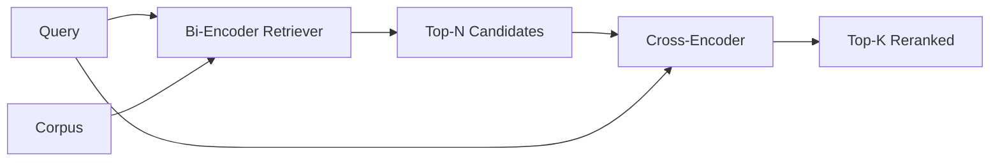

# Reranker Kodera Krzyżowego

> Dwukoder osadza zapytanie i dokument niezależnie. Koder krzyżowy konkatenuje je i czyta oba naraz. Koder krzyżowy jest najmądrzejszym czytnikiem i najwolniejszym. Użyty jako drugi etap na top-k dwukodera, zwraca się z nawiązką.

**Typ:** Build
**Języki:** Python
**Wymagania wstępne:** Faza 11, lekcja 06 (RAG), lekcja 07 (zaawansowany RAG); Faza 19, Track B foundations (lekcje 20-29); Faza 19, lekcja 65 (wyszukiwanie hybrydowe zasilające ten etap)
**Czas:** ~90 minut

## Cele dydaktyczne
- Odróżnić dwukoder wyszukiwacz od kodera krzyżowego rerankera po kształcie wejścia, liczbie parametrów i koszcie na zapytanie.
- Zaimplementować mały koder krzyżowy od podstaw jako blok transformera, który konsumuje spakowaną sekwencję (zapytanie, dokument) i emituje pojedynczy skalar istotności.
- Podłączyć dwuetapowy potok wyszukaj-potem-rerankuj: wyszukaj top-N tanim wyszukiwaczem, rerankuj N do top-K za pomocą kodera krzyżowego, zwróć K.
- Zmierzyć zależność opóźnienia od jakości na małym korpusie testowym i wybrać odpowiednie N dla danego budżetu opóźnienia.

## Problem

Dwukoder mapuje zapytanie i dokument do tej samej przestrzeni wektorowej i rankingu według cosinusa. Dwa kodowania nigdy się nie widzą. Model musi skompresować wszystko, co użyteczne o dokumencie, do pojedynczego wektora, ślepego na zapytanie. To jest szybkie - jedno osadzenie na dokument w czasie indeksowania i jedno na zapytanie w czasie zapytania - i to jedyny sposób na ranking w skali korpusu.

Kosztem jest precyzja. Dwa dokumenty, które mają ten sam ogólny temat, mogą mieć prawie identyczne osadzenia, nawet gdy jeden z nich odpowiada na zapytanie, a drugi nie. Dwukoder nie może ich odróżnić.

Koder krzyżowy rozwiązuje to, czytając zapytanie i dokument razem. Model otrzymuje `[query] [SEP] [document]` jako pojedynczą sekwencję, uruchamia pełną uwagę przez połączenie i produkuje jeden skalar istotności. Każdy token dokumentu może zwracać uwagę na każdy token zapytania. Model decyduje o wyniku z pełnym kontekstem.

Kosztem jest przepustowość. Gdzie dwukoder osadza raz i zapytuje wiecznie, koder krzyżowy uruchamia się raz na parę (zapytanie, dokument). Dla korpusu 10 milionów dokumentów to 10 milionów forwardów na zapytanie. Niewykonalne w budżecie żądania.

Rozwiązaniem jest etapowanie. Użyj dwukodera, aby wyszukać top-N. Użyj kodera krzyżowego, aby rerankować N do top-K. N jest małe (50 do 200), a wzrost jakości kodera krzyżowego jest skoncentrowany tam, gdzie ma znaczenie. Całkowite opóźnienie pozostaje w budżecie żądania. Całkowita jakość to jakość kodera krzyżowego, ograniczona przez recall dwukodera na N.

## Koncepcja



### Kształt wejścia kodera krzyżowego

Standardowe pakowanie to `[CLS] query_tokens [SEP] document_tokens [SEP]`. Wyjście pozycji CLS jest podawane do pojedynczej liniowej głowy, która wypisuje skalar istotności. Niektóre implementacje używają średniego poolingu zamiast CLS; różnica jest mała. Chodzi o to, że model produkuje jedną liczbę na parę.

Koder krzyżowy o 22M parametrach (opublikowana klasa wag `ms-marco-MiniLM-L-6-v2`) to typowy punkt produkcyjny. Mniejsze modele tracą jakość szybciej niż zyskują na opóźnieniu. Większe modele (np. `bge-reranker-v2-m3` z 568M parametrami) są zarezerwowane do rerankowania offline lub do rerankowania pierwszej strony, gdzie K jest małe.

### Dlaczego ta lekcja trenuje mały

Prawdziwy koder krzyżowy to dostrojony koder transformera. W produkcji ładujesz punkt kontrolny i uruchamiasz go. W tej lekcji celem jest pokazanie kształtu modelu i kształtu krzywej opóźnienie-jakość, a nie trenowanie rankera najnowszej generacji. Budujemy więc mały `nn.Module` z jednym blokiem transformera, wielogłową uwagą (4 głowy domyślnie) i jedną głową regresyjną. Jest inicjalizowany deterministycznie z seeda, aby demo było odtwarzalne bez wag na dysku.

Zabawkowy model uczy się prawidłowego kształtu z korpusu testowego: istotne pary zapytanie-dokument mają wyższe przewidywane wyniki niż pary nieistotne. Potok end-to-end rerankuje wyjście dwukodera, a top-k rerankowania koreluje z złotymi etykietami.

### Opóźnienie vs jakość

Dwuetapowy potok ma jeden regulowany parametr: N. Przeskanuj N od 5 do 100 na wstrzymanym zestawie zapytań i otrzymujesz krzywą.

| N | Recall@1 etapu 2 | Forwardy kodera krzyżowego na zapytanie | Opóźnienie |
|---|------------------|----------------------------------------|------------|
| 5 | 0.62 | 5 | niskie |
| 20 | 0.81 | 20 | średnie |
| 50 | 0.86 | 50 | wysokie |
| 100 | 0.86 | 100 | bardzo wysokie |

Liczby powyżej są ilustracyjne dla kształtu, a nie pomiary z tego zestawu testowego. Kształt jest prawdziwy. Zawsze jest kolano w okolicy 20 do 50 kandydatów, gdzie wzrost rerankowania się nasyca. Poza kolanem płacisz za nic.

Wybierz N z krzywej ewaluacyjnej plus budżetu opóźnienia. Koder krzyżowy nie może podnieść recall powyżej recall dwukodera na N, więc niskie N ogranicza jakość, a nie tylko opóźnienie.

## Zbuduj to

`code/main.py` implementuje:

- `CrossEncoder` - mały `torch.nn.Module`: osadzanie tokenów, jeden blok transformera z wielogłową uwagą i feedforward, średnio pulowana głowa produkująca jeden skalar.
- `tokenize_pair(query, document)` - pakuje dwa ciągi w pojedynczą sekwencję ID z ID typów oznaczającymi granicę, deterministyczne i stdlib.
- `train_tiny(pairs)` - jeden przebieg nadzorowanego trenowania na ręcznie oznakowanej liście trójek (zapytanie, dokument, istotność), aby model produkował sensowne wyniki na zestawie testowym.
- `rerank(query, candidates, top_k)` - interfejs produkcyjny.
- `pipeline(query, retriever, top_n, top_k)` - dwuetapowy przepływ.
- Demo `main()`, które ładuje korpus ze wzorca z lekcji 65, wyszukuje top-N, rerankuje do top-K, wypisuje obie listy obok siebie i raportuje opóźnienie każdego etapu.

Uruchom:

```bash
python3 code/main.py
```

Wynik pokazuje top-N dwukodera, top-K kodera krzyżowego i podsumowanie czasowe. Koder krzyżowy trwa dłużej na wywołanie, ale nie uruchamia się na całym korpusie. Łączny czas dwuetapowy pozostaje w budżecie żądania, jednocześnie wybierając odpowiedź, którą dwukoder uplasował na drugim lub trzecim miejscu.

## Tryby awarii, których demo nie ukryje

**Koder krzyżowy nie jest symetryczny.** `rerank(q, d)` i `rerank(d, q)` to różne wyniki. Zawsze podawaj zapytanie pierwsze. Jeśli przypadkowo zamienisz, recall załamuje się.

**N jest za małe, by ujawnić błąd.** Jeśli ustawisz N = K, koder krzyżowy nie może zmienić kolejności; może tylko zmienić wagi. Wzrost wygląda na zero. Wybierz N co najmniej trzy razy K.

**Dane treningowe wyciekają do ewaluacji.** Jeśli ręcznie oznakowane pary treningowe obejmują zapytania ewaluacyjne, rerankowanie wygląda magicznie. Ściśle rozdziel trenowanie i ewaluację, nawet na zestawie testowym.

**Wagi produkcyjne są gęste.** Koder krzyżowy o 22M parametrach to 88MB przy float32. Zaplanuj pamięć serwera modelu, zanim obiecasz p95 poniżej 100ms.

**Grupowanie ma znaczenie.** Prawdziwy koder krzyżowy uruchamia N kandydatów w jednym batchu. Ta lekcja robi to w `_batch_encode`, który buduje grupowane tensory ID i ID typów z `torch.tensor(...)` i uruchamia jeden forward. Pomiń grupowanie, a opóźnienie mnoży się przez N.

## Użyj tego

Wzorce produkcyjne:

- Przypnij dwukoder, koder krzyżowy i N razem. Zmiana któregokolwiek unieważnia ewaluację.
- Buforuj wyjście rerankera według hasha (zapytanie, document_id). To samo zapytanie na stabilnym korpusie rerankuje do tej samej kolejności; trafienia w pamięci podręcznej dają darmowe cięcie opóźnienia.
- Zaloguj wynik rank-1 kodera krzyżowego. Zapytanie, którego wynik top-1 jest poniżej progu specyficznego dla korpusu, to trafienie poza domeną; przedstaw je LLM jako "Nie jestem pewien".

## Dostarcz to

Lekcja 68 ewaluuje ten dwuetapowy potok end-to-end. Lekcja 69 podłącza ten reranker za hybrydowym wyszukiwaczem z lekcji 65 i przed generatorem odpowiedzi. Reranker jest drugim etapem systemu end-to-end.

## Ćwiczenia

1. Przeskanuj N od 5 do 50 i wykreśl recall@1 rerankowanego wyjścia. Znajdź kolano na tym zestawie testowym.
2. Trenuj koder krzyżowy przez dziesięć epok zamiast jednej. Zmierz margines wyniku między parami pozytywnymi a negatywnymi w każdej epoce.
3. Zastąp średni pooling głową opartą na tokenie CLS. Porównaj zbieżność na tym zestawie testowym.
4. Dodaj drugą głowę kodera krzyżowego, która przewiduje binarną etykietę "czy ta odpowiedź jest w dokumencie". Użyj obu głów podczas wnioskowania; jednej do rankowania, drugiej do progowania.
5. Zastąp deterministyczny mock dwukodera tym z lekcji 65 i połącz dwa etapy. Zmierz zmianę w top-K w porównaniu z samym dwukoderem.

## Kluczowe terminy

| Termin | Co ludzie mówią | Co to naprawdę znaczy |
|--------|-----------------|-----------------------|
| Dwukoder | "Wyszukiwacz wektorowy" | Koduje zapytanie i dok. niezależnie; rankingu według cosinusa |
| Koder krzyżowy | "Reranker" | Koduje (zapytanie, dok.) łącznie; wypisuje jeden skalar istotności |
| Dwuetapowy potok | "Wyszukaj i rerankuj" | Tani wyszukiwacz zwraca N, drogi reranker zatrzymuje K |
| N (budżet kandydatów) | "Pula rerankowania" | Liczba kandydatów, których koder krzyżowy punktuje na zapytanie |
| Głowa średniego poolingu | "Średnia ostatniego ukrytego" | Uśrednij wyjścia ostatniej warstwy kodera w jeden wektor |

## Dalsza lektura

- Nogueira, Cho, "Passage Re-ranking with BERT", 2019 - kanoniczny artykuł rankera kodera krzyżowego
- Reimers, Gurevych, "Sentence-BERT: Sentence Embeddings using Siamese BERT-Networks", 2019 - o dwukoderach vs koderach krzyżowych
- [Dokumentacja SentenceTransformers Cross-Encoders](https://www.sbert.net/examples/applications/cross-encoder/README.html)
- [Karta modelu BGE Reranker v2](https://huggingface.co/BAAI/bge-reranker-v2-m3)
- Faza 19, lekcja 65 - hybrydowy wyszukiwacz zasilający ten etap rerankowania
- Faza 19, lekcja 68 - ewaluacja mierząca wzrost, który ten reranker dostarcza