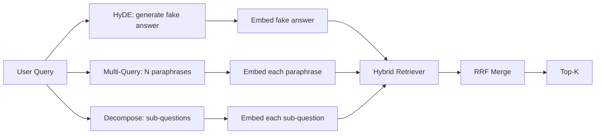

# Przepisywanie Zapytań: HyDE, Multi-Query i Dekompozycja

> Zapytanie, które wpisuje użytkownik, nie jest zapytaniem, którego chce twój wyszukiwacz. Przepisywanie wypełnia lukę przed wyszukiwaniem, aby indeks zobaczył coś bliższego temu, jak wygląda odpowiedź.

**Typ:** Build
**Języki:** Python
**Wymagania wstępne:** Faza 11, lekcje 04 (osadzania), 06 (RAG); Faza 19, Track B foundations (lekcje 20-29); Faza 19, lekcje 64 i 65
**Czas:** ~90 minut

## Cele dydaktyczne
- Zaimplementować Hipotetyczne Osadzenia Dokumentów (HyDE): wygeneruj fałszywą odpowiedź, osadź ją, wyszukaj względem tego wektora zamiast wektora zapytania.
- Zaimplementować ekspansję multi-zapytania: przepisz jedno zapytanie na N parafraz, wyszukaj każdą, połącz unię przez fuzję rankingów wzajemnych.
- Zaimplementować dekompozycję zapytań: podziel złożone pytanie na podpytania, wyszukaj na podpytanie, połącz.
- Porównać trzy przepisywacze bezpośrednio na zestawie testowym i wyjaśnić, kiedy każda strategia wygrywa.
- Podłączyć mockowy LLM, który produkuje deterministyczne, zgodne z zestawem testowym wyniki, aby pętla przepisywania działała offline.

## Problem

Użytkownik wpisuje "co robi nasz zespół, gdy przesyłanie się nie udaje i budżet się wyczerpie?". Korpus zawiera dokument, który mówi "AbortMultipartOnFail przerywa przesyłanie S3 multipart w locie i zmniejsza budżet ponownych prób na bucket, gdy przesyłanie się nie udaje". Zapytanie i dokument nie dzielą frazy rzeczownikowej. BM25 nie trafia. Dwukoder rankuje dokument na trzecim lub czwartym miejscu, ponieważ wektor zapytania ląduje w regionie przestrzeni osadzania, który preferuje dokument o anulowanych zadaniach, a nie o przerwanych przesyłaniach. Dwuetapowy reranker z lekcji 66 może uratować odpowiedź, jeśli znajduje się w top-N, ale jeśli nie dociera nawet do top-N, reranker nigdy go nie widzi.

Naprawą jest przepisanie zapytania, zanim trafi do wyszukiwacza. Artykuł z 2023 "Precise Zero-Shot Dense Retrieval without Relevance Labels" (Gao i in.) wprowadził HyDE: poproś LLM o napisanie dokumentu, który odpowiedziałby na zapytanie, osadź ten hipotetyczny dokument i użyj jego osadzenia jako wektora wyszukiwania. Hipotetyczny dokument znajduje się we właściwym regionie przestrzeni osadzania, ponieważ jest napisany głosem korpusu. Wektor zapytania nie był.

Dwie pokrewne techniki towarzyszą HyDE. Ekspansja multi-zapytania (termin używany przez GraphRAG Microsoftu) generuje N parafraz zapytania i wyszukuje każdą, a następnie łączy. Dekompozycja (spopularyzowana jako "dekompozycja podzapytań" w pracach Stanford DSPy z 2024) dzieli "co robi nasz zespół, gdy przesyłanie się nie udaje i budżet się wyczerpie" na dwa pytania: "co się dzieje, gdy przesyłanie się nie udaje" i "co się dzieje, gdy budżet ponownych prób się wyczerpie". Dwa wyszukiwania, jeden połączony wynik, oba elementy odpowiedzi osiągalne.

Ta lekcja implementuje wszystkie trzy i uruchamia je na tym samym korpusie testowym.

## Koncepcja



### HyDE szczegółowo

HyDE zastępuje wektor zapytania użytkownika wektorem hipotetycznego dokumentu napisanego przez LLM. Prompt jest krótki:

```
You are a domain expert. Write a one-paragraph passage that answers the question
below. Use the same vocabulary and phrasing the documentation in this domain would
use. Do not refuse. Do not say you do not know.

Question: {user_query}

Passage:
```

Odpowiedź LLM jest błędna jako faktyczna odpowiedź, ponieważ LLM nie zna twojego korpusu. To w porządku. Wyszukiwacz nie dba o poprawność faktograficzną, tylko o rozkład tokenów. Hipotetyczny fragment zawiera słowa "abort", "multipart", "bucket", "budget", ponieważ tak brzmiałby fragment dokumentacji na ten temat. Osadź ten fragment. Wektor ląduje blisko prawdziwego fragmentu.

W produkcji ogranicz hipotetyczny dokument do dwóch lub trzech zdań. Dłuższe hipotetyczne dokumenty zbierają więcej szumu. Krótsze tracą sygnał leksykalny, którego potrzebuje HyDE.

### Ekspansja multi-zapytania szczegółowo

Wygeneruj N parafraz zapytania użytkownika. Najprostszy prompt:

```
Rewrite the following question in {N} different ways. Each rewrite must preserve
the original intent. Number them 1 to {N}. Do not add explanations.
```

Wyszukaj top-k dla każdej parafrazy. Połącz N rankingowych list za pomocą RRF (ten sam algorytm z lekcji 65). Tanie, równoległe, deterministyczne.

Multi-zapytanie wygrywa, gdy sformułowanie użytkownika jest jednym z wielu równie ważnych sposobów zadania pytania, a każda z przepisanych wersji zadałaby je lepiej. Przegrywa, gdy wszystkie przepisania są równie złe, ponieważ oryginał był zły w ten sam sposób.

### Dekompozycja szczegółowo

Pojedyncze wyszukiwanie nie może zaspokoić wieloaspektowego pytania. Dekompozycja prosi LLM o podzielenie pytania na podpytania, a system wyszukuje na podpytanie. Prompt:

```
The following question may require information from multiple distinct topics.
Decompose it into a list of sub-questions. Each sub-question must be answerable
independently. If the question is already atomic, return it unchanged.

Question: {user_query}
```

Wyszukaj na podpytanie. Połącz. Dekompozycja jest właściwym narzędziem dla pytań zawierających spójniki, porównania wieloklauzulowe lub dwa niepowiązane tematy. Niewłaściwe narzędzie dla pytań atomowych; zadaniem dekompozytora jest zwrócić pojedyncze pytanie i nie wymyślać fałszywych podpytań.

### Dlaczego wszystkie trzy istnieją

Trzy są komplementarne. HyDE wypełnia lukę tokenową między zapytaniem a korpusem. Multi-zapytanie pokrywa wariancję parafrazy. Dekompozycja pokrywa zapytania wielotematyczne. System produkcyjny uruchamia wszystkie trzy i wybiera strategię na zapytanie (system end-to-end w lekcji 69 pokazuje selektor).

## Mockowy LLM

Lekcja działa offline. Mockowy LLM to mała tabela odnośników kluczowana na zapytaniu użytkownika, plus zastępcza dla zapytań, których nie widział. Tabela odnośników zawiera:

- Dla każdego zapytania testowego: napisany hipotetyczny fragment, trzy parafrazy i dekompozycja.
- Dla nieznanego zapytania: deterministyczna transformacja: weź słowa treściowe zapytania, rozszerz je przez mapę synonimów i zwróć wynik.

Kształt mocka ma znaczenie, nie dane. W produkcji zamieniasz mocka na prawdziwe wywołanie modelu. Wyszukiwacz się nie zmienia.

## Zbuduj to

`code/main.py` implementuje:

- `MockLLM` - deterministyczny zastępnik opisany powyżej.
- `HyDERewriter` - wywołuje LLM, aby napisać hipotetyczny dokument, zwraca wynik przepisywania jako `RewriteResult` z hipotetycznym tekstem i zapytaniem, którego wyszukiwacz powinien użyć.
- `MultiQueryRewriter` - wywołuje LLM dla N parafraz, zwraca listę zapytań.
- `DecomposeRewriter` - wywołuje LLM do dekompozycji, zwraca podpytania.
- `retrieve_with_rewriter` - bierze przepisywacz i wyszukiwacz, uruchamia przepisania, łączy wyniki.
- Demo, które uruchamia trzy przepisywacze na zestawie testowym i wypisuje, która strategia zwróciła złoty dokument odpowiedzi jako pierwsza.

Kształt wyszukiwacza jest ponownie użyty z lekcji 65 (hybrydowy BM25 + gęste). Fuzja to ten sam RRF. Jedynym nowym kształtem jest interfejs przepisywacza, który jest mały.

Uruchom:

```bash
python3 code/main.py
```

Wynik to ranking na strategię i końcowe podsumowanie. HyDE wygrywa na zapytaniu o niedopasowanym sformułowaniu. Multi-zapytanie wygrywa na zapytaniu o wariancji parafrazy. Dekompozycja wygrywa na zapytaniu wielotematycznym. Zastępcza (bez przepisywacza) przegrywa na co najmniej jednym z trzech.

## Tryby awarii, których demo nie ukryje

**HyDE halucynuje identyfikatory specyficzne dla korpusu błędnie.** Model wymyśla nazwę funkcji. Wynik BM25 hipotetycznego dokumentu na właściwym dokumencie załamuje się, ponieważ wymyślona nazwa jest teraz tokenem o wysokiej wadze, który nie pojawia się w indeksie. Ogranicz długość hipotetycznego dokumentu i obniż wagę BM25 w fuzji.

**Multi-zapytanie wszystkie zbiegają się.** Słaby model produkuje trzy prawie identyczne parafrazy. N wyszukiwań zwraca to samo top-k. Fuzja RRF nie jest lepsza niż pojedyncze wyszukiwanie. Dodaj jawną instrukcję różnorodności do promptu przepisywania i wykrywaj duplikaty przez Jaccarda.

**Dekompozycja nadmiernie dzieli.** Dekompozytor zamienia atomowe pytanie w listę. Wyszukiwania wszystkie zwracają ten sam dokument, ale z obniżonym rankingiem. Fuzja jest gorsza niż oryginał. Wykryj to za pomocą przejścia "czy te podpytania są wystarczająco odrębne" przed rozesłaniem.

**Opóźnienie mnoży się.** HyDE kosztuje jedno wywołanie LLM. Multi-zapytanie kosztuje jedno wywołanie LLM do wygenerowania N przepisań, a następnie N wyszukiwań. Dekompozycja kosztuje jedno wywołanie LLM do dekompozycji, a następnie M wyszukiwań. Wyszukiwania działają równolegle; wywołanie LLM jest dolną granicą.

## Użyj tego

Wzorce produkcyjne:

- Wybór strategii na zapytanie według długości zapytania: atomowe krótkie zapytania dostają multi-zapytanie, złożone wieloklauzulowe dostają dekompozycję, zapytania pełne żargonu dostają HyDE.
- Buforuj wynik przepisywacza według hasha zapytania. Wiele zapytań się powtarza.
- Uruchom wszystkie trzy równolegle i połącz trzy zestawy wyników w jeden za pomocą RRF. Koszt to trzy wywołania LLM i jedna fuzja; jakość to unia pokrycia wszystkich trzech strategii.

## Dostarcz to

Lekcja 69 podłącza ten etap przepisywania przed wyszukiwaczem z lekcji 65 i rerankerem z lekcji 66. Lekcja 68 ewaluuje wzrost, jaki przepisywacz dodaje do recall wyszukiwania.

## Ćwiczenia

1. Zaimplementuj RAG-Fusion (wariant multi-zapytania z 2024), gdzie parafrazy przepisywacza są celowo różnorodne, a następnie etap rerankowania (lekcja 66) wybiera końcową listę.
2. Dodaj czwartą strategię: step-back prompting (poproś LLM o bardziej ogólne pytanie, wyszukaj na nim, a następnie zawęź). Porównaj na zestawie testowym.
3. Trenuj dekompozytor do rozpoznawania atomowych zapytań, dodając głowę "czy pytanie jest atomowe". Zmierz wskaźnik nadmiernego dzielenia przed i po.
4. Zastąp mockowy LLM prawdziwym wywołaniem modelu. Zmierz opóźnienie na strategię na swoim stosie.
5. Dodaj wynik ufności na przepisanie. Odrzuć przepisania poniżej progu. Zmierz wpływ na recall.

## Kluczowe terminy

| Termin | Co ludzie mówią | Co to naprawdę znaczy |
|--------|-----------------|-----------------------|
| HyDE | "Wyszukiwanie fałszywego dokumentu" | LLM pisze odpowiedź; osadź i wyszukaj na tym zamiast na zapytaniu |
| Multi-zapytanie | "Ekspansja parafrazy" | N przepisań zapytania; wyszukaj N razy, połącz przez RRF |
| Dekompozycja | "Podział podzapytań" | Zapytania wielotematyczne podzielone na podpytania, wyszukane osobno |
| Zapytanie atomowe | "Jednotematyczne" | Nie może być zdekomponowane bez wymyślania fałszywych podpytań |
| Step-back | "Abstrahuj zapytanie" | Zapytaj o bardziej ogólne pytanie, wyszukaj, a następnie zawęź |

## Dalsza lektura

- Gao, Ma, Lin, Callan, "Precise Zero-Shot Dense Retrieval without Relevance Labels" (HyDE), 2023
- Microsoft Research, "Multi-Query Expansion for Retrieval"
- Stanford DSPy, "Subquery Decomposition for Multi-Hop QA"
- [Dokumentacja transformacji zapytań LlamaIndex](https://docs.llamaindex.ai/en/stable/optimizing/advanced_retrieval/query_transformations/)
- Faza 11, lekcja 07 - zaawansowane wzorce RAG
- Faza 19, lekcja 65 - wyszukiwacz, który ten przepisywacz zasila
- Faza 19, lekcja 68 - ewaluacja mierząca wzrost przepisywacza