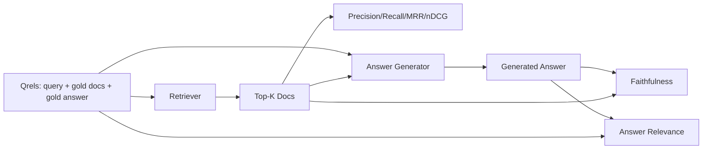

# Ewaluacja RAG: Precision, Recall, MRR, nDCG, Wierność, Istotność Odpowiedzi

> Jeśli nie możesz ocenić swojego wyszukiwania i swojej odpowiedzi w tym samym czasie, nie możesz wdrożyć systemu. Te dwie rzeczy to nie ta sama metryka, a ten sam prompt zawodzi na różnych osiach.

**Typ:** Build
**Języki:** Python
**Wymagania wstępne:** Faza 11, lekcje 06 (RAG), 10 (ewaluacja); Faza 19, Track B foundations (lekcje 20-29); Faza 19, lekcje 64, 65, 66, 67
**Czas:** ~90 minut

## Cele dydaktyczne
- Obliczyć cztery metryki wyszukiwania z złotych qrels: precision@k, recall@k, MRR (średni wzajemny ranking) i nDCG@k.
- Obliczyć dwie metryki oceny odpowiedzi: wierność (każde twierdzenie ugruntowane w wyszukanym kontekście) i istotność odpowiedzi (odpowiedź odnosi się do pytania).
- Zbudować plik qrels testowych (zapytania, ID złotych dokumentów, złoty tekst odpowiedzi), który ewaluacja czyta end-to-end.
- Odczytać wartości metryk, aby zdiagnozować, gdzie potok zawodzi: wyszukiwanie, rankingowanie, generowanie lub ugruntowanie.

## Problem

System RAG ma co najmniej cztery ruchome części: fragmentator, wyszukiwacz, reranker, generator. Każda z nich może być przyczyną błędnej odpowiedzi. Bez metryk na etap lecisz po omacku.

Użytkownik zgłasza błędną odpowiedź. Czy to dlatego, że fragmentator odciął zakres odpowiedzi? Czy to dlatego, że wyszukiwacz nie dołączył fragmentu do top-k? Czy to dlatego, że reranker zepchnął właściwy fragment poza pozycję pierwszą? Czy to dlatego, że generator zignorował fragment i coś zmyślił? Nie możesz stwierdzić z samej odpowiedzi. Potrzebujesz:

- Metryk wyszukiwania do oceny tego, co wyszło z wyszukiwacza.
- Metryk rankingowania do oceny, gdzie właściwy fragment znajdował się w kolejności.
- Wierności do oceny, czy generator pozostał w wyszukanym kontekście.
- Istotności odpowiedzi do oceny, czy odpowiedź w ogóle odnosi się do pytania.

Ta lekcja buduje wszystkie sześć na wierzchu pliku qrels testowych. Ewaluacja jest offline i deterministyczna; w produkcji zamieniasz mockowego LLM-jako-sędziego na prawdziwego.

## Koncepcja



### Precision@k

Z top-k dokumentów zwróconych przez wyszukiwacz, jaka część jest w złotym zbiorze? Jeśli złoto ma trzy dokumenty, a top-3 zwraca dwa z nich i jeden błędny, precision@3 wynosi 2 / 3. Użyj precyzji, gdy koszt nieistotnego wyszukanego fragmentu jest wysoki (generator marnuje na niego tokeny lub fragment zatruwa odpowiedź).

### Recall@k

Z złotych dokumentów, jaka część jest w top-k? Jeśli złoto ma trzy dokumenty, a top-5 zawiera wszystkie trzy, recall@5 wynosi 1.0. Użyj recall, gdy koszt pominiętej odpowiedzi jest wysoki (wolisz zobaczyć jeden dodatkowy błędny fragment niż przegapić fragment z odpowiedzią).

W produkcyjnym RAG metryką, którą ludzie zwykle podają, jest recall@k. Generowanie może łatwo odrzucić nieistotne fragmenty; nie może wymyślić odpowiedzi z fragmentu, którego nigdy nie widziało.

### MRR (Mean Reciprocal Rank)

Dla każdego zapytania znajdź pozycję pierwszego istotnego dokumentu w rankingowej liście. Odwrotny ranking to 1 / pozycja. Średnia po zestawie zapytań. MRR to jednonumeryczne podsumowanie tego, jak dobrze wyszukiwacz umieszcza najlepszą odpowiedź na górze.

MRR waży pozycję-1 mocno. Zapytanie, gdzie złoty dokument jest na rankingu 1, wnosi 1.0. Ranking 2 wnosi 0.5. Ranking 10 wnosi 0.1. Metryka jest zdominowana przez górę listy.

### nDCG@k

Znormalizowany zdyskontowany skumulowany zysk. Pełny wzór przypisuje zysk każdemu wyszukanemu dokumentowi (często 1 za istotny, 0 za nie), dyskontuje przez logarytm pozycji, sumuje i dzieli przez idealny DCG (DCG, który miałbyś przy idealnym rankingowaniu). Zakres 0 do 1.

nDCG obsługuje stopniowaną istotność: złoto może powiedzieć "dokument A to 3, dokument B to 2, dokument C to 1". MRR i recall@k spłaszczają wszystko do binarnego. Użyj nDCG, gdy korpus ma wiele częściowo istotnych dokumentów na zapytanie.

### Wierność

Dla każdego twierdzenia w wygenerowanej odpowiedzi sprawdź, czy twierdzenie jest poparte przez wyszukany kontekst. Standardowa implementacja używa promptu LLM-jako-sędziego, który bierze (twierdzenie, kontekst) i zwraca tak lub nie. Metryką jest ułamek twierdzeń, które przechodzą.

Wierność łapie tryb awarii generatora, w którym model wymyśla treść. Nawet jeśli wyszukiwacz zwrócił właściwe fragmenty, generator, który halucynuje, jest zepsuty. Wierność jest również nazywana ugruntowaniem, wsparciem, atrybucją.

Ta lekcja implementuje wierność z deterministycznym mockowym sędzią, który sprawdza, czy tokeny każdego twierdzenia nakładają się na wyszukany kontekst powyżej progu. W produkcji zamieniasz na prawdziwe wywołanie modelu. Kształt metryki jest ten sam.

### Istotność odpowiedzi

Czy odpowiedź faktycznie odnosi się do pytania? Wierność pyta "czy odpowiedź jest ugruntowana w kontekście?". Istotność odpowiedzi pyta "czy odpowiedź jest ugruntowana w pytaniu?". Wierna, ale nie na temat odpowiedź ma wysoki wynik wierności i niski istotności. Krótka, na temat odpowiedź, która ignoruje kontekst, ma wysoki wynik istotności i niski wierności.

Standardowa implementacja również używa LLM-jako-sędziego: weź (pytanie, odpowiedź) i zapytaj, czy odpowiedź odnosi się do pytania. Ta lekcja implementuje zastępnik oparty na nakładaniu tokenów plus sędzia.

## Testowe qrels

```python
{
  "qid": "q1",
  "query": "what is the abort threshold for multipart uploads",
  "gold_doc_ids": ["d1", "d3"],
  "gold_answer_substring": "three failed parts",
  "graded_relevance": {"d1": 3, "d3": 2},
}
```

Każde zapytanie przenosi:
- ciąg zapytania,
- zbiór złotych ID dokumentów (dla precision / recall / MRR),
- słownik stopniowanej istotności (dla nDCG),
- podciąg złotej odpowiedzi (przechowywany jako referencyjne metadane na każdym qrelu; wierność w tej lekcji jest obliczana przez ocenę wyodrębnionych twierdzeń względem wyszukanego kontekstu, a nie względem tego podciągu).

W produkcji oznaczasz je. Ta lekcja dostarcza ręcznie zbudowany zestaw testowy, aby ewaluacja działała od razu.

## Zbuduj to

`code/main.py` implementuje:

- `precision_at_k(retrieved, gold, k)` - dosłowna definicja.
- `recall_at_k(retrieved, gold, k)` - dosłowna definicja.
- `mean_reciprocal_rank(retrieved_list_of_lists, gold_list)` - średnia po zapytaniach.
- `ndcg_at_k(retrieved, graded_relevance, k)` - DCG / IDCG z binarnymi lub stopniowanymi zyskami.
- `extract_claims(answer)` - dzieli odpowiedź na twierdzenia w kształcie zdań.
- `faithfulness(claims, context_texts, judge)` - ułamek twierdzeń uznanych za poparte.
- `answer_relevance(question, answer, judge)` - sędzia, czy odpowiedź odnosi się do pytania.
- `MockJudge` - deterministyczny sędzia nakładania tokenów, aby ewaluacja działała offline.
- `evaluate_pipeline(pipeline_fn, qrels, ks)` - orkiestrator uruchamiający każdą metrykę.
- Demo, które uruchamia trzy warianty potoku (linia bazowa fragmentatora, wyszukiwanie hybrydowe, hybrydowe + reranker) względem qrels i wypisuje tabelę metryk.

Uruchom:

```bash
python3 code/main.py
```

Wynik pokazuje precision@k, recall@k, MRR, nDCG@k, wierność i istotność odpowiedzi dla każdego wariantu w jednej tabeli metryk. Wiersz wyszukiwania hybrydowego bije linię bazową fragmentatora na recall; wiersz rerankowania bije hybrydowe na MRR.

## Odczytywanie metryk do diagnozowania awarii

| Symptom | Prawdopodobna przyczyna | Co naprawić |
|---------|------------------------|-------------|
| Niski recall@k, niska precision@k | Fragmentator odciął odpowiedź lub wyszukiwacz nie może jej znaleźć | Granice fragmentatora (lekcja 64) lub modalność wyszukiwacza (lekcja 65) |
| Przyzwoity recall@k, niski MRR | Właściwy fragment jest w top-k, ale nie na pozycji 1 | Reranker (lekcja 66) |
| Wysoki MRR, niska wierność | Generator wymyśla treść mimo właściwego kontekstu | Prompt generowania; wymuś cytowanie lub odmowę |
| Wysoka wierność, niska istotność | Odpowiedź ugruntowana, ale nie na temat | Przepisywacz zapytań (lekcja 67) lub prompt generowania |
| Wszystkie cztery wysokie, użytkownicy nadal narzekają | Zestaw ewaluacyjny niereprezentatywny | Rozszerz qrels o prawdziwe zapytania użytkowników |

## Tryby awarii, których demo nie ukryje

**Stronniczość LLM-jako-sędziego.** Model ocenia własne wyniki jako bardziej wierne niż są. Użyj innej rodziny modeli dla sędziego niż generatora lub ręcznie oceń próbkę.

**Zgnicie qrels.** Złote odpowiedzi dryfują, gdy korpus się zmienia. Dokument, który był złoty dla q1 w styczniu 2024, nie jest już właściwą odpowiedzią w październiku 2024, ponieważ zespół zmienił nazwę funkcji. Zaplanuj kwartalny przegląd qrels.

**Mikrokontrole wierności pomijają makro twierdzenia.** Wierność na zdanie może przechodzić, podczas gdy ogólna struktura odpowiedzi wprowadza w błąd. Dodaj jakościowy przegląd na poziomie próbki na wierzchu automatycznej metryki.

**Recall@k maskuje awarie na zapytanie.** Średni recall 90% może ukrywać, że jedna klasa zapytań zawsze zawodzi. Podziel qrels według klasy zapytania (dosłowne, sparafrazowane, wielotematyczne) i raportuj na plasterek.

## Użyj tego

Wzorce produkcyjne:

- Uruchom ewaluację przy każdej zmianie wyszukiwacza lub generatora. Traktuj regresję recall@k jak nieudany test.
- Utrwal ślad metryk na zapytanie. Gdy użytkownik narzeka, znajdź wpis qrels, który pasuje i sprawdź, czy zostałby wychwycony.
- Warstwuj qrels: zestaw dymny 20 zapytań, który działa w CI; zestaw regresyjny 200, który działa co noc; głęboki zestaw 2000, który działa co tydzień.

## Dostarcz to

Lekcja 69 podłącza cały potok (fragmentator, wyszukiwacz, reranker, generator) i uruchamia tę ewaluację na systemie end-to-end.

## Ćwiczenia

1. Dodaj piątą metrykę wyszukiwania: hit-rate@k. Porównaj ją z recall@k. Wyjaśnij, kiedy się różnią.
2. Zaimplementuj stopniowaną wierność: 0 (niepoparte), 1 (częściowo poparte), 2 (w pełni poparte). Zaktualizuj metrykę odpowiednio.
3. Zastąp mockowego sędziego prawdziwym wywołaniem modelu. Zmierz niezgodność między mockiem a prawdziwym sędzią na zestawie testowym.
4. Dodaj plasterek klasy zapytania ("dosłowne", "sparafrazowane", "wielotematyczne"). Raportuj metryki na plasterek.
5. Dodaj metrykę "długość odpowiedzi" i skoreluj ją z wiernością. Wykreśl krzywą.

## Kluczowe terminy

| Termin | Co ludzie mówią | Co to naprawdę znaczy |
|--------|-----------------|-----------------------|
| Precision@k | "Wskaźnik trafień wśród wyszukanych" | Ułamek top-k, które są złote |
| Recall@k | "Wskaźnik trafień wśród złotych" | Ułamek złotych w top-k |
| MRR | "Pozycja pierwszego trafienia" | Średnia 1 / rank pierwszego istotnego dokumentu |
| nDCG@k | "Jakość rankingowania stopniowana" | DCG na top-k podzielone przez idealne DCG |
| Wierność | "Ugruntowanie" | Ułamek twierdzeń odpowiedzi popartych przez wyszukany kontekst |
| Istotność odpowiedzi | "Czy odnosi się do pytania?" | Czy odpowiedź pasuje do intencji pytania |
| Qrels | "Złote etykiety" | Oznaczony zestaw zapytań i ich złotych dokumentów i odpowiedzi |

## Dalsza lektura

- Buckley, Voorhees, "Evaluating Evaluation Measure Stability", SIGIR 2000 - kanoniczny artykuł o metrykach rankingowych
- Jarvelin, Kekalainen, "Cumulated Gain-based Evaluation of IR Techniques" - artykuł o nDCG
- [Ragas: Automated Evaluation of RAG Pipelines](https://docs.ragas.io)
- [Anthropic, Evaluating RAG](https://www.anthropic.com/news/evaluating-rag)
- Faza 11, lekcja 10 - podstawy frameworku ewaluacyjnego
- Faza 19, lekcje 64-67 - komponenty ewaluowane tutaj
- Faza 19, lekcja 69 - potok end-to-end oceniany przez tę ewaluację