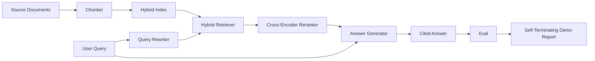

# System RAG End-to-End

> Sześć lekcji komponentów. Jeden potok. Jedna pętla ewaluacyjna. Jedno samokończące się demo. To jest system, który wdrażasz.

**Typ:** Build
**Języki:** Python
**Wymagania wstępne:** Faza 11, lekcje 06 (RAG), 10 (ewaluacja); Faza 19, Track B foundations (lekcje 20-29); Faza 19, lekcje 64, 65, 66, 67, 68
**Czas:** ~90 minut

## Cele dydaktyczne
- Skomponować fragmentator, hybrydowy wyszukiwacz, przepisywacz zapytań, reranker kodera krzyżowego i generator odpowiedzi w jeden potok end-to-end.
- Zaimplementować generator odpowiedzi, który cytuje swoje twierdzenia przez kotwicę fragmentu, z zastępczą odmową przy niskiej pewności.
- Uruchomić ewaluację z lekcji 68 na złożonym potoku i udowodnić, że stopniowa budowa wygrywa na każdej metryce względem tych samych komponentów w izolacji.
- Zbudować samokończące się demo CLI, które wczytuje korpus testowy, uruchamia ustalony zestaw zapytań i kończy z kodem zero z raportem podsumowującym.

## Problem

Sześć komponentów w izolacji niczego nie dowodzi. Fragmentator może wygrać na recall@5 na korpusie i przegrać na recall@5 systemu, ponieważ wyszukiwacz nie może rankingować tego, co emituje fragmentator. Reranker może podnieść MRR na syntetycznej puli kandydatów i zawieść na prawdziwych kandydatach dwukodera, ponieważ recall dwukodera na budżecie rerankowania jest zbyt niski. Przepisywacz zapytań może promować złoty dokument na jednym zapytaniu i zepsuć na następnym, ponieważ mock LLM zwraca zdegenerowany hipotetyczny dokument.

Test integracyjny to cały potok uruchomiony end-to-end na tych samych testowych qrels, z tą samą metryką, z jednym plikiem orkiestratora, który łączy wszystko razem. To właśnie buduje ta lekcja. Jeśli metryki na zintegrowanym potoku biją metryki na izolowanym demo każdego etapu, udowodniłeś system.

## Koncepcja



### Wybory połączeń

Potok to mały graf. Każdy etap to funkcja z jasną sygnaturą.

| Etap | Wejście | Wyjście |
|------|---------|---------|
| Fragmentator | Tekst dokumentu | Lista rekordów Chunk |
| Wyszukiwacz | Ciąg zapytania | Rekordy Chunk Top-N |
| Przepisywacz (opcjonalny) | Ciąg zapytania | Lista przepisań + hipotetyczny |
| Reranker | Zapytanie, kandydaci | Rekordy Chunk Top-K z wynikami krzyżowymi |
| Generator | Zapytanie, rekordy Chunk Top-K | Ciąg odpowiedzi z cytowaniami |

Kompozycja jest prosta, gdy każda sygnatura jest stabilna. Klasa `Pipeline` lekcji przechowuje pięć etapów i metodę `query`, która uruchamia je w kolejności. Każdy etap jest wymienny: przekaż inny fragmentator, wyszukiwacz, przepisywacz, reranker lub generator, a potok nadal działa.

### Generator odpowiedzi z cytowaniami

Generator jest ostatnim etapem i najłatwiejszym do zepsucia. Lekcja dostarcza deterministyczny mock generator, który:

1. Bierze top-K rerankowanych fragmentów.
2. Wybiera do dwóch fragmentów, których tekst zawiera największe nakładanie tokenów treściowych z zapytaniem.
3. Emituje odpowiedź będącą konkatenacją jednego-zdania-z-każdego-wybranego-fragmentu, z każdym zdaniem po którym następuje kotwica `[doc_id:chunk_index]`.
4. Jeśli żaden fragment nie ma nakładania powyżej progu odmowy, emituje "Nie wiem" bez cytowania.

W produkcji zamieniasz mocka na prawdziwe wywołanie LLM z szablonem promptu:

```
You are answering a question using only the snippets below.
Cite every claim with the anchor in parentheses.
If the snippets do not answer the question, say "I do not know".

Question: {query}

Snippets:
{enumerated chunks with anchors}

Answer:
```

Ścieżka odmowy przy niskiej pewności to cały powód, dla którego wynik rank-1 kodera krzyżowego jest logowany. Jeśli znajduje się poniżej progu korpusu, generator odmawia. To jest zawór bezpieczeństwa przed halucynowanymi odpowiedziami.

### Samokończące się demo

Demo uruchamia wszystko end-to-end. Wypisuje podział na etap jednego zapytania, uruchamia ewaluację na czterech testowych qrels, wypisuje tabelę metryk i kończy z kodem zero, jeśli wszystkie metryki z lekcji 68 spełniają progi ustawione w demo. Jeśli jakakolwiek metryka jest poniżej progu, demo kończy z niezerowym kodem i komunikatem wskazującym zawodną metrykę.

To jest kształt, jaki przyjmuje test dymny CI. Potok działa offline, szybko, deterministycznie. Progi są celowo ciasne na zestawie testowym, aby regresja w którejkolwiek z sześciu lekcji powodowała niepowodzenie demo.

## Zbuduj to

`code/main.py` implementuje:

- `Chunk` - rekord przenoszony przez wszystkie etapy (rozszerza kształt z lekcji 64 o chunk_index i source doc_id).
- `Chunker` - wybiera strategię z lekcji 64 (domyślnie podział rekurencyjny).
- `HybridIndex` - łączy BM25 + gęste + RRF z lekcji 65.
- `Rewriter` (opcjonalny) - wybiera jeden z HyDE, multi-zapytania, dekompozycji z lekcji 67 według długości zapytania i obecności spójników.
- `Reranker` - wytrenowany koder krzyżowy z lekcji 66, z mniejszym zestawem treningowym testowym, aby zbiegał w sekundach.
- `Generator` - deterministyczny mock generator z cytowaniami i odmową przy niskiej pewności.
- `Pipeline` - komponuje pięć etapów z metodą `query(question)` zwracającą `Result(answer, top_k, latency_ms_per_stage)`.
- `run_demo()` - wczytuje korpus, uruchamia trzy testowe zapytania, uruchamia ewaluację, wypisuje wyniki, ustawia kod wyjścia według progu.

Uruchom:

```bash
python3 code/main.py
```

Wynik to jeden wydrukowany ślad zapytania, pełna tabela ewaluacyjna i końcowy status zaliczenia/niezaliczenia. Zwraca kod wyjścia 0 na zestawie testowym.

## Tryby awarii, których demo nie ukryje

**Dryf granic fragmentatora.** Jeśli zmienisz strategię fragmentatora między oznaczeniem qrels ewaluacyjnych a demem, złote ID dokumentów już nie pasują. Zablokuj strategię fragmentatora w pliku qrels. Demo zawiera nagłówek, który nazywa fragmentator.

**Zestaw treningowy rerankera wycieka do ewaluacji.** 14 trójek treningowych w lekcji 66 obejmuje zapytania przypominające zapytania ewaluacyjne. W produkcji, ściśle wstrzymaj zapytania ewaluacyjne. Zapytania ewaluacyjne demo są celowo rozłączne z zestawem treningowym rerankera.

**Mock generator ukrywa ryzyko halucynacji.** Mock nie może halucynować, ponieważ emituje tylko tekst z wyszukanych fragmentów. Lekcja to odnotowuje i wskazuje ścieżkę zastąpienia produkcji prawdziwym modelem.

**Brak strumieniowania.** Potok zwraca pełną odpowiedź na końcu każdego etapu. System produkcyjny strumieniowałby wyjście generatora. Strumieniowanie jest poza zakresem; metryki oceny odpowiedzi działają na końcowym ciągu w obu przypadkach.

**Opóźnienie jest offline.** Wywołania mockowego LLM są stałoczasowe. Prawdziwe wywołania LLM dominują. Zaplanuj budżet opóźnienia w zakresie żądania; pomiar czasu na etap w lekcji mierzy tylko pracę CPU.

## Użyj tego

Wzorce produkcyjne:

- Dostarcz plik potoku pod jednym orkiestratorem z jawnymi interfejsami etapów. Unikaj rozpraszania połączeń po repozytorium.
- Uruchom ewaluację przed każdym scaleniem, które dotyka etapu. Jeśli ewaluacja spada, scalenie nie ląduje.
- Utrwal ślad metryk na uruchomienie CI, abyś mógł przypisać regresje do zamiany etapu.
- Dodaj zestaw dymny 20 zapytań (podzbiór zestawu regresyjnego), który działa w poniżej 30 sekund; pełny zestaw regresyjny działa co noc.

## Dostarcz to

Plik potoku w tej lekcji jest kształtem, który zakładają pozostałe lekcje Toru F w Fazie 19. Kolejne lekcje dodałyby automatyzację wczytywania, przyrostowe ponowne indeksowanie, telemetrię i warstwę serwującą na wierzchu. Wyszukiwanie, rerankowanie, przepisywanie i ewaluacja są tutaj kompletne.

## Ćwiczenia

1. Dodaj selektor strategii na zapytanie wewnątrz przepisywacza: heurystyki z lekcji 67 (długość, spójniki, stosunek żargonu) wybierają HyDE, multi-zapytanie lub dekompozycję.
2. Dodaj prawdziwe wywołanie LLM dla generatora za flagą środowiskową. Domyślnie mock. Zmierz różnicę opóźnienia.
3. Rozszerz demo, aby przyjmowało flagę `--corpus path`, która ładuje prawdziwy korpus. Uruchom ponownie ewaluację i sprawdzenie progów.
4. Dodaj flagę `--strategy` do fragmentatora. Zmierz wkład każdej strategii w end-to-end recall.
5. Dodaj strumieniowy interfejs generatora i podaj go do ewaluacji. Potwierdź, że wierność jest obliczana na końcowym ciągu, a nie na strumieniowanym prefiksie.

## Kluczowe terminy

| Termin | Co ludzie mówią | Co to naprawdę znaczy |
|--------|-----------------|-----------------------|
| Potok | "Potok RAG" | Złożone etapy od wczytania do cytowanej odpowiedzi |
| Kotwica cytowania | "Link źródłowy" | Odniesienie (doc_id, chunk_index) dołączone do każdego twierdzenia |
| Odmowa przy niskiej pewności | "Nie wiem" | Generator zwraca brak odpowiedzi, gdy wynik rank-1 rerankera jest poniżej progu |
| Zestaw dymny | "Ewaluacja CI" | Minimalny podzbiór qrels uruchamiany w każdej kontroli PR |
| Interfejs etapu | "Sygnatura funkcji" | Stabilny typ wejścia i wyjścia każdego etapu potoku |

## Dalsza lektura

- [Anthropic, Building search and retrieval](https://www.anthropic.com/news/contextual-retrieval)
- [Pinterest, MCP internal search](https://medium.com/pinterest-engineering) - referencyjna architektura produkcyjna
- [Ragas: Automated Evaluation of RAG Pipelines](https://docs.ragas.io)
- Faza 11, lekcja 06 - podstawy RAG
- Faza 19, lekcje 64-68 - komponenty złożone tutaj