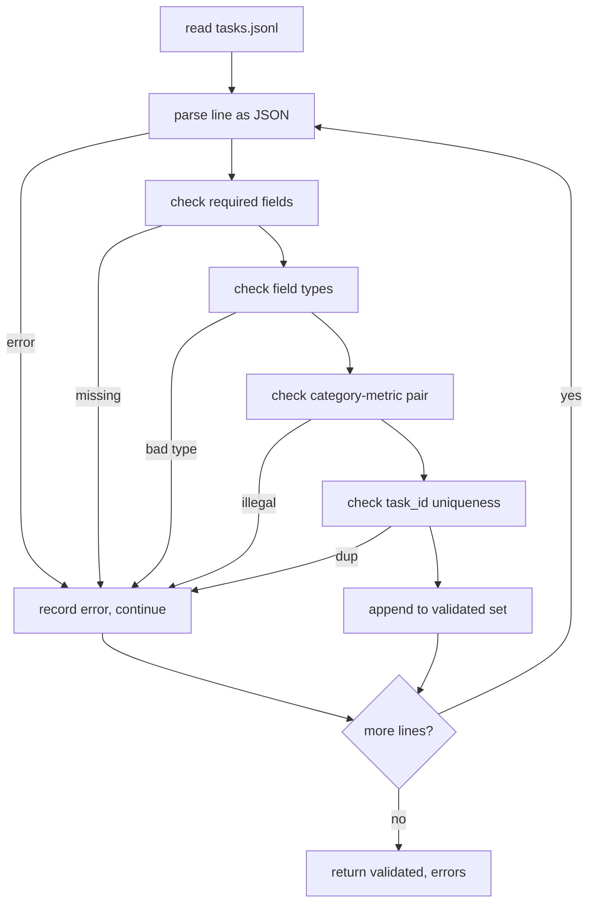

# Format Specyfikacji Zadań

> Harness ewaluacyjny jest tak dobry, jak umowa, którą szanują jego zadania. Zamroź format JSONL i słownik metryk, zanim napiszesz choćby jedną funkcję oceniającą.

**Typ:** Budowa
**Języki:** Python
**Wymagania wstępne:** Faza 19, ścieżka B — podstawy
**Czas:** ~90 min

## Cele nauczania

- Zdefiniuj schemat rekordu zadania w formacie JSONL, który obejmuje arytmetykę, wielokrotny wybór, wykonywanie kodu, klasyfikację i streszczanie dowolnego tekstu w jednym kształcie.
- Ustal zamknięty słownik nazw metryk, aby lekcje pochodne (71–73) mogły dysponować na podstawie pojedynczego pola.
- Określ przykłady kilku(strzałowe) i reguły post-processingu jako część zadania, a nie runnera, aby ten sam prompt dawał ten sam cel w różnych modelach.
- Zaimplementuj ścisły walidator, który odrzuca nieprawidłowe rekordy, zanim trafią do runnera.
- Dostarcz zestaw 10 zadań testowych ćwiczących każdą gałąź specyfikacji, aby walidator miał coś rzeczywistego do przeanalizowania.

## Dlaczego zamrożona specyfikacja

Kod badawczy będzie gromadził skrypty ewaluacyjne szybciej niż testy. Po sześciu miesiącach każdy notebook ma swój własny kształt JSON, każda metryka jest zaimplementowana dwukrotnie, a nic nie można porównać między uruchomieniami. Rozwiązanie jest nudne. Wybierz schemat. Napisz walidator. Odrzuć wszystko inne. To właśnie robi ta lekcja.

Kształt zapożycza pomysły z BIG-bench, HELM i harnessów w stylu lm-eval, ale nazwy pól są nasze. Każde pole ma jednego właściciela. Runner czyta zadanie. Metryka czyta cele. Krok post-processingu normalizuje generację. Żadne pole nie jest mutowalne w trakcie pipeline'u.

## Kształt rekordu

Zadanie to obiekt JSON w jednej linii. Harness czyta `tasks.jsonl` i waliduje każdą linię niezależnie. Nieprawidłowa linia przerywa ten rekord, nie całe uruchomienie.

```json
{
  "task_id": "arith_001",
  "category": "arithmetic",
  "prompt": "Compute the result. Question: 17 + 24\nAnswer:",
  "targets": ["41"],
  "metric_name": "exact_match",
  "few_shot_examples": [
    {"prompt": "Question: 2 + 2\nAnswer:", "completion": "4"}
  ],
  "post_process": "strip_whitespace",
  "metadata": {"difficulty": "easy"}
}
```

Wymagane pola to `task_id`, `category`, `prompt`, `targets`, `metric_name`, `post_process`. `few_shot_examples` i `metadata` są opcjonalne. Nieznane pola najwyższego poziomu powodują błąd walidacji.

## Reguły pól

`task_id` to ciąg znaków bez białych znaków. Walidator wymusza unikalność w obrębie pliku.

`category` to jedna z wartości: `arithmetic`, `mcq`, `code_exec`, `classification`, `summary`. Kategoria ogranicza, która para metryka–post-process jest dozwolona. Zadanie `code_exec` musi używać `metric_name = code_exec`, a zadanie `mcq` musi używać `metric_name = exact_match` względem jednoznakowego celu.

`prompt` to niepusty ciąg znaków. Walidator zabrania końcowych białych znaków i odrzuca rekordy, które już zawierają blok few-shot w treści prompta. Renderowanie few-shot odbywa się w runnerze, a nie u autora.

`targets` to niepusta lista ciągów znaków. Dla `exact_match` liczy się każdy pasujący element. Dla `f1` i `rouge_l` wygrywa cel z najwyższym wynikiem. Dla `mcq` lista zawiera dokładnie jeden element.

`metric_name` to jedna z wartości: `exact_match`, `f1`, `bleu_4`, `rouge_l`, `accuracy`, `code_exec`. Słownik jest zamknięty. Nowa metryka wymaga nowej lekcji i nowego wpisu tutaj.

`few_shot_examples` to lista par `{prompt, completion}`. Walidator ogranicza listę do ośmiu wpisów, aby utrzymać ograniczoną długość promptów.

`post_process` to jedna z wartości: `none`, `strip_whitespace`, `lower`, `extract_letter`, `extract_code_block`, `extract_first_line`. Każda reguła ma jedno deterministyczne zachowanie. Walidator zabrania łączenia reguł.

## Zachowanie walidatora



Walidator zwraca dwie listy: rekordy poprawne i rekordy błędów z linią naruszającą, naruszoną regułą i polem, którego dotyczy problem. Runner odmawia uruchomienia, jeśli lista błędów nie jest pusta, chyba że ustawiono jawną flagę `--allow-bad-tasks`.

## Renderowanie few-shot

Runner łączy przykłady few-shot przed promptem, oddzielając pustą linią. Ta sama ścieżka kodu działa dla każdego modelu, więc jedynym źródłem wariancji jest sam model. Autorzy piszą przykłady raz, nie raz na dostawcę.

```python
def render(task):
    parts = []
    for ex in task.get("few_shot_examples", []):
        parts.append(ex["prompt"] + " " + ex["completion"])
    parts.append(task["prompt"])
    return "\n\n".join(parts)
```

## Reguły post-processingu

Krok post-processingu działa po generacji, przed metryką. Jest deterministyczny i bezstanowy.

- `none` zwraca ciąg bez zmian.
- `strip_whitespace` usuwa początkowe i końcowe białe znaki.
- `lower` zamienia ciąg na małe litery.
- `extract_letter` zwraca pierwszy znak pasujący do `[A-E]`, używany dla MCQ.
- `extract_code_block` zwraca treść pierwszego bloku otoczonego potrójnymi backtickami, używany dla code-exec.
- `extract_first_line` zwraca pierwszą niepustą linię, używany dla klasyfikacji streszczeń.

Zadanie wymagające reguły spoza tej listy należy do nowej lekcji.

## Czego ta lekcja nie robi

Nie ocenia. Nie wywołuje modelu. Nie uruchamia kodu. To przychodzi w lekcjach 71, 72 i 75. Ta lekcja zamraża umowę, którą wszystkie one szanują.

Zestaw 10 zadań obejmuje dwa elementy arytmetyczne, dwa elementy MCQ, dwa elementy code-exec, dwa elementy klasyfikacji i dwa elementy streszczania. Walidator przepuszcza wszystkie 10. Osobny zestaw (`tasks_bad.jsonl`) narusza każdą regułę, a walidator zwraca dokładnie tyle błędów.

## Jak czytać kod

`main.py` definiuje `TaskSpec`, `validate_task`, `validate_file` i punkt wejścia CLI. Ładowarką zestawów jest `load_fixtures`. Funkcje render i post-process znajdują się obok walidacji, aby runner z lekcji 75 mógł zaimportować pojedynczy moduł.

Czytaj `main.py` od góry do dołu. Następnie przeczytaj `code/tests/test_spec.py`. Testy przypinają każdą regułę walidacji i każde zachowanie post-processu. Demo na dole `main.py` waliduje dołączony zestaw i wypisuje podsumowanie.

## Idąc dalej

Prawdziwe zestawy ewaluacyjne rozwijają kategorie tak, jak schematy rozwijają kolumny. Rozsądnym podejściem jest odmowa dodania kategorii bez jednoczesnego dodania metryki, reguły post-processu i co najmniej jednego zadania testowego. Traktuj specyfikację jak migrację bazy danych. Każda zmiana jest recenzowana, wersjonowana i opatrzona testami. Walidator w tej lekcji jest bramą.