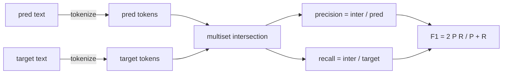
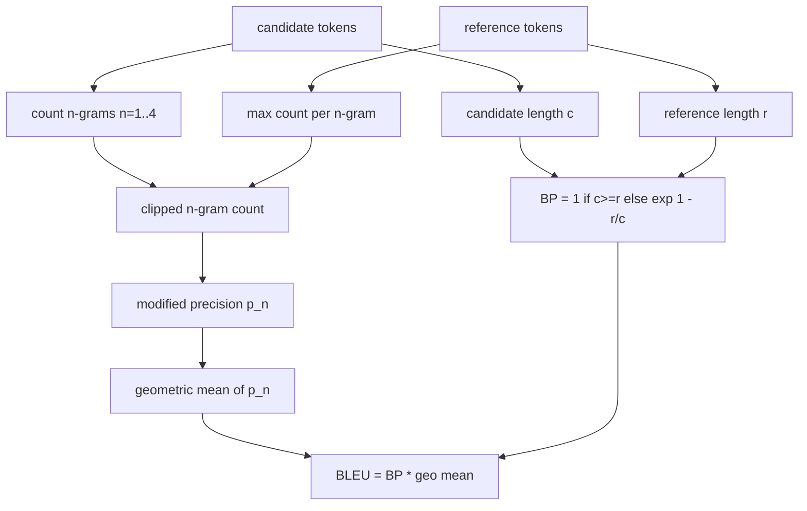

# Klasyczne Metryki

> BLEU, ROUGE-L, F1, exact-match, accuracy. Pięć metryk, które wciąż odpowiadają za większość publikowanych wyników ewaluacji LLM. Zaimplementuj każdą od podstaw, aby wiedzieć, co oznacza dana liczba.

**Typ:** Budowa
**Języki:** Python
**Wymagania wstępne:** Faza 19, ścieżka B — podstawy, lekcja 70
**Czas:** ~90 min

## Cele nauczania

- Zaimplementuj dokładne dopasowanie na poziomie tokenów, F1 i dokładność z jawnymi regułami tokenizacji.
- Zaimplementuj BLEU-4 od podstaw: zmodyfikowana precyzja n-gramów, średnia geometryczna dla n równego 1 do 4, kara za zwięzłość.
- Zaimplementuj ROUGE-L przy użyciu najdłuższego wspólnego podciągu, z kombinacją F-beta precyzji i czułości.
- Dysponuj na podstawie pola metric_name z lekcji 70, aby runner pozostał niezależny od metryk.
- Przypnij zachowanie za pomocą wektorów referencyjnych zaczerpniętych z przepracowanych przykładów, a nie z biblioteki zewnętrznej.

## Dlaczego ponownie implementować

Będziesz czytać artykuły, które podają BLEU 28.3 i inne, które podają BLEU 0.283. Znajdziesz wyniki ROUGE-L różniące się o dziesięć punktów między dwiema bibliotekami, ponieważ jedna obcina do małych liter, a druga nie. Najszybszym sposobem, aby przestać być zdezorientowanym, jest napisanie metryk samodzielnie, a następnie wskazanie linii, w której zadecydowano o tokenizerze i linii, w której zastosowano wygładzanie. Potem porównywanie liczb między artykułami staje się kwestią czytania konfiguracji metryki, a nie kłócenia się o biblioteki.

Stdlib plus numpy wystarczy. BLEU to zliczanie i ograniczanie. ROUGE-L to programowanie dynamiczne. F1 to przecięcie zbiorów na tokenach. Najtrudniejszą częścią jest wybór tokenizera i trzymanie się go.

## Tokenizacja

Tokenizer to `re.findall(r"\w+", text.lower())`. Małe litery, ciągi alfanumeryczne, pomiń interpunkcję. Każda metryka w tej lekcji używa dokładnie tego tokenizera. Runner nie ma wyboru. Jeśli zmienisz tokenizer, używasz innego benchmarka.

```python
TOKEN_RE = re.compile(r"\w+", re.UNICODE)
def tokenize(text):
    return TOKEN_RE.findall(text.lower())
```

To celowe uproszczenie. Produkcyjne konfiguracje będą dbać o CJK, skróty i identyfikatory kodu. Celem lekcji jest pokazanie, że tokenizer to umowa, a nie pokrętło.

## Dokładne dopasowanie

```python
def exact_match(pred, targets):
    return float(any(pred.strip() == t.strip() for t in targets))
```

Zwraca 1.0 lub 0.0 na zadanie. Agregat dla całego zestawu danych to średnia. To koń roboczy dla zadań arytmetycznych, MCQ i krótkich zadań klasyfikacyjnych.

## F1 na poziomie tokenów

Zbuduj multizbiór tokenów dla predykcji i celu. Precyzja to przecięcie multizbiorów podzielone przez multizbiór predykcji. Czułość to to samo przecięcie podzielone przez multizbiór celu. F1 to średnia harmoniczna. Implementacja obsługuje przypadki brzegowe pustej predykcji i pustego celu.



Dla zadań z wieloma celami bierzemy najlepsze F1 z listy celów. To odpowiada zachowaniu w stylu SQuAD powszechnie opisywanemu w literaturze.

## BLEU-4

BLEU to kanoniczna metryka tłumaczenia maszynowego, która wciąż pojawia się w pracach nad streszczaniem. Używana przez nas formulacja to BLEU-4 na poziomie korpusu ze standardową karą za zwięzłość i wygładzaniem addytywnym jeden na zmodyfikowanych liczebnościach n-gramów, aby pojedynczy brakujący 4-gram nie spychał wyniku do zera.

Dla każdej pary kandydat–referencja liczymy zmodyfikowaną precyzję n-gramów dla n równego 1, 2, 3, 4. Zmodyfikowana precyzja ogranicza liczebność n-gramu kandydata przez maksymalną liczebność tego n-gramu w dowolnej referencji, aby kandydat nie mógł zawyżyć wyniku przez powtarzanie jednej frazy. Średnia geometryczna z czterech precyzji jest opakowana przez karę za zwięzłość.



Reguła wygładzania to ta, którą Lin i Och nazwali metodą 1: dodaj jeden zarówno do licznika, jak i mianownika każdej precyzji n-gramów przed logarytmowaniem. Pozwala to uniknąć `log 0`, gdy referencja nie ma pasującego 4-gramu, i pozostaje blisko niewygładzonej wartości dla długich kandydatów.

## ROUGE-L

ROUGE-L porównuje najdłuższy wspólny podciąg sekwencji tokenów kandydata i referencji. LCS uchwyca kolejność słów bez wymuszania ciągłości, dlatego jest domyślną metryką streszczania. Obliczamy długość LCS za pomocą standardowej tablicy programowania dynamicznego, następnie wyprowadzamy czułość jako `lcs / długość referencji`, precyzję jako `lcs / długość kandydata` i łączymy z F-beta, gdzie beta równa się jeden dla symetrycznej postaci F1.

```python
def lcs_length(a, b):
    n, m = len(a), len(b)
    dp = numpy.zeros((n + 1, m + 1), dtype=int)
    for i in range(n):
        for j in range(m):
            if a[i] == b[j]:
                dp[i+1, j+1] = dp[i, j] + 1
            else:
                dp[i+1, j+1] = max(dp[i+1, j], dp[i, j+1])
    return int(dp[n, m])
```

Tablica numpy sprawia, że implementacja jest czytelna; czyste listy Pythona też by działały. Zadania, które wybierają ROUGE-L, płacą koszt O(n m) na zadanie. Dla typowych długości streszczeń pozostaje to poniżej milisekundy.

## Dokładność

Dla zadań klasyfikacji wieloklasowej dokładność sprowadza się do dokładnego dopasowania względem pojedynczego znormalizowanego celu. Udostępniamy ją jako osobną funkcję, aby dyspozytor mógł dysponować na podstawie `metric_name` bez przechodzenia przez porównania ciągów wewnątrz runnera.

## Kontrakt dyspozytora

Pojedynczy punkt wejścia to `score(metric_name, prediction, targets)`. Zwraca liczbę zmiennoprzecinkową w `[0, 1]`. Runner nie rozgałęzia się na nazwie metryki. Przekazuje wywołanie i zapisuje wynik. To jest powierzchnia, którą lekcja 75 przyklei do specyfikacji zadania z lekcji 70.

```python
def score(metric_name, pred, targets):
    if metric_name == "exact_match":
        return exact_match(pred, targets)
    if metric_name == "f1":
        return max(f1_score(pred, t) for t in targets)
    if metric_name == "bleu_4":
        return max(bleu4(pred, t) for t in targets)
    if metric_name == "rouge_l":
        return max(rouge_l(pred, t) for t in targets)
    if metric_name == "accuracy":
        return accuracy(pred, targets)
    raise ValueError(f"unknown metric_name: {metric_name}")
```

`code_exec` jest obsługiwane w lekcji 72 i wstawiane do dyspozytora tam.

## Czego ta lekcja nie robi

Nie wywołuje modelu. Nie normalizuje generacji poza tym, co już zrobiły reguły post-processingu z lekcji 70. Nie oblicza przedziałów ufności. Nie robi BLEURT ani BERTScore (te wymagają modelu i należą do innej lekcji). Chodzi o fundament: pięć metryk, jeden tokenizer, jedna tablica dyspozytorska.

## Jak czytać kod

`main.py` definiuje każdą metrykę jako wolną funkcję plus dyspozytor. Wektory referencyjne znajdują się w bloku `_reference_examples` na dole pliku. Demo uruchamia dyspozytor na ośmiu przykładach i wypisuje wyniki dla każdej metryki. Testy w `code/tests/test_metrics.py` przypinają wektory referencyjne i testują każdy przypadek brzegowy (pusta predykcja, pusta referencja, brak wspólnych tokenów, dokładne dopasowanie, ograniczanie przez powtarzanie fraz).

Czytaj `main.py` od góry do dołu. Funkcje są uporządkowane według złożoności. exact_match i accuracy to jedna linia każda. F1 to sześć linii. BLEU i ROUGE-L to cięższe części i zawierają szczegółowe komentarze na temat reguły wygładzania i rekurencji LCS.

## Idąc dalej

Klasyczne metryki są konieczne, ale niewystarczające. Nagradzają powierzchowne nakładanie się i pomijają znaczenie. Rozwiązaniem jest nałożenie metryk opartych na modelu (BLEURT, BERTScore, GEval), gdy zaufa się klasycznemu fundamentowi. To lekcja na później. Na razie: spraw, aby te pięć działało, przypnij je testami, a będziesz miał stos metryk, który jest audytowalny, szybki i powtarzalny.