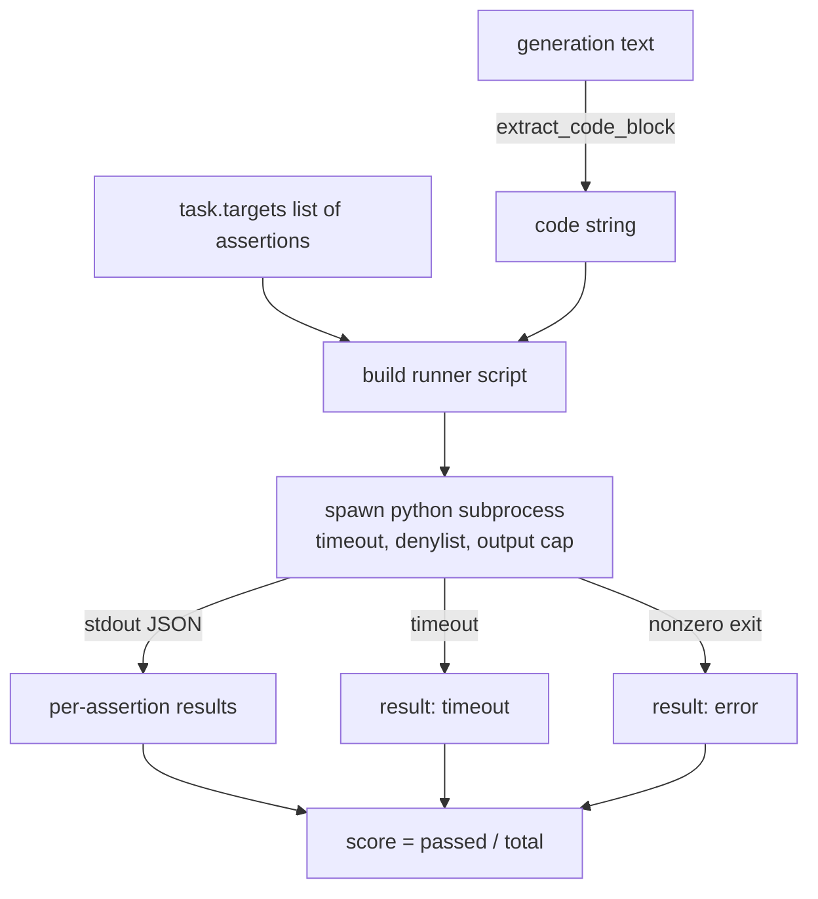
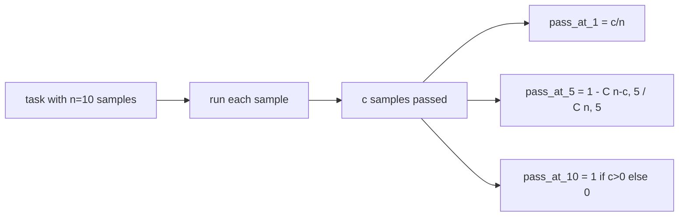

# Metryka Wykonywania Kodu

> Wygenerowany kod jest poprawny, gdy przechodzi testy. Harness ewaluacyjny musi wyodrębnić kod, uruchomić go bez zawieszania hosta i uczciwie podliczyć wskaźniki zaliczeń. Ta lekcja buduje tę powierzchnię.

**Typ:** Budowa
**Języki:** Python
**Wymagania wstępne:** Faza 19, ścieżka B — podstawy, lekcje 70 i 71
**Czas:** ~90 min

## Cele nauczania

- Wyodrębnij blok kodu z dowolnej generacji w sposób zgodny z regułą post-processingu z lekcji 70.
- Wykonaj kod kandydata w izolowanym podprocesie z limitem czasu ściennego, ograniczeniem wyjścia i listą zabronionych importów.
- Oceń zadanie jako ułamek dostarczonych asercji, które przechodzą względem kandydata.
- Oblicz pass-at-k dla zadań, które próbkują wiele generacji z jednego modelu.
- Traktuj awarie sandboksów, błędy składniowe i przekroczenia czasu jako pełnoprawne tryby awarii z odrębnymi kodami wyjścia, które runner może rejestrować.

## Dlaczego izolowany podproces

Wbudowane `exec` jest zagrożeniem dla bezpieczeństwa i stabilności. Wygenerowane `while True: pass` blokuje ewaluację na zawsze. Wygenerowane `import shutil; shutil.rmtree('/')` jest tak katastrofalne, jak brzmi. Rozwiązaniem jest uruchomienie świeżego interpretera Pythona na kandydata, przekazanie kodu przez stdin, zapisanie wyników asercji do stdout i zabicie procesu, jeśli przekroczy limit. Proces ewaluacyjny hosta działa dalej.

Prawdziwe ewaluacje, takie jak HumanEval, MBPP, BigCodeBench i LiveCodeBench, wszystkie używają sandboksa podprocesowego. Niektóre nakładają na to Docker. Zatrzymujemy się na podprocesie z konkretnego powodu: jest przenośny, jest w stdlib i wychwytuje tryby awarii, które mają znaczenie dla edukacyjnej ewaluacji. Produkcyjne wdrożenia dodają seccomp, izolację sieciową i system plików tylko do odczytu. Następna lekcja o zabezpieczaniu znajduje się poza tą ścieżką.

## Kształt zadania code-exec

Zadanie `code_exec` przenosi ciągi asercji w `targets`. Runner wyodrębnia blok kodu z generacji, buduje wokół niego harness testowy i uruchamia wynik.



Wynik to ułamek w `[0, 1]`. Zadanie z trzema asercjami, z których dwie przechodzą, otrzymuje wynik 0,667. Runner zwraca ten sam kształt niezależnie od tego, co się nie powiedzie: awarie podprocesów są mapowane na znormalizowany kod błędu, a nie na ślad stosu Pythona propagujący się do harnessu.

## Lista zabronionych importów

Lista zabronionych importów opiera się na imporcie. Przed uruchomieniem kodu kandydata skrypt runnera przepisuje importy niebezpiecznych modułów na atrapę, która podnosi `ImportError("denied")`. Lista jest celowo konserwatywna: `os.system`, `subprocess`, `socket`, `requests`, `urllib`, `urllib.request`, `urllib.error`, `urllib.parse`, `ctypes`, `shutil`, `http.client`, `asyncio.subprocess`.

Nie udajemy, że jest to nie do przebicia. Zdeterminowany, adversarialny kod może uciec z każdego sandboksa wewnątrzprocesowego w Pythonie. Lista zabronionych importów jest zabezpieczeniem. Limit czasu ściennego i ograniczenie wyjścia są głównymi kontrolami.

```python
DENIED = {
    "os.system": True,
    "subprocess": True,
    "socket": True,
    "shutil": True,
    "requests": True,
    "urllib": True,
    "ctypes": True,
}
```

Opakowujemy kandydata, dodając `import sys` i strażnika, który monkey-patchuje `os.system`, aby podnosił błąd. Pełny szablon znajduje się w `main.py`.

## Limit czasu ściennego

Każdy podproces otrzymuje domyślny budżet trzech sekund czasu ściennego. Runner używa `subprocess.run(..., timeout=t)`. Jeśli limit czasu zostanie przekroczony, runner łapie `TimeoutExpired`, zabija proces i rejestruje powód `timeout` dla zadania. Wynik dla tego zadania to zero. Runner przechodzi dalej.

Limit czasu jest konfigurowalny na zadanie przez `task.metadata.timeout_s`. Testy jednostkowe o długim czasie wykonania mogą poprosić o więcej; walidator z lekcji 70 ogranicza wartość do trzydziestu sekund, aby utrzymać zestaw w ryzach.

## Ograniczenie wyjścia

Podproces może zalać stdout, wyczerpując pamięć hosta. Runner strumieniuje stdout do bufora i zabija proces potomny, gdy tylko całkowity rozmiar przekroczy 256 KB. Wynik jest rejestrowany jako `exit_code = error` z ciągiem szczegółów `"output overflow"`. To zdarza się w praktyce, gdy generacja przypadkowo tworzy nieskończoną pętlę, która wypisuje dane.

## Pass-at-k

Pass-at-k to nieobciążony estymator używany przez HumanEval i podobne. Danych `n` niezależnych próbek na zadanie i `c` z nich przechodzących, prawdopodobieństwo, że próbka rozmiaru `k` z `n` zawiera co najmniej jedno przechodzące rozwiązanie, wynosi:

```
pass_at_k(n, c, k) = 1 - C(n - c, k) / C(n, k)
```

Gdy `n - c < k`, licznik jest niezdefiniowany, a wartość wynosi `1`. Implementacja obsługuje ten przypadek brzegowy bezpośrednio. Udostępniamy `pass_at_k(n, c, k)` do użytku przez warstwę rankingu w lekcji 74.



## Kody wyjścia

Runner zwraca jeden z pięciu wyników na zadanie:

- `pass`, gdy każda asercja przeszła.
- `assertion_fail`, gdy kod został uruchomiony, ale co najmniej jedna asercja nie przeszła.
- `syntax_error`, gdy kod nie zaimportował się lub miał SyntaxError.
- `timeout`, gdy czas ścienny wygasł.
- `error` dla każdej innej awarii, w tym trafień na liście zabronionych importów i przepełnienia wyjścia (przepełnienie pojawia się ze szczegółem `"output overflow"`).

Wynik to wciąż ułamek. Kod wyjścia to metadane. Lekcje pochodne mogą zdecydować, czy liczyć timeout jako zero, czy jako brakujące dane.

## Czego ta lekcja nie robi

Nie daje prawdziwego sandboksa. Nie uruchamia niezaufanego kodu z otwartej sieci. Nie obsługuje zadań stanowych, takich jak operacje wejścia/wyjścia plików czy wywołania sieciowe. Te wymagają kontenera lub mikroVM. Celem tej lekcji jest umowa: izolowany podproces, lista zabronionych importów, limit czasu, ograniczenie wyjścia, czysty słownik kodów wyjścia i matematyka pass-at-k.

## Jak czytać kod

`main.py` definiuje `extract_code`, `run_candidate`, `score_code_exec` i `pass_at_k`. Skrypt runnera podprocesu jest budowany jako ciąg znaków i przekazywany jako `-c` do świeżego interpretera Pythona. Testy w `code/tests/test_exec.py` ćwiczą cztery kody wyjścia plus pass-at-k na przepracowanych przykładach zaczerpniętych ze stylu HumanEval.

Czytaj `main.py` od góry do dołu. Szablon runnera jest kluczowym elementem. Wpatruj się w pętlę asercji, aż będziesz w stanie przewidzieć kopertę JSON, którą zapisuje z powrotem do procesu nadrzędnego.

## Idąc dalej

Gdy kształt podprocesu działa, następną kwestią jest przenośność. Różne wersje Pythona inaczej obsługują SIGKILL w systemie Windows. Najczystszym rozwiązaniem jest umieszczenie runnera w obrazie Docker. Kolejną rzeczą jest zastąpienie ciągów asercji prawdziwymi plikami testów jednostkowych, aby ewaluacja odpowiadała temu, co robi produkcyjne CI. Przestań wtedy nazywać ciągi asercji testami; są to testy zabawkowe i mają zabawkowe tryby awarii.