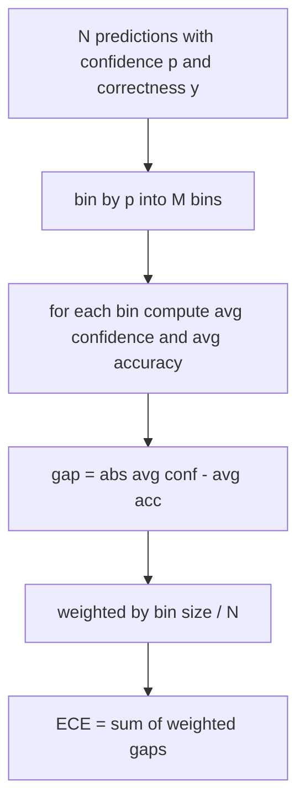
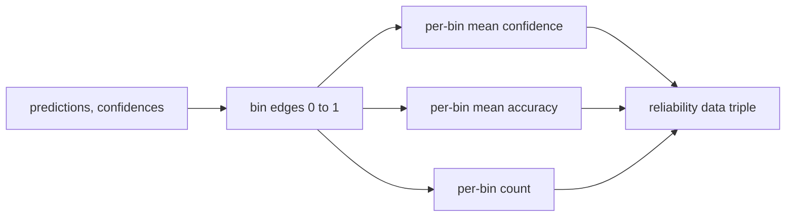

# Perpleksja i Kalibracja

> Jeśli Twój model mówi, że jest w 90 procentach pewny na tysiącu odpowiedzi, a sześćset z nich jest poprawnych, nie jest dobrze skalibrowany. Kalibracja to połowa wiarygodnej ewaluacji. Drugą połową jest perpleksja, która mówi, czy model w ogóle uważa tekst wyłączony z treningu za prawdopodobny.

**Typ:** Budowa
**Języki:** Python
**Wymagania wstępne:** Faza 19, ścieżka B — podstawy, lekcje 70 i 71
**Czas:** ~90 min

## Cele nauczania

- Oblicz perpleksję na poziomie tokenów na korpusie wyłączonym z treningu na podstawie negatywnych log-prawdopodobieństw tokenów dostarczonych przez adapter modelu.
- Oblicz oczekiwany błąd kalibracji (ECE) klasyfikatora lub ewaluacji wielokrotnego wyboru z przedziałowanych przewidywanych prawdopodobieństw.
- Oblicz wynik Brier (średni błąd kwadratowy względem wskaźnika poprawności) i wyjaśnij, kiedy robi to, czego ECE nie robi.
- Zbuduj dane diagramu wiarygodności potrzebne do narysowania krzywej ufność-kontra-dokładność.
- Podłącz wszystkie trzy do harnessu ewaluacyjnego, aby runner mógł dołączyć liczby `perplexity`, `ece` i `brier` do raportu modelu.

## Co mówi perpleksja

Perpleksja to wykładnicza średnia negatywnego logarytmu wiarygodności na token. Niższa znaczy lepiej. Perpleksja równa jeden oznacza, że model przypisuje prawdopodobieństwo jeden każdemu faktycznemu tokenowi. Perpleksja równa rozmiarowi słownika oznacza, że model jest jednostajny i niczego się nie nauczył. Rzeczywiste liczby mieszczą się pomiędzy: silny model bazowy z 2026 roku na WikiText-103 osiąga około osiem do dwunastu. Słaby na tym samym tekście osiąga pięćdziesiąt plus.

Harness nie oblicza log-prawdopodobieństw samodzielnie. Pochodzą one z adaptera modelu. Harness agreguje: przyjmuje listę log-prawdopodobieństw na token, listę liczebności tokenów na sekwencję i zwraca perpleksję korpusu.

```python
def perplexity(neg_log_probs, token_counts):
    total_nll = sum(neg_log_probs)
    total_tokens = sum(token_counts)
    return math.exp(total_nll / total_tokens)
```

Implementacja obsługuje przypadki brzegowe zerowej liczby tokenów i asertywnie sprawdza, że negatywne log-prawdopodobieństwa są nieujemne. Częstym błędem jest zapomnienie o negacji: adapter zwracający `log p` zamiast `-log p` daje perpleksję poniżej jeden, co jest niemożliwe. Funkcja wychwytuje to jako naruszenie umowy.

## Co mierzy ECE

Oczekiwany błąd kalibracji grupuje predykcje według ich ufności w ustaloną liczbę przedziałów, a następnie mierzy średnią lukę między ufnością a dokładnością w przedziałach, ważoną rozmiarem przedziału.



Standardowa formulacja używa dziesięciu przedziałów o równej szerokości na `[0, 1]`. Implementacja obsługuje dowolną dodatnią liczbę całkowitą. Udostępniamy parametr `bins`, aby runner mógł wybrać między konwencją publikacyjną (10) a konwencją porównawczą (15).

ECE jest obciążone przez liczbę przedziałów i rozmiar próbki. Przy dziesięciu przedziałach i stu predykcjach nie można odróżnić ECE 0,02 od szumu losowego. Implementacja zwraca liczbę wypełnionych przedziałów wraz z ECE, aby runner mógł odmówić raportowania pojedynczej liczby na zbyt małej próbce.

## Co wynik Brier robi, czego ECE nie robi

ECE dba tylko o średnie luki. Model, który jest zbyt pewny w połowie przedziałów i zbyt niepewny w drugiej połowie, może mieć niski ECE, będąc jednocześnie słabo skalibrowanym lokalnie. Wynik Brier mierzy błąd kwadratowy względem rzeczywistego wyniku na predykcję, więc karze rozrzut bezpośrednio.

Dla wyników binarnych Brier to `mean((p_i - y_i)^2)`. Rozkłada się na wiarygodność, rozdzielczość i niepewność. Obliczamy wynik i dekompozycję. Runner raportuje skalar, ale rejestruje dekompozycję dla pulpitu nawigacyjnego.

```python
def brier(p, y):
    return float(np.mean((p - y) ** 2))
```

## Dane diagramu wiarygodności

Diagram wiarygodności wykreśla przewidywaną ufność względem empirycznej dokładności w każdym przedziale. Przekątna to idealna kalibracja. Funkcja zwraca trzy tablice: średnią ufność na przedział, średnią dokładność na przedział i liczebność na przedział. Kod rysujący znajduje się gdzie indziej; ta lekcja kończy się na kształcie danych.



Zwracana krotka to to, czego potrzebuje warstwa wywołująca, aby narysować wykres lub obliczyć niestandardowy wariant ECE (adaptacyjny ECE, ECE z przeszukiwaniem itp.). Zwracamy tablice numpy, aby kod pochodny nie musiał konwertować.

## Źródła ufności

Harness nie zakłada, że ufność pochodzi z softmax. Akceptuje dowolną liczbę w `[0, 1]` na predykcję. Dla zadań wielokrotnego wyboru naturalną ufnością jest `softmax nad log-prawdopodobieństwami opcji`. Dla dowolnego tekstu naturalną ufnością jest samodeklarowane prawdopodobieństwo modelu lub eksponenta średniego log-prawdopodobieństwa. Ewaluacja po prostu konsumuje liczbę. Skąd pochodzi, to zadanie adaptera.

## Przypadki brzegowe

- Wszystkie predykcje błędne: ECE to średnia ufność, Brier wysoki, perpleksja taka, jaką model przypisuje tekstowi.
- Wszystkie predykcje poprawne z wysoką ufnością: ECE blisko zera, Brier blisko zera.
- Doskonale niepewny predyktor przy p=0,5: ECE to 0,5 minus dokładność, Brier to 0,25 minus składnik korekcyjny.
- Puste wejście: ECE, Brier i wiarygodność zwracają `0.0` (lub tablice wypełnione zerami). Perpleksja zwraca `NaN` dla przypadku zerowej liczby tokenów. Żadna z tych ścieżek nie emituje ostrzeżenia; runner sprawdza wartości i decyduje, czy raportować, czy pominąć.

Te przypadki są wbudowane w testy. Prawdziwy model na prawdziwym benchmarku ich nie napotka, ale błędny adapter lub mała próbka tak, i runner nie powinien się zawieszać.

## Dyspozycja

Kalibracja nie jest metryką na zadanie, taką jak F1. To raport na model. Runner gromadzi pary `(ufność, poprawność)` w całej ewaluacji i oblicza ECE, Brier oraz dane wiarygodności raz. Perpleksja jest obliczana na korpusie tekstowym wyłączonym z treningu, oddzielnie od oceny zadanie po zadaniu.

Interfejs to:

```python
report = CalibrationReport.from_predictions(confidences, correct)
report.ece          # float
report.brier        # float
report.reliability  # tuple of three numpy arrays
report.populated_bins  # int
```

`PerplexityResult.from_token_nll(neg_log_probs, token_counts)` zwraca perpleksję i średnie negatywne log-prawdopodobieństwo na token.

## Czego ta lekcja nie robi

Nie wywołuje modelu. Nie implementuje softmax. Nie szacuje ufności z tokenów wyjściowych; to zadanie adaptera. Nie robi skalowania temperaturowego ani skalowania Platta; to poprawki post-hoc, które należą do innej lekcji. Celem tej lekcji jest uczynienie trzech liczb (perpleksja, ECE, Brier) wiarygodnymi i powtarzalnymi.

## Jak czytać kod

`main.py` definiuje `perplexity`, `expected_calibration_error`, `brier_score`, `reliability_diagram` oraz klasy danych `CalibrationReport` / `PerplexityResult`. Demo działa na syntetycznych predykcjach, gdzie znana jest rzeczywista prawda: dobrze skalibrowany model, zbyt pewny siebie i zbyt niepewny. Testy w `code/tests/test_calibration.py` przypinają każdy przypadek brzegowy plus wartości referencyjne dla syntetycznych predyktorów.

Czytaj `main.py` od góry do dołu. Kolejność funkcji idzie od skalara do wektora do raportu. Każda funkcja ma krótki docstring z matematyką i umową.

## Idąc dalej

Kalibracja to najbardziej ignorowana oś w publikowanych ewaluacjach. Większość rankingów podaje pojedynczą liczbę dokładności i kończy. Model, który wygrywa na dokładności i przegrywa na Brier, jest gorszym wdrożeniem produkcyjnym niż model, który osiąga kilka punktów niżej na dokładności, ale wiarygodnie raportuje swoją niepewność. Gdy masz już infrastrukturę kalibracji, dodaj skalowanie temperaturowe na oddzielnym wycinku walidacyjnym, przelicz ECE i obserwuj, jak luka się zmniejsza. To osobna lekcja, ale fundament leży tutaj.