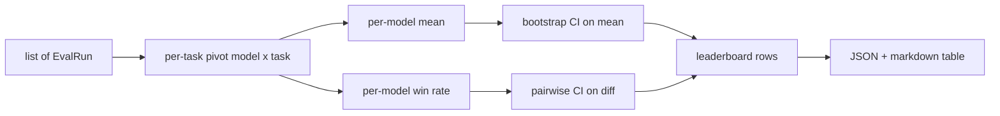
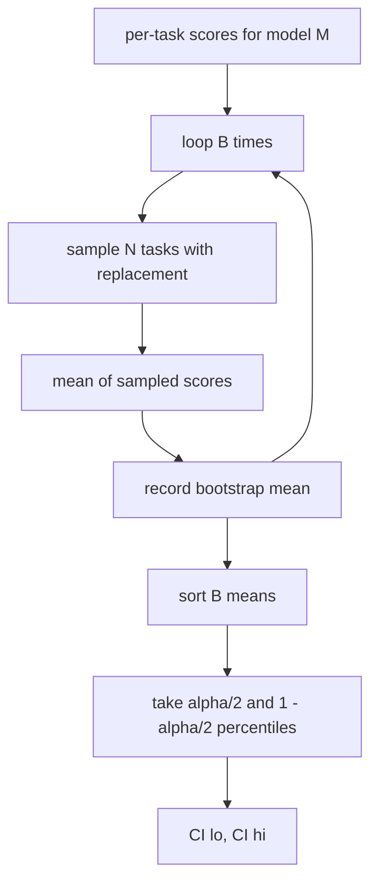

# Agregacja Rankingu

> Wyniki na zadanie są łatwe. Rankingi na model w zróżnicowanych zadaniach są trudniejsze. Istotność statystyczna na rankingu z tysiącem predykcji to część, którą wszyscy pomijają. Ta lekcja jej nie pomija.

**Typ:** Budowa
**Języki:** Python
**Wymagania wstępne:** Faza 19, ścieżka B — podstawy, lekcje 70, 71, 73
**Czas:** ~90 min

## Cele nauczania

- Agreguj wyniki na zadanie dla wielu modeli i wielu zadań w schludny wiersz na model.
- Normalizuj heterogeniczne wyniki, aby wskaźniki zaliczeń i wartości BLEU nie wpływały nadmiernie na agregat.
- Rankinguj modele według średniej i według wskaźnika wygranych oraz wyjaśnij, kiedy każdy z nich jest właściwym podsumowaniem.
- Oblicz przedziały ufności bootstrap dla średniego wyniku na model i dla różnic parami.
- Wyjściem rankingu jest raport JSON i tabela markdown, którą runner z lekcji 75 może wkleić do komentarza CI.

## Kształt wejścia

Agregator konsumuje listę rekordów `EvalRun`:

```python
@dataclass
class EvalRun:
    model_id: str
    task_id: str
    metric_name: str
    score: float          # in [0, 1]
    category: str
```

Runner z lekcji 75 emituje jeden rekord na parę `(model, zadanie)`. Agregator nie interesuje się, jak wynik został wyprodukowany. Oczekuje, że normalizacja już nastąpiła: każdy wynik jest w `[0, 1]`.

## Wyjście

Powstają trzy tabele:



Wiersz rankingu zawiera: `model_id`, `mean_score`, `mean_ci_lo`, `mean_ci_hi`, `win_rate`, `tasks_completed` i opcjonalną mapę `categories` dla średniej na kategorię.

## Normalizacja

Jeśli jedno zadanie punktuje w `[0, 1]`, a drugie w `[0, 100]`, drugie po cichu dominuje średnią. Agregator sprawdza, czy każdy wynik wejściowy mieści się w `[0, 1]` i odrzuca uruchomienie w przeciwnym razie. Poprawka leży po stronie nadrzędnej: metryka powinna już zwracać ułamek. Lekcje 71–73 egzekwują tę umowę.

## Średnia i wskaźnik wygranych

Dwa schematy rankingowe służą różnym celom.

Średni wynik to średnia wyników na zadanie dla jednego modelu. To nagłówek, który podają rankingi. Jest wrażliwy na wartości odstające i na brak równowagi zadań.

Wskaźnik wygranych liczy, jak często model pokonuje każdy inny model na tym samym zadaniu. Dla każdego zadania model z najwyższym wynikiem wygrywa (remisy są dzielone). Wskaźnik wygranych równa się wygranym podzielonym przez liczbę zadań, w których model ma wynik. Jest mniej wrażliwy na wartości odstające i różnice skali, ale traci informację.

```python
def win_rate(model_id, runs_by_task, all_models):
    wins, total = 0, 0
    for task_id, runs in runs_by_task.items():
        scores = {r.model_id: r.score for r in runs if r.model_id in all_models}
        if model_id not in scores:
            continue
        total += 1
        best = max(scores.values())
        if scores[model_id] >= best:
            wins += 1
    return wins / total if total else 0.0
```

Harness raportuje oba. Runner z lekcji 75 domyślnie rankinguje według średniej; kolumna markdown dla wskaźnika wygranych jest tuż obok, na wypadek gdyby użytkownik wolał ją.

## Przedziały ufności bootstrap

Średnie na model są dostarczane z przedziałem ufności oszacowanym przez bootstrap przez próbkowanie zadań ze zwracaniem. Próbkujemy identyfikatory zadań ze zwracaniem, obliczamy średnią z próbkowanego zestawu, powtarzamy `B` razy i bierzemy przedział percentylowy na poziomie `alpha`.



Dla porównań parami bootstrapujemy różnicę na zadanie `score_A - score_B`, bierzemy przedział percentylowy i raportujemy go. Użytkownik odczytuje, czy przedział wyklucza zero. Jeśli tak, różnica jest istotna na poziomie alpha. Jeśli nie, ranking traktuje modele jako remisujące.

Funkcje pomocnicze niskiego poziomu (`bootstrap_mean_ci`, `bootstrap_pairwise_diff`) domyślnie używają `B=1000`; publiczne agregatory (`aggregate`, `pairwise_diffs`) domyślnie używają `b=500`, aby demo i testy pozostały szybkie. Domyślna alpha to 0,05. Lekcja utrzymuje bootstrap w czystym numpy, bez scipy.

## Kategorie

Jeśli `EvalRun.category` jest ustawione, agregator raportuje również średnią na kategorię. To kolumna na każdym rankingu, która mówi `math`, `reasoning`, `code`, `safety`. Pozwala runnerowi zauważyć, czy model jest ogólnie dobry, ale słaby w kodzie — to informacja, którą nagłówek średniej ukrywa.

## Renderowanie markdown

Ranking jest renderowany jako tabela markdown:

```text
| Rank | Model | Mean | 95% CI | Win rate | Tasks |
|------|-------|------|--------|----------|-------|
| 1    | gpt   | 0.78 | 0.74-0.82 | 0.62 | 50 |
| 2    | claude| 0.75 | 0.71-0.79 | 0.34 | 50 |
| 3    | random| 0.10 | 0.07-0.13 | 0.04 | 50 |
```

Tabela jest sortowana według średniego wyniku. Przedział ufności jest renderowany do dwóch miejsc po przecinku. Długie identyfikatory modeli są skracane do dwudziestu znaków.

## Czego ta lekcja nie robi

Nie uruchamia modeli. Nie wywołuje warstwy metryk. Nie implementuje adaptacyjnego ECE ani innych wariantów kalibracji; to lekcja 73. Nie implementuje ważenia zadań. Każde zadanie liczy się tutaj tak samo. Produkcyjne rankingi ważą zadania; pozostawiamy ten hak otwarty przez pole `weight`, ale ignorujemy je w agregatorze. Dodaj ważenie w lekcji uzupełniającej, jeśli potrzebujesz.

## Jak czytać kod

`main.py` definiuje `EvalRun`, `LeaderboardRow`, `aggregate`, `bootstrap_mean_ci`, `bootstrap_pairwise_diff` i `render_markdown`. Demo buduje syntetyczny zestaw trzech modeli i dwunastu zadań, agreguje i wypisuje ranking plus tabelę różnic parami. Testy w `code/tests/test_leaderboard.py` przypinają bootstrap, renderowanie markdown, przypadki brzegowe wskaźnika wygranych i zachowanie dla pustego wejścia.

Czytaj `main.py` od góry do dołu. Kształt danych (`EvalRun`, `LeaderboardRow`) jest pierwszy, agregator następny, bootstrap trzeci, renderowanie ostatnie. Każda funkcja ma skupioną umowę.

## Idąc dalej

Naturalnym następnym krokiem jest istotność zadań sparowanych zamiast bootstrapu niesparowanego. Jeśli model A i B oba uruchomiły te same sto zadań, właściwym testem jest bootstrap sparowany na różnicach zadanie po zadaniu, który implementujemy. Dalej, potrzebny jest bootstrap hierarchiczny, który respektuje rodziny zadań (problemy matematyczne nie są od siebie niezależne; wzorzec błędu arytmetycznego wpływa na dziesięć z nich). To jest uzupełnienie. Celem tej lekcji jest poprawne ustawienie fundamentu, aby ewaluacja raportowała liczbę, którą możesz obronić.