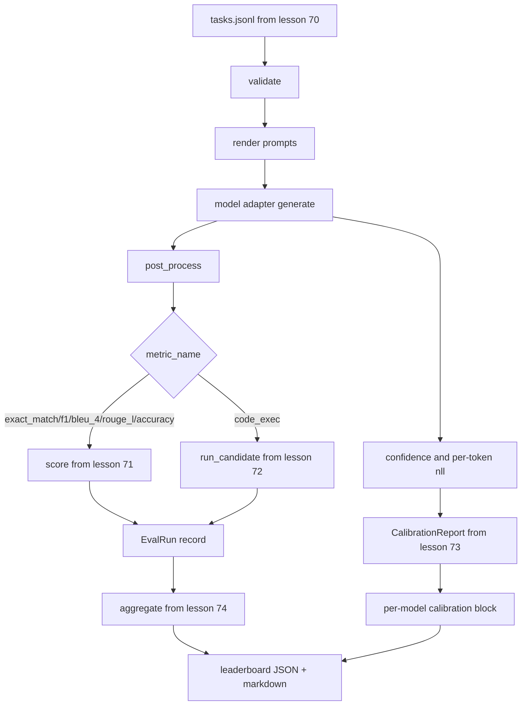

# Kompleksowy Runner Ewaluacyjny

> Pięć lekcji instalacji, jedna lekcja, aby je skleić. Runner czyta specyfikację zadania z lekcji 70, wywołuje model przez adapter, ocenia z lekcjami 71 i 72, dołącza raport kalibracji z lekcji 73 i emituje ranking z lekcji 74. Demo samo się kończy.

**Typ:** Budowa
**Języki:** Python
**Wymagania wstępne:** Faza 19, ścieżka B — podstawy, lekcje 70–74
**Czas:** ~90 min

## Cele nauczania

- Zdefiniuj interfejs `ModelAdapter`, który każdy model (atrapa, lokalny, API) może zaspokoić małą powierzchnią metod.
- Uruchom ewaluację na pliku JSONL z zestawami testowymi z równoległym wykonywaniem zadań w puli wątków roboczych.
- Złóż warstwę metryk (exact_match, F1, BLEU-4, ROUGE-L, code_exec) z warstwą kalibracji w jednym przebiegu.
- Emituj rekordy `EvalRun` na model i przekaż je bezpośrednio do agregatora rankingu.
- Wyjściem jest zarówno raport JSON, jak i tabela markdown; samo zakończenie z kodem zero dla czystego uruchomienia, niezerowym dla błędu walidacji lub wykonania.

## Potok



Runner jest punktem integracji. Każda lekcja 70–74 posiada jeden moduł, który runner składa. Runner nie powiela żadnej logiki z tych modułów: importuje je.

## Interfejs adaptera

Adapter jest szwem między runnerem a dowolnym modelem. Interfejs jest celowo mały.

```python
class ModelAdapter:
    model_id: str

    def generate(self, prompt: str, task: TaskSpec) -> Generation: ...
```

`Generation` to klasa danych z:

- `text`: swobodne wyjście modelu
- `confidence`: liczba zmiennoprzecinkowa w `[0, 1]` reprezentująca samodeklarowane prawdopodobieństwo modelu dla odpowiedzi
- `token_nll`: opcjonalna suma negatywnych log-prawdopodobieństw wygenerowanych tokenów
- `token_count`: opcjonalna liczba wygenerowanych tokenów

Adaptery zastępcze w runnerze zapewniają trzy smaki: `RuleBasedAdapter` (deterministyczny, prawie idealny), `NoisyAdapter` (zbyt pewny siebie, często błędny) i `BiasedAdapter` (dobry w jednej kategorii, okropny w innej). Demo uruchamia wszystkie trzy na zestawie z lekcji 70.

## Równoległe wykonywanie

Runner używa `concurrent.futures.ThreadPoolExecutor` do równoległego uruchamiania zadań na model. Liczba wątków roboczych domyślnie równa się mniejszej z ośmiu i liczby zadań. Wątki są wystarczające, ponieważ wąskim gardłem dla rzeczywistych wywołań modeli jest wejście/wyjście sieciowe. Ścieżka code-exec uruchamia własny podproces wewnątrz zadania, a executor tylko planuje oczekiwanie.

Dla deterministycznych testów runner udostępnia `run_eval(adapters, tasks, parallel=False)`, aby testy mogły ustalić kolejność wykonania.

## Pętla oceny w jednym przebiegu

Dla każdego zadania:

1. Renderuj prompt (prefiks few-shot plus treść prompta).
2. Wywołaj adapter i zmierz czas wywołania.
3. Przetwórz generację zgodnie z regułą zadania.
4. Dysponuj do warstwy metryk.
5. Zbuduj rekord `EvalRun` z wynikiem i metadanymi metryki.
6. Dołącz parę `(ufność, poprawność)` do bufora kalibracji.

Sygnał `poprawność` to `score >= 1.0` dla metryk w stylu exact_match (`exact_match`, `accuracy`, `code_exec`) i `score >= 0.5` dla metryk stopniowanych. Próg żyje w `_correct_from_score`, a runner nie udostępnia publicznego nadpisania.

## Agregacja

Po tym, jak każde zadanie ma wynik, runner wywołuje `aggregate` i `pairwise_diffs` z lekcji 74 oraz `CalibrationReport.from_predictions` z lekcji 73. Wyjściem jest pojedyncza koperta JSON:

```json
{
  "leaderboard": [...],
  "pairwise": [...],
  "calibration": {
    "model_id_a": {"ece": 0.04, "brier": 0.10, "populated_bins": 8, ...},
    ...
  },
  "summary": {
    "tasks": 10,
    "models": 3,
    "wall_seconds": 1.2
  }
}
```

Runner zapisuje również tabelę markdown na standardowe wyjście, aby użytkownik mógł wkleić wynik do recenzji PR.

## Samo kończące się demo

Demo uruchamia trzy zastępcze adaptery na dziesięciu zadaniach testowych z lekcji 70. Czas ścienny powinien wynosić poniżej dziesięciu sekund. Kod wyjścia to zero dla czystego uruchomienia.

Kryteria czystego uruchomienia:

- Każde zadanie zweryfikowane w ramach lekcji 70.
- Każde zadanie ocenione w ramach lekcji 71 i 72.
- Raport kalibracji zagregowany w ramach lekcji 73 bez błędów.
- Ranking umieścił adapter oparty na regułach ściśle powyżej adaptera losowego.

Jeśli którekolwiek z nich się zepsuje, runner kończy się z kodem niezerowym ze strukturalnym błędem w kopercie JSON.

## Czego ta lekcja nie robi

Nie wywołuje prawdziwego modelu. Nie implementuje przepływu klucza API ani obsługi limitów szybkości. Nie implementuje strumieniowania ani częściowej generacji; adapter zwraca jedną generację na wywołanie. Nie robi ponowień ani buforowania. Te kwestie leżą na warstwie adaptera; runner jest niezależny od metryk i dostawców.

## Jak czytać kod

`main.py` to integracja. Importuje z pozostałych pięciu modułów lekcyjnych przez mały pomocnik `_load_sibling`, który rozwiązuje je względną ścieżką. Klasy danych `Generation`, `EvalReport` i `ModelAdapter` są zdefiniowane lokalnie. Zastępcze adaptery znajdują się na dole pliku.

Czytaj `main.py` od góry do dołu. Przejrzyj importy, następnie spójrz na `run_eval`, potem `_score_one`, potem adaptery. Demo na końcu jest punktem wejścia.

Testy w `code/tests/test_runner.py` przypinają interfejs adaptera, pętlę jednoprzebiegową, równoważność równoległy-vs-sekwencyjny, bufor kalibracji i kształt koperty JSON.

## Idąc dalej

Ten runner to fundament. Produkcyjny system ewaluacyjny dodaje: pamięć podręczną wyników kluczowaną przez `(task_id, model_id, model_version)`, rejestr kosztów śledzący dolary i tokeny na uruchomienie, warstwę ponowień z backoffem na limitach szybkości, politykę próbkowania dla zadań pass-at-k oraz strumieniowy format wyjścia dla długich zestawów. Każda z tych kwestii jest pojedynczą troską, która opakowuje runner bez zmiany warstwy metryk lub agregacji. To rozdzielenie jest sednem umowy.

Dodaj adapter dla prawdziwego dostawcy, gdy już masz działające atrapy. Wybierz takiego z darmowym poziomem, napisz trzydzieści linii kleju, obserwuj, jak ranking się zapala. Następnie dodaj drugiego dostawcę i pozwól harnessowi wykonać pracę.