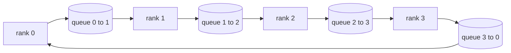

# Operacje Kolektywne od Podstaw

> Cztery operacje kolektywne, które trzymają trening rozproszony w całości, to allreduce, broadcast, allgather i reduce_scatter. Każdy inny prymityw oferowany przez framework treningowy jest opakowaniem wokół nich. Zbuduj je raz przez siatkę `multiprocessing.Queue`, zweryfikuj względem implementacji referencyjnej, a reszta ścieżki stanie się instalacją.

**Typ:** Budowa
**Języki:** Python
**Wymagania wstępne:** Faza 19, ścieżka C, lekcje 42–49
**Czas:** ~90 min

## Cele nauczania

- Zaimplementuj pierścieniowy allreduce w dwóch przebiegach (reduce-scatter, a następnie allgather) i udowodnij, że objętość komunikacji na rangę wynosi 2(N-1)/N bajtów na element.
- Zbuduj broadcast, allgather i reduce_scatter na bazie transmisji punkt-punkt przez `multiprocessing.Queue`.
- Zweryfikuj każdy prymityw względem referencji `torch.distributed` z backendem gloo dla tych samych danych wejściowych.
- Uzasadnij wybór pierścienia kontra drzewa w zależności od kształtu klastra, opóźnienia bazowego i górnego limitu przepustowości.

## Problem

Naiwny allreduce na N rangach wysyła N razy tensor do korzenia i nadaje N razy z powrotem. Przepustowość skaluje się jako O(N) na rangę, korzeń staje się wąskim gardłem, a minimalny czas ścienny to najwolniejsze łącze razy N. Pierścieniowy allreduce spłaszcza to w 2(N-1) fragmentów rozmiaru T/N, więc bajty na rangę spadają do 2T(N-1)/N niezależnie od rozmiaru klastra. Allreduce drzewiasty wygrywa dla małego N i łączy o wysokim opóźnieniu, ponieważ głębokość wynosi log2(N) skoków zamiast 2(N-1). Wybierz złą topologię dla kształtu klastra, a najwolniejsze GPU dyktuje czas kroku.

Każdy framework rozproszonego treningu, który przeczytasz w tej ścieżce, zależy od tych czterech prymitywów. PyTorch DDP synchronizuje gradienty jednym allreduce na kubełek parametrów. ZeRO sharduje stan optymalizatora przez reduce_scatter i nadaje zaktualizowane parametry przez allgather. FSDP zamienia cały forward w allgather plus reduce_scatter. Pipeline parallel potrzebuje broadcast dla aktywacji między grupami etapów. Jeśli nie potrafisz zaimplementować czterech operacji kolektywnych, nie możesz rozumować o tym, dlaczego trening się zacina, dlaczego niedopasowanie gradientów pojawia się na randze 3 lub dlaczego bańka pipeline'u podwaja się po zmianie topologii.

## Koncepcja



### Pierścieniowy allreduce w dwóch przebiegach

Podziel tensor na N równych fragmentów indeksowanych 0..N-1. Każda ranga jest właścicielem fragmentu o indeksie równym swojej randze. Przebieg 1, reduce-scatter, wykonuje N-1 kroków. W kroku s ranga r wysyła fragment (r - s) mod N do rangi (r + 1) mod N i odbiera fragment (r - s - 1) mod N od rangi (r - 1) mod N, akumulując odebrany fragment w swojej lokalnej kopii. Po N-1 krokach ranga r jest właścicielem pełnej sumy dla fragmentu r. Przebieg 2, allgather, wykonuje kolejne N-1 kroków i obraca gotowe fragmenty wokół pierścienia, aż każda ranga będzie miała pełną sumę dla każdego fragmentu.

| Prymityw | Bajty na rangę | Kroki | Kiedy używać |
|---|---|---|---|
| Pierścieniowy allreduce | 2T(N-1)/N | 2(N-1) | Duże T, jednorodny klaster z szybkimi łączami |
| Drzewiasty allreduce | T log2(N) | 2 log2(N) | Małe T lub łącza o wysokim opóźnieniu |
| Broadcast | T | log2(N) drzewo | Inicjalizacja parametrów, konfiguracja skalarna |
| Allgather | T(N-1)/N | N-1 | Forward shardowany, ZeRO odshardowanie |
| Reduce_scatter | T(N-1)/N | N-1 | ZeRO shardowanie gradientów |

### Siatka kolejek jako zamiennik NCCL

NCCL działa przez PCIe i NVLink ze sprzętowo odciążonymi redukcjami. Na CPU nie masz tego. `multiprocessing.Queue` na krawędź pierścienia daje uporządkowaną dostawę punkt-punkt z pojedynczym producentem i pojedynczym konsumentem. Redukcja odbywa się w przestrzeni użytkownika, więc płacisz narzut Pythona, ale wzór na łączu jest identyczny z pierścieniowym allreduce NCCL. Rozumuj o poprawności na wersji z kolejkami, a zachowanie klastra z niego wynika.

### Weryfikacja względem gloo

Każdy prymityw ląduje z testem jednostkowym, który porównuje jego wyjście z `torch.distributed` zainicjalizowanym z backendem gloo na tym samym tensorze przy tym samym rozmiarze świata. Jeśli twój pierścieniowy allreduce różni się od gloo o więcej niż epsilon float32, test nie przechodzi. Weryfikacja względem implementacji referencyjnej jest nie do negocjacji; bez niej prymityw wygląda poprawnie aż do kroku 10000 prawdziwego treningu.

## Zbuduj To

`code/main.py` implementuje:

- Klasa `Mesh`, która łączy N instancji `multiprocessing.Queue` w pierścień i udostępnia `send(dst, tensor)` oraz `recv(src)` na rangę.
- `ring_allreduce(mesh, rank, world_size, tensor)` uruchamiający dwuprzebiegowy algorytm.
- `broadcast(mesh, rank, world_size, tensor, src)` przez logarytmiczne drzewo.
- `allgather(mesh, rank, world_size, tensor)` używający N-1 rotacji.
- `reduce_scatter(mesh, rank, world_size, tensor)` jako pierwsza połowa allreduce.
- `_gloo_reference(op, world_size, tensor)` uruchamiający te same dane wejściowe przez `torch.distributed` z gloo do porównania bajt po bajcie.

Uruchom:

```bash
python3 code/main.py
```

Wynik: tabela weryfikacyjna na prymityw porównująca wyjścia siatki kolejek i gloo, a następnie licznik bajtów na rangę dowodzący skalowania 2T(N-1)/N.

## Wzorce produkcyjne w praktyce

Trzy wzorce utwardzają prymitywy na tyle, by można je było wdrożyć.

**Grupuj gradienty przed allreduce.** Model z 1 miliardem parametrów ma dziesiątki tysięcy tensorów gradientów. Jeden allreduce na tensor płaci opóźnienie bazowe N razy. DDP grupuje gradienty w kubełki o rozmiarze ~25 MB i wykonuje jeden allreduce na kubełek; małe tensory jadą na grzbiecie dużych. Bez grupowania narzut opóźnienia dominuje nad krokiem.

**Nakładaj komunikację na obliczenia.** Backward oblicza gradienty warstwa po warstwie w odwrotnej kolejności. W momencie, gdy gradient ostatniej warstwy jest gotowy, uruchom jego allreduce, podczas gdy następna warstwa kontynuuje obliczenia. PyTorch DDP łączy to z hakami gotowości kubełka. Nakładanie zmniejsza widoczny czas komunikacji o połowę, gdy sieć ma luz.

**Wybieraj pierścień lub drzewo według rozmiaru wiadomości, nie religii.** NCCL ma detektor topologii, który wybiera pierścień dla wiadomości powyżej ~1 MB i drzewo poniżej. Punkt przecięcia to przepustowość kontra opóźnienie: powyżej 1 MB dominuje składnik przepustowości 2T(N-1)/N i wygrywa pierścień; poniżej 1 MB wygrywa liczba skoków log2(N). Zakodowanie na stałe jednej topologii kosztuje przepustowość przy złym rozmiarze wiadomości.

## Użyj Tego

Wzorce produkcyjne:

- **PyTorch DDP.** Wywołuje `dist.all_reduce` na zgrupowanych gradientach po backward. Rozmiar kubełka jest regulowany; domyślne 25 MB jest rozsądne dla Ethernetu 100Gbit.
- **DeepSpeed ZeRO.** Wydaje reduce_scatter do shardowania gradientów i allgather do rekonstrukcji pełnych parametrów przed forward. Prymitywy z lekcji to dokładnie te wywołania, których używa ZeRO.
- **FSDP.** Forward zaczyna się od allgather do odshardowania warstwy, oblicza, następnie redukuje przez reduce_scatter i odrzuca odshardowanie. Te same prymitywy, inny harmonogram.

## Wdróż To

Użyj prymitywów siatki kolejek w lekcjach 77–81. Lekcja 77 łączy allreduce w DDP. Lekcja 78 łączy reduce_scatter w ZeRO. Lekcja 79 łączy broadcast w aktywacje pipeline'u. Lekcja 81 składa wszystkie cztery w kompleksowe demo.

## Ćwiczenia

1. Dodaj drzewiasty wariant allreduce i przełączaj między pierścieniem a drzewem według rozmiaru wiadomości. Zmierz punkt przecięcia.
2. Dodaj `recv_timeout_ms`, aby zablokowana ranga zgłaszała błąd przekroczenia czasu zamiast wisieć w nieskończoność.
3. Zastąp `multiprocessing.Queue` gniazdami TCP dla czterech prymitywów. Te same testy, prawdziwe łącze.
4. Dodaj hak instrumentacji przepustowości, aby licznik bajtów na rangę logował do JSONL.
5. Porównaj czas ścienny pierścienia kontra drzewa na 4 rangach dla tensorów rozmiaru 1KB, 1MB, 16MB. Uzasadnij punkt przecięcia empirycznie.

## Kluczowe Terminy

| Termin | Co ludzie mówią | Co to naprawdę znaczy |
|---|---|---|
| Allreduce | "Suma na rangach" | Po wywołaniu każda ranga ma ten sam zredukowany tensor |
| Pierścień | "Szybka topologia" | N-1 fragmentów rozmiaru T/N krąży wokół cyklu dwa razy |
| Drzewo | "Topologia logarytmiczna" | Redukcja podąża za drzewem binarnym; głębokość to log2(N) skoków |
| Allgather | "Połącz shardy" | Każda ranga kończy z shardem każdej innej rangi |
| Reduce_scatter | "Podziel sumę" | Każda ranga kończy z sumą tylko jednego fragmentu |
| Kubełek | "Połącz małe tensory" | Połącz N małych allreduce w jeden duży |

## Dalsza Lektura

- [PyTorch Distributed: NCCL collectives](https://pytorch.org/docs/stable/distributed.html#collective-functions)
- [Horovod ring allreduce paper](https://arxiv.org/abs/1802.05799)
- [NCCL topology and algorithm selection](https://docs.nvidia.com/deeplearning/nccl/user-guide/docs/index.html)
- [Patarasuk and Yuan, Bandwidth optimal allreduce algorithms](https://www.cs.fsu.edu/~xyuan/paper/09jpdc.pdf)
- Faza 10, Lekcja 05 — przegląd treningu rozproszonego
- Faza 19, Lekcja 77 — DDP zbudowany na tych prymitywach