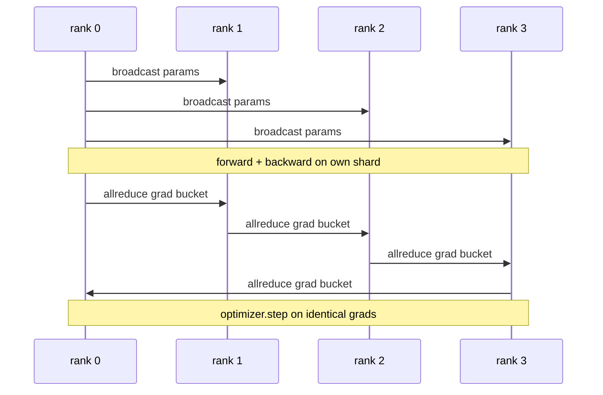

# Równoległość Danych DDP od Podstaw

> DistributedDataParallel to hak na allreduce. Opakuj model, nadaj początkowe parametry z rangi 0, aby każda ranga zaczęła identycznie, zainstaluj hak backward na każdym parametrze, który wykonuje allreduce gradientu, a reszta to zejście gradientowe. Cały wzór to 200 linii.

**Typ:** Budowa
**Języki:** Python
**Wymagania wstępne:** Faza 19, ścieżka C, lekcje 42–49
**Czas:** ~90 min

## Cele nauczania

- Podłącz opakowanie w kształcie `DistributedDataParallel`, które nadaje początkowe parametry i allredukuje gradienty po backward.
- Rozpocznij N rang CPU za pomocą `torch.multiprocessing.spawn` z backendem gloo i rendez-vous opartym na plikach.
- Udowodnij poprawność synchronizacji gradientów, trenując ten sam model na tych samych danych sekwencyjnie i pokazując równoważność parametrów na krok.
- Uzasadnij użycie kubełków (fuzja gradientów) i nakładania (komunikacja podczas backward) jako dwóch zmian, które zamieniają działające DDP w produkcyjne DDP.

## Problem

Model z 1 miliardem parametrów i 12 GB aktywacji nie mieści się na jednym konsumenckim GPU. Nawet jeśli się mieści, trening trwa tygodnie. Równoległość danych dzieli partię na N rang, każda ranga oblicza forward i backward na swoim fragmencie, a na każdym kroku gradienty każdej rangi są sumowane, aby wszystkie N kopii pozostały identyczne. Sumowany gradient jest tym, na czym krok optymalizatora.

Bez synchronizacji gradientów N replik rozchodzi się po kroku 2. Model nie jest już "jednym modelem trenowanym na większej ilości danych", to N oddzielnych modeli, które przypadkiem mają wspólne wagi początkowe. Przy źle zrobionej synchronizacji gradientów (jeden allreduce na parametr, brak nakładania, brak grupowania) sieć jest wąskim gardłem, a GPU czekają bezczynnie na łącze. Sztuką DDP jest uczynienie synchronizacji gradientów prawie darmową względem obliczeń. Kanoniczne PyTorch DDP osiąga to przez grupowanie gradientów, nakładanie allreduce na backward następnej warstwy i używanie NCCL na NVLink. Możemy zrobić wszystko trzy na CPU z gloo i nauczyć się tych samych lekcji.

## Koncepcja



### Trzy operacje, których potrzebuje DDP

| Etap | Kolektyw | Dlaczego |
|---|---|---|
| Inicjacja | broadcast z rangi 0 | Każda ranga zaczyna z tymi samymi parametrami |
| Po backward | allreduce każdego gradientu | Średni gradient to to, na czym krok optymalizatora |
| Czasami | broadcast buforów | Statystyki bieżące BatchNorm pozostają zsynchronizowane |

### Dlaczego średnia, a nie suma

Allreduce-SUM podzielone przez world_size daje średni gradient. Średnia jest niezmienna względem world_size: współczynnik uczenia dostrojony przy jednej randze działa przy czterech rangach, ponieważ wielkość gradientu na krok nie zmienia się. Allreduce-SUM bez dzielenia zmusza do ponownego dostrajania współczynnika uczenia za każdym razem, gdy zmieniasz rozmiar klastra. DDP opakowuje SUM i dzieli; zrób to samo w lekcji.

### Dlaczego grupować gradienty

Transformer ma tysiące tensorów parametrów. Jeden allreduce na tensor płaci opóźnienie bazowe gloo tysiące razy. DDP grupuje gradienty w kubełki ~25 MB i wykonuje jeden allreduce na kubełek. Te same całkowite bajty przemieszczają się przez łącze, ale opóźnienie jest zamortyzowane na kubełek. Dla małego modelu w lekcji grupujemy wszystko w jeden kubełek; struktura jest tym, co przenosi się dalej.

### Dlaczego ustalić ziarno

Każda ranga musi wywołać `torch.manual_seed(seed + rank)` do mieszania, ale `torch.manual_seed(seed)` do inicjalizacji parametrów. Pojedyncze współdzielone ziarno oznacza, że każda ranga widzi tę samą kolejność partii (pokonuje równoległość danych); ziarno specyficzne dla rangi dla parametrów oznacza, że początkowe parametry różnią się o epsilon float32, a synchronizacja gradientów nie czyni już replik identycznymi. Ustaw wzór ziarna poprawnie, albo test równoważności parametrów nie przejdzie na kroku 1.

## Zbuduj To

`code/main.py` implementuje:

- `MiniMLP`: 3-warstwowe MLP wystarczająco małe, by zbiec w sekundach, wystarczająco duże, by ujawnić okablowanie.
- `DistributedDataParallel(model, world_size)`: nadaje parametry w czasie konstrukcji, zwraca opakowanie, którego `sync_grads` dzieli zakumulowane allreduce-sumowane gradienty przez world_size.
- `worker(rank, world_size, ...)`: pełna pętla treningowa z inicjalizacją `torch.distributed` przez gloo, forward, backward, synchronizacją, krokiem.
- `_reference_single_process_loop(...)`: trenuje ten sam model na tych samych danych sekwencyjnie na jednej randze, używane przez test do równoważności parametrów bajt po bajcie po każdym kroku.

Uruchom:

```bash
python3 code/main.py
```

Wynik: tabela treningowa na krok porównująca stratę jedno procesową i sumę kontrolną parametrów z uruchomieniem DDP na 4 rangach. Te dwie ścieżki dają identyczne krzywe straty do epsilon float32, co dowodzi poprawności synchronizacji gradientów.

## Wzorce produkcyjne w praktyce

Trzy wzorce utwardzają DDP na tyle, by można je było wdrożyć.

**Znajdź nieużywane parametry.** Niektóre ścieżki forward pomijają parametry warunkowo (wczesne wyjście, router mieszanki ekspertów). Pominięte parametry nie mają gradientu, ale hak gotowości kubełka DDP wciąż na nie czeka, a allreduce wpada w zakleszczenie. `find_unused_parameters=True` mówi DDP, aby sprawdziło, które parametry otrzymały gradienty przed redukcją. Koszt to przejście grafu na krok, więc wyłącz, chyba że twój forward się rozgałęzia.

**Optymalizacja statycznego grafu.** Gdy forward jest stabilny między krokami, `static_graph=True` pozwala DDP wstępnie obliczyć harmonogram kubełków. Optymalizacja ma znaczenie przy skali: wstępne obliczanie oszczędza kilka ms na krok, co kumuluje się przez 10000 kroków.

**Akumulacja gradientów wymaga ostrożności.** Akumulowanie gradientów przez K mikro-partii bez synchronizowania każdej mikro-partii to 10-krotny zysk przepustowości. DDP udostępnia `no_sync()` jako menedżer kontekstu, który wstrzymuje allreduce po backward. Zapomnij o menedżerze, a allredukujesz K razy za nic; przepustowość spada do minimum.

## Użyj Tego

Wzorce produkcyjne:

- **PyTorch DDP.** Kanoniczna implementacja. `torch.nn.parallel.DistributedDataParallel(model)` łączy grupowanie, nakładanie i kontekst no_sync.
- **HuggingFace Accelerate.** Dodaje program uruchamiający, który obsługuje zmienne env `torchrun` i opakowanie modelu. To samo DPD pod spodem.
- **Megatron-LM data parallel.** Łączy DDP z równoległością tensorową dla dużych modeli; część równoległości danych to ten sam wzór allreduce-po-backward.

## Wdróż To

Lekcja 78 (ZeRO shardowanie) zastępuje allreduce na parametr reduce_scatter, aby każda ranga przechowywała tylko swój fragment stanu optymalizatora. Lekcja 81 składa DDP z ZeRO w kompleksowe demo.

## Ćwiczenia

1. Dodaj kubełki gradientów o konfigurowalnym rozmiarze i zmierz przyspieszenie vs jeden-allreduce-na-parametr na głębszym modelu.
2. Zaimplementuj `no_sync()` jako menedżer kontekstu i zweryfikuj, że akumulacja gradientów odpowiada bazowej pojedynczej ścieżce przez K mikro-partii.
3. Dodaj tryb `find_unused_parameters`, gdzie forward czasami pomija jedną z warstw MLP; bez flagi uruchomienie powinno się zablokować.
4. Zastąp gloo synchronizacją tylko `torch.distributed.barrier()`, aby poczuć różnicę między synchronizacją opartą na allreduce i barierach.
5. Zmierz narzut synchronizacji gradientów jako ułamek czasu kroku dla rozmiarów partii 1, 16, 256 i wyjaśnij skalowanie.

## Kluczowe Terminy

| Termin | Co ludzie mówią | Co to naprawdę znaczy |
|---|---|---|
| DDP | "Równoległość danych" | Opakowanie, które nadaje parametry i allredukuje gradienty na każdym kroku |
| Kubełek | "Połącz gradienty" | Grupuj N małych allreduce w jeden duży |
| Nakładanie | "Ukryj komunikację" | Wydaj allreduce, podczas gdy późniejsze warstwy wciąż obliczają backward |
| no_sync | "Akumuluj" | Pomiń allreduce po backward dla akumulacji gradientów |
| find_unused | "Rozgałęziony forward" | Wykryj parametry bez gradientu przed redukcją |

## Dalsza Lektura

- [PyTorch DistributedDataParallel docs](https://pytorch.org/docs/stable/generated/torch.nn.parallel.DistributedDataParallel.html)
- [PyTorch DDP internals tutorial](https://pytorch.org/tutorials/intermediate/ddp_tutorial.html)
- [Li et al, PyTorch Distributed: Experiences on Accelerating Data Parallel Training](https://arxiv.org/abs/2006.15704)
- Faza 19, Lekcja 76 — kolektywy, na których zbudowane jest DDP
- Faza 19, Lekcja 78 — ZeRO shardowanie zastępuje allreduce na parametr reduce_scatter