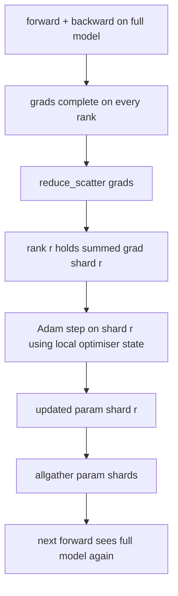

# ZeRO — Shardowanie Stanu Optymalizatora

> Adam przechowuje dwa oszacowania momentów na parametr, oba w float32. Model z 7 miliardami parametrów niesie 56 GB stanu optymalizatora. ZeRO etap 1 sharduje to na N rang; każda ranga jest właścicielem 1/N optymalizatora. Po lokalnym kroku zaktualizowane fragmenty parametrów są nadawane z powrotem, każda ranga odtwarza pełny model i zaczyna się następny krok. Zysk to liniowy spadek pamięci w największej pojedynczej alokacji w stosie treningowym.

**Typ:** Budowa
**Języki:** Python
**Wymagania wstępne:** Faza 19, ścieżka C, lekcje 42–49
**Czas:** ~90 min

## Cele nauczania

- Sharduj stan optymalizatora (pierwszy moment, drugi moment, fp32 master copy) na N rang, tak aby każda ranga była właścicielem 1/N.
- Użyj reduce_scatter, aby dostarczyć każdej randze tylko sumę gradientów jej fragmentu, a następnie allgather, aby nadać zaktualizowane fragmenty parametrów z powrotem.
- Oblicz tabelę oszczędności pamięci dla etapu 1, etapu 2, etapu 3 w porównaniu z waniliowym DDP.
- Uzasadnij wybór etapu 1 vs etapu 2 vs etapu 3 w zależności od rozmiaru modelu i budżetu przepustowości.

## Problem

Waniliowe DDP replikuje wszystko: parametry, gradienty i stan optymalizatora są w pełni obecne na każdej randze. Dla modelu z 7 miliardami parametrów w fp16 oznacza to 14 GB parametrów, 14 GB gradientów i 28 GB stanu optymalizatora na rangę. Stan optymalizatora jest największym składnikiem i najłatwiejszym do shardowania, ponieważ jest dotykany tylko podczas kroku, a nie podczas forward lub backward.

ZeRO etap 1 sharduje stan optymalizatora. Każda ranga przechowuje 1/N momentów Adama. Po backward, zamiast allredukować pełny gradient i wykonywać krok lokalnie, ZeRO wykonuje reduce_scatter, aby każda ranga otrzymała tylko zsumowany gradient swojego fragmentu. Ranga stosuje krok optymalizatora do swojego fragmentu parametrów głównych. Zaktualizowane fragmenty parametrów są następnie allgather'owane z powrotem, aby każda ranga miała pełny model na następny forward. Pamięć optymalizatora spada N-krotnie. Ruch w łączu na krok jest taki sam jak w DDP: jeden reduce_scatter plus jeden allgather równa się jeden allreduce pod względem przepustowości. Pamięć wygrywa, przepustowość się utrzymuje.

## Koncepcja



### Etapy ZeRO

| Etap | Co jest shardowane | Pamięć na rangę | Komunikacja na krok |
|---|---|---|---|
| DDP | nic | parametry + gradienty + opt. | 1x allreduce |
| ZeRO-1 | stan optymalizatora | parametry + gradienty + opt./N | 1x reduce_scatter + 1x allgather |
| ZeRO-2 | opt. + gradienty | parametry + gradienty/N + opt./N | 1x reduce_scatter + 1x allgather |
| ZeRO-3 | opt. + gradienty + parametry | parametry/N + gradienty/N + opt./N | 1x allgather na warstwę + 1x reduce_scatter na warstwę |

Etap 1 to najtańszy zysk, ponieważ stan optymalizatora dominuje budżet. Etap 2 wymaga logiki akumulacji shardów gradientów, ale przepustowość jest taka sama. Etap 3 (FSDP) płaci komunikację na warstwę za każdy forward i backward, zyskując spadek pamięci shardowanych parametrów. Lekcja implementuje w pełni etap 1.

### Matematyka pamięci, rzeczywiste liczby

Dla modelu z P parametrami trenowanego z Adamem w mieszanej precyzji:

| Składnik | Waniliowy | ZeRO-1 | Dlaczego |
|---|---|---|---|
| fp16 parametry | 2P bajtów | 2P bajtów | potrzebne do forward |
| fp16 gradienty | 2P bajtów | 2P bajtów | potrzebne do backward |
| fp32 master copy | 4P bajtów | 4P/N bajtów | używa go tylko opt. |
| fp32 pierwszy moment | 4P bajtów | 4P/N bajtów | używa go tylko opt. |
| fp32 drugi moment | 4P bajtów | 4P/N bajtów | używa go tylko opt. |
| Razem | 16P bajtów | 4P + 12P/N bajtów |   |

Przy N=8: waniliowy 16P, ZeRO-1 5,5P, spadek o 65%. Przy N=64: waniliowy 16P, ZeRO-1 4,19P, spadek o 74%.

### Dlaczego reduce_scatter bije allreduce-then-shard

Allreduce daje każdej randze pełny zsumowany gradient. Jeśli potrzebujesz tylko fragmentu r, to (N-1)/N gradientu, które zostało zredukowane, jest marnowane na randze r. Reduce_scatter dostarcza dokładnie fragment, którego właścicielem jest każda ranga; bajty na rangę są takie same jak w allreduce (ponieważ allreduce to reduce_scatter + allgather), ale druga połowa jest zastąpiona późniejszym allgather fragmentów parametrów. Łącze netto jest identyczne z DDP, pamięć jest dzielona.

## Zbuduj To

`code/main.py` implementuje:

- `flatten_params(module)` i `unflatten_into(module, flat)`, które pakują parametry modelu w jeden ciągły tensor i rozpakowują z powrotem. Układ płaski jest tym, co sprawia, że shardowanie według rangi jest prostym wycinkiem.
- `ZeroOptimizer(model, world_size, rank, lr)`, który jest właścicielem fragmentu rangi master copy i momentów Adama.
- `step()`, który uruchamia reduce_scatter na płaskim gradiencie, stosuje Adama do fragmentu rangi i allgather'uje zaktualizowane parametry z powrotem.
- Demo, które trenuje 3-warstwowe MLP przez 20 kroków i wypisuje budżet pamięci na krok obok bazowego waniliowego DDP.

Uruchom:

```bash
python3 code/main.py
```

Wynik: strata na krok i tabela pamięci pokazująca, że ZeRO-1 przechowuje 1/N stanu optymalizatora na każdej randze w porównaniu z pełną kopią DDP.

## Wzorce produkcyjne w praktyce

Trzy wzorce utwardzają ZeRO na tyle, by można je było wdrożyć.

**Shardowane punktowanie kontrolne ma znaczenie.** Stan optymalizatora ZeRO-1 jest podzielony między rangi; punkt kontrolny musi rejestrować, która ranga jest właścicielem czego. Lekcja 80 buduje manifest shardowanego punktu kontrolnego, który wznawia uruchomienie ZeRO przy tym samym rozmiarze świata. Bez tego zapisany stan jest nieczytelny przy restarcie.

**Mieszana precyzja jest sednem.** ZeRO to technika mieszanej precyzji; fp32 master copy jest tym, co jest shardowane. Uruchamianie ZeRO bez mieszanej precyzji płaci podatek pamięciowy za fp32 master bez odpowiedniego zysku fp16 forward. Produkcyjne uruchomienia zawsze łączą ZeRO z autocast lub wagami bf16.

**Etap 1 to prawie darmowy zysk.** Komunikacja jest identyczna z DDP pod względem przepustowości. Oszczędności pamięci są liniowe w N. Jedynym kosztem jest księgowość fragmentu optymalizatora. Produkcyjne stosy domyślnie używają etapu 1, chyba że pamięć shardowanych parametrów również stanowi problem; wtedy etap 2 lub 3 wymienia komunikację na pamięć.

## Użyj Tego

Wzorce produkcyjne:

- **DeepSpeed ZeRO.** Implementacja referencyjna. `deepspeed_config.json` wybiera etap 1/2/3 i rozmiary partycji.
- **PyTorch FSDP.** Natywny odpowiednik PyTorcha. `ShardingStrategy.SHARD_GRAD_OP` to ZeRO-2; `FULL_SHARD` to ZeRO-3.
- **HuggingFace Accelerate.** Opakowuje zarówno DeepSpeed, jak i FSDP pod jednolitą konfiguracją.

## Wdróż To

Lekcja 79 (pipeline parallel) to ortogonalna oś shardowania: zamiast shardować stan optymalizatora w ramach tego samego modelu, pipeline sharduje warstwy między rangami. Lekcja 81 składa DDP + ZeRO w kompleksowe demo.

## Ćwiczenia

1. Rozszerz do ZeRO-2 przez shardowanie gradientów: każda ranga przechowuje tylko gradient dla swojego fragmentu, osiągnięte przez wyzerowanie części niebędącej fragmentem po backward.
2. Dodaj profiler pamięci, który wypisuje rzeczywiste użycie bajtów fp32 na randze 0 w porównaniu z przewidywaniem wzoru.
3. Zmierz czas ścienny na krok waniliowego DDP w porównaniu z ZeRO-1 i rozłóż na forward, backward, komunikację.
4. Zaimplementuj przycinanie gradientów w ZeRO-1: norma L2 musi być obliczona we wszystkich fragmentach przez allreduce lokalnej normy kwadratowej.
5. Zaimplementuj "naiwne ZeRO" z allreduce zamiast reduce_scatter, zmierz różnicę czasu na łączu. Uzasadnij wybór reduce_scatter liczbami.

## Kluczowe Terminy

| Termin | Co ludzie mówią | Co to naprawdę znaczy |
|---|---|---|
| ZeRO-1 | "Sharduj optymalizator" | Każda ranga przechowuje 1/N fp32 master + momentów Adama |
| ZeRO-2 | "Sharduj też gradienty" | Każda ranga odrzuca również gradienty spoza fragmentu po reduce_scatter |
| ZeRO-3 | "Sharduj parametry" | Każda ranga przechowuje 1/N fp16 parametrów; allgather na warstwę w forward |
| Master copy | "Wagi fp32" | Kopia parametru o wysokiej precyzji, którą aktualizuje optymalizator |
| Reduce_scatter | "Podziel sumę" | Dostarcz każdej randze tylko zsumowany gradient jej fragmentu |

## Dalsza Lektura

- [Rajbhandari et al, ZeRO: Memory Optimizations Toward Training Trillion Parameter Models](https://arxiv.org/abs/1910.02054)
- [DeepSpeed ZeRO documentation](https://www.deepspeed.ai/tutorials/zero/)
- [PyTorch FSDP documentation](https://pytorch.org/docs/stable/fsdp.html)
- Faza 19, Lekcja 76 — reduce_scatter i allgather, na których stoi ta lekcja
- Faza 19, Lekcja 80 — shardowane punktowanie kontrolne, którego musi używać stan ZeRO