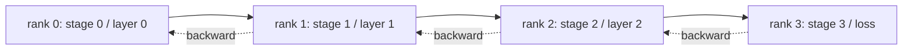

# Równoległość Potokowa i Analiza Bańki

> Równoległość tensorowa dzieli mnożenie macierzy między rangi. Równoległość potokowa dzieli model między rangi, jeden etap na rangę. Mikro-partie przepływają przez potok. Pusty czas na początku i na końcu to bańka; jej minimalizacja to cała sztuka.

**Typ:** Budowa
**Języki:** Python
**Wymagania wstępne:** Faza 19, ścieżka C, lekcje 42–49
**Czas:** ~90 min

## Cele nauczania

- Podziel model sekwencyjny na N etapów i zasymuluj potok forward przez N rang.
- Zaplanuj M mikro-partii przez potok przy użyciu harmonogramu GPipe (wypełnienie tylko forward, następnie backward) i oblicz ułamek bańki.
- Porównaj bańkę z przeplatanym harmonogramem 1F1B używanym w Megatron-LM i PipeDream.
- Uzasadnij przypisanie etapów: równa moc obliczeniowa na etap ma większe znaczenie niż równa liczba parametrów na etap.

## Problem

Model z 70 miliardami parametrów w fp16 potrzebuje 140 GB samych parametrów. Żaden konsumencki GPU go nie pomieści. ZeRO-3 sharduje parametry między rangi, ale wciąż wymaga, aby każda ranga allgather'owała pełną warstwę dla każdego kroku forward, płacąc log(N) skoków na warstwę. Równoległość potokowa idzie inną drogą: przytnij model do N etapów i umieść jeden etap na każdej randze. Forward warstwy 1 kończy się na randze 0 i przekazuje tensor aktywacji do rangi 1; ranga 1 uruchamia warstwę 2 i przekazuje do rangi 2; i tak dalej. Backward płynie w odwrotnej kolejności. Pamięć spada liniowo, ponieważ każda ranga przechowuje tylko jeden etap; obliczenia są sekwencyjne, co stanowi problem bańki.

Bańka to czas bezczynności na początku potoku (oczekiwanie, aż pierwsza mikro-partia dotrze do ostatniego etapu) i na końcu (oczekiwanie, aż ostatnia mikro-partia spłynie z powrotem). Przy M mikro-partiach i N etapach ułamek bańki na etap wynosi (N-1)/(M+N-1). Przy M=8, N=4 jest to 27%. Przy M=64, N=4 jest to 4,5%. Bańka kurczy się, gdy masz wiele mikro-partii na krok, co oznacza małe rozmiary partii na mikro-partię, co jest ograniczeniem, które napędza projektowanie mikro-partii.

## Koncepcja



### Harmonogram GPipe

Wypełnij potok forward wszystkimi M mikro-partiami przed rozpoczęciem jakiegokolwiek backward; następnie opróżnij backward w odwrotnej kolejności. Aktywacje z każdej mikro-partii muszą być przechowywane do momentu jej backward, więc pamięć rośnie liniowo z M. Forward zajmuje M+N-1 cykli, backward kolejne M+N-1 cykli. Użyteczna praca na etap to 2M cykli; bańka na etap to 2(N-1) cykli. Ułamek bańki wynosi (N-1)/(M+N-1), gdy każdy forward i backward zajmuje jedną jednostkę czasu. Wybranie M znacznie większego niż N ukrywa bańkę.

### Harmonogram 1F1B

Przeplatanie: gdy tylko forward mikro-partii dotrze do ostatniego etapu, rozpocznij jej backward i pozwól mu płynąć z powrotem. Harmonogram przeplata jeden forward i jeden backward na etap. Bańka wciąż wynosi N-1, ale pamięć aktywacji jest ograniczona przez głębokość potoku, a nie liczbę mikro-partii. Produkcyjne potoki używają 1F1B (Megatron, PipeDream). Lekcja implementuje najpierw GPipe, ponieważ jest prostszy, a 1F1B jako ćwiczenie.

### Dlaczego równa moc obliczeniowa na etap ma znaczenie

Jeśli etap 0 zajmuje 50 ms, a etap 1 zajmuje 100 ms, każdy cykl jest ograniczony przez etap 1. Pozostałe etapy są bezczynne przez 50 ms na cykl, czekając na etap 1. Równa liczba parametrów to zła oś: obliczenia transformatora są zdominowane przez uwagę plus MLP na warstwę, a warstwy osadzania mają wiele parametrów, ale mało obliczeń. Przypisanie etapów powinno wyrównywać FLOPy na etap, a nie wagi na etap.

### Mikro-partia kontra partia

Potok uruchamia M mikro-partii rozmiaru B każda. Efektywny rozmiar partii to M*B. Gradient na końcu kroku potoku to gradient na połączonych M*B przykładach. Ułamek bańki zależy od M; optymalizator widzi M*B. Dostrojenie M oznacza wymianę bańki (niższa przy wysokim M) na pamięć na mikro-partię (wyższa pamięć aktywacji przy wysokim M dla GPipe).

## Zbuduj To

`code/main.py` implementuje:

- `PipelineStage`: mały `nn.Module`, który przechowuje parametry jednego etapu i udostępnia `forward(activation)`.
- `Pipeline(stages, num_microbatches)`: orkiestruje harmonogram GPipe na symulowanych etapach przy użyciu symulowanego czasu ściennego na etap.
- `bubble_fraction(num_stages, num_microbatches)`: postać zamknięta (N-1)/(M+N-1).
- 4-etapowe demo, które wypisuje ślad na mikro-partię i zmierzony ułamek bańki.

Uruchom:

```bash
python3 code/main.py
```

Wynik: wykres Gantta etap po mikro-partii i procent bańki w porównaniu z przewidywaniem postaci zamkniętej.

## Wzorce produkcyjne w praktyce

Trzy wzorce utwardzają równoległość potokową na tyle, by można ją było wdrożyć.

**Punktowanie kontrolne aktywacji łączy się z potokiem.** Przy M mikro-partiach w locie w GPipe, pamięć aktywacji wynosi M razy jedna mikro-partia. Punktowanie kontrolne aktywacji przelicza forward w czasie backward, wymieniając obliczenia na pamięć; kombinacja jest tym, co czyni potok wykonalnym dla długich sekwencji.

**Bilans etapów jest mierzony, nie zakładany.** Zespoły produkcyjne uruchamiają przebieg profilujący, który mierzy rzeczywiste obliczenia na warstwę (FLOPy i czas ścienny) na docelowym sprzęcie, a następnie partycjonują według tego pomiaru. Flaga `--num-layers-per-stage` w Megatron-LM akceptuje listę, aby umożliwić nierówną liczbę warstw, gdy etapy mają różny koszt na warstwę.

**Harmonogram wysyłania-odbierania musi unikać zakleszczenia.** Potok, w którym każdy etap wysyła przed odebraniem, wpada w zakleszczenie na łączu. Standardowym rozwiązaniem jest przeplatanie: etapy o parzystej randze wysyłają najpierw, potem odbierają; etapy o nieparzystej randze odbierają najpierw, potem wysyłają. Lekcja jawnie planuje rangi, aby wzór był widoczny.

## Użyj Tego

Wzorce produkcyjne:

- **Megatron-LM.** Referencja dla równoległości potokowej w skali. Używa 1F1B i obsługuje połączenie równoległości tensorowej + potokowej + danych.
- **DeepSpeed Pipeline.** Integruje się z ZeRO; ZeRO-1 + potok to powszechna kombinacja dla największych otwartych modeli.
- **PyTorch Pipe.** Natywne opakowanie potoku PyTorcha, zbudowane na `torch.distributed.pipeline.sync.Pipe`.

## Wdróż To

Lekcja 80 przechowuje fragmenty parametrów na etap w shardowanym punkcie kontrolnym. Lekcja 81 składa DDP + ZeRO + potok w kompleksowe demo (w duchu; demo utrzymuje potok symulowany dla czasu wykonania).

## Ćwiczenia

1. Zaimplementuj 1F1B i zweryfikuj, że ułamek bańki zgadza się z GPipe, ale pamięć aktywacji jest ograniczona.
2. Profiluj rzeczywisty czas na etap na głębszym modelu i zrównoważ etapy według zmierzonego czasu ściennego.
3. Dodaj akumulację gradientów przez mikro-partie potoku i sprawdź, czy gradient jest równy gradientowi równoważnego forward pełnej partii.
4. Połącz potok z punktowaniem kontrolnym aktywacji i zmierz spadek pamięci w porównaniu z kosztem obliczeniowym.
5. Połącz potok z DDP (każda ranga potoku jest replikowana w grupie równoległości danych) i przeanalizuj dwuwymiarowy harmonogram.

## Kluczowe Terminy

| Termin | Co ludzie mówią | Co to naprawdę znaczy |
|---|---|---|
| Potok | "Równoległość modelu wzdłuż głębokości" | Jeden etap na rangę, aktywacje płyną od etapu do etapu |
| Bańka | "Czas bezczynności potoku" | (N-1) kroków na początku i końcu, gdzie niektóre etapy nie mają pracy |
| Mikro-partia | "Wycinek partii" | Jednostka forward/backward; bańka kurczy się, gdy M rośnie |
| GPipe | "Wypełnij, potem opróżnij" | Wszystkie M forward przed jakimkolwiek backward; wysoka pamięć aktywacji |
| 1F1B | "Harmonogram przeplatany" | Jeden forward, jeden backward na etap; ograniczona pamięć aktywacji |

## Dalsza Lektura

- [Huang et al, GPipe: Efficient Training of Giant Neural Networks](https://arxiv.org/abs/1811.06965)
- [Narayanan et al, PipeDream: Generalized Pipeline Parallelism for DNN Training](https://arxiv.org/abs/1806.03377)
- [Megatron-LM pipeline parallel docs](https://github.com/NVIDIA/Megatron-LM)
- Faza 19, Lekcja 76 — prymitywy wysyłania/odbierania, których używa harmonogram
- Faza 19, Lekcja 78 — ZeRO jest ortogonalne do potoku i często łączone