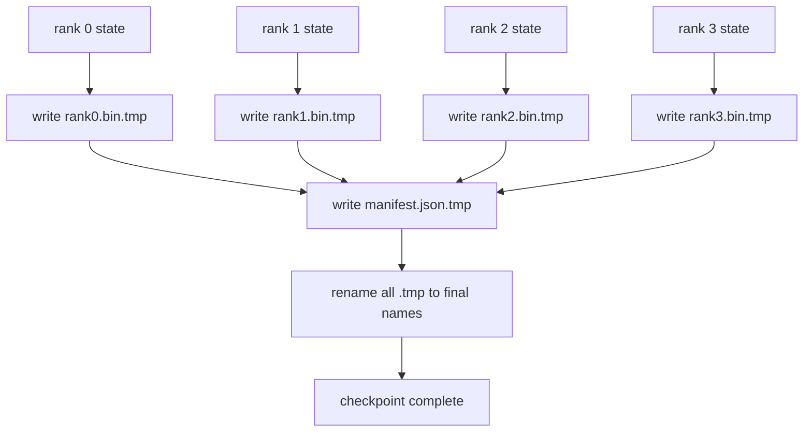

# Shardowany Punkt Kontrolny i Atomowe Wznawianie

> Zadanie treningowe z modelem 70 miliardów parametrów jest zatrzymywane przez awarię węzła co kilka godzin. Format punktu kontrolnego decyduje, czy stracisz 30 minut, czy 30 godzin. Shardowany punkt kontrolny zapisuje fragment każdej rangi równolegle i rejestruje własność w manifeście. Wznowienie ładuje fragment każdej rangi z własnego pliku, odtwarza stan przy tym samym rozmiarze świata, a optymalizator wykonuje krok, jakby nic się nie stało. Atomowy zapis zapobiega zatruciu następnego wznowienia przez połowicznie ukończony punkt kontrolny.

**Typ:** Budowa
**Języki:** Python
**Wymagania wstępne:** Faza 19, ścieżka C, lekcje 42–49
**Czas:** ~90 min

## Cele nauczania

- Zapisz wielorangowy punkt kontrolny jako plik fragmentu na rangę plus manifest rejestrujący, która ranga jest właścicielem czego.
- Użyj wzorca atomowego zapisu (zapisz do ścieżki tymczasowej, a następnie zmień nazwę), aby awaria w trakcie zapisu nigdy nie produkowała połowicznie ukończonego punktu kontrolnego.
- Wznów z manifestu, weryfikując stan bajt po bajcie zarówno dla parametrów fp16, jak i stanu optymalizatora ZeRO na każdej randze.
- Uzasadnij schemat manifestu wobec trzech trybów awarii: zmiana rozmiaru świata, niezgodność liczby fragmentów i częściowy zapis.

## Problem

Waniliowy punkt kontrolny odczytuje wszystkie parametry i stan optymalizatora do rangi 0, gromadzi i zapisuje pojedynczy plik. Dla modelu 70B to 1,1 TB stanu przez port sieciowy jednej rangi. Zapis blokuje każdą inną rangę, ponieważ czekają bezczynnie na zebranie. Przepustowość wejścia/wyjścia to najwolniejsze łącze sieciowe pojedynczego GPU, a nie suma. Na prawdziwym klastrze krok zbierz-i-zapisz może zająć dłużej niż poprzednia godzina treningu, co oznacza, że zadanie wysyła mniej niż jeden punkt kontrolny na dzień treningu.

Shardowane punkty kontrolne odwracają wzór: każda ranga zapisuje swój własny fragment do własnego pliku równolegle. Manifest rejestruje, która ranga była właścicielem którego fragmentu, aby wznowienie mogło umieścić każdy fragment tam, skąd pochodzi. Zagregowana przepustowość zapisu skaluje się z klastrem. Punkt kontrolny 1 TB, który zajmował 4 godziny przez jedną rangę, zajmuje 4 minuty przez 64 rangi. Dodatkowo manifest daje umowę dla niezgodnych wznowień: zmiana rozmiaru świata jest wykrywalna, częściowe zapisy są wykrywalne, a ścieżka ładowania może głośno zawieść, zamiast po cichu używać nieaktualnych danych.

## Koncepcja



### Schemat manifestu

```json
{
  "world_size": 4,
  "step": 1234,
  "wall_clock_seconds": 4521,
  "shards": [
    {"rank": 0, "path": "rank0.bin", "sha256": "...", "param_shard_offset": 0, "param_shard_numel": 65536},
    {"rank": 1, "path": "rank1.bin", "sha256": "...", "param_shard_offset": 65536, "param_shard_numel": 65536}
  ],
  "schema_version": 1
}
```

Trzy pola mają kluczowe znaczenie. `world_size` powoduje głośną awarię wznowienia przy innym rozmiarze, zamiast po cichu uszkadzać dane. `sha256` na fragment wychwytuje częściowe lub uszkodzone zapisy. `param_shard_offset` i `param_shard_numel` na fragment pozwalają ładowarce odtworzyć płaski tensor parametrów na prawidłowej pozycji.

### Atomowy zapis

Standardowy wzór: zapisz każdy fragment do `<nazwa>.tmp`, zapisz manifest do `manifest.json.tmp`, wykonaj fsync na każdym, a następnie zmień nazwę. POSIX rename w obrębie tego samego systemu plików jest atomowy; albo nowy plik jest w pełni obecny, albo stary pozostaje. Awaria przed ostateczną zmianą nazwy pozostawia poprzedni punkt kontrolny jako aktywny. Bez atomowego zapisu awaria może pozostawić częściowy fragment z istniejącym manifestem, który na niego wskazuje, a ładowanie uszkadza stan optymalizatora przy wznowieniu.

### Trzy tryby awarii, przed którymi schemat musi chronić

| Awaria | Objaw | Obrona |
|---|---|---|
| Zmiana rozmiaru świata | wznowienie na N=8 z manifestem z N=4 | niezgodność world_size w manifeście, głośna awaria |
| Niezgodność liczby fragmentów | wznowienie widzi mniej plików rank*.bin niż fragmentów w manifeście | wylicz fragmenty, zweryfikuj, że każdy istnieje |
| Częściowy zapis | plik fragmentu obcięty w trakcie opróżniania | weryfikacja sha256 przy ładowaniu |

Każda obrona odrzuca złe ładowanie wcześnie; alternatywą jest ciche uszkodzenie, które ujawnia się 100 kroków później, gdy strata idzie do NaN.

### Dlaczego pliki na rangę, a nie jeden duży plik

Współbieżny zapis do jednego pliku przez `O_APPEND` działa na POSIX dla zapisów bajtowo-wyrównanych, ale w praktyce przesunięcia w obrębie jednego fragmentu obejmują regiony o rozmiarze MB, a blokowanie dominuje. Pliki na rangę nie mają rywalizacji i korzystają ze stripingowania, gdy bazowy system plików jest równoległy (Lustre, GPFS). Produkcyjne stosy (DeepSpeed, FSDP, NeMo) wszystkie używają plików na rangę z tego powodu.

## Zbuduj To

`code/main.py` implementuje:

- Klasa danych `ShardManifest` z powyższym schematem plus `to_json`/`from_json`.
- `save_sharded(state_dict_per_rank, dir, step)`, który zapisuje stan binarny każdej rangi do własnego pliku przy użyciu atomowego wzorca temp-następnie-zmień-nazwę, a następnie zapisuje manifest.
- `load_sharded(dir, expected_world_size)`, który odczytuje manifest, weryfikuje sha256 każdego fragmentu i zwraca słowniki stanu na rangę.
- Test podróży w obie strony: zbuduj stan na rangę, zapisz, załaduj, asertywnie sprawdź bajt po bajcie.

Uruchom:

```bash
python3 code/main.py
```

Wynik: 4 pliki fragmentów plus manifest zapisane, następnie ponownie załadowane z weryfikacją bajt po bajcie.

## Wzorce produkcyjne w praktyce

Trzy wzorce utwardzają punkt kontrolny na tyle, by można go było wdrożyć.

**Zapis asynchroniczny.** Produkcyjne stosy wykonują zapis punktu kontrolnego w oddzielnym wątku lub procesie, aby trening kontynuował się dalej. Bariera jest przy następnym punkcie kontrolnym: nie rozpoczynaj następnego zapisu, dopóki poprzedni się nie zakończy. Flaga `async_io` DeepSpeed robi dokładnie to. Lekcja utrzymuje zapis synchroniczny, aby kroki były widoczne.

**Najpierw szybki dysk lokalny, potem asynchroniczne przesyłanie.** Zapisz na lokalny NVMe (szybko), a następnie asynchronicznie prześlij do S3 lub GCS. Dwupoziomowy wzór utrzymuje szybki wewnątrzklastrowy punkt kontrolny do wznowienia, jednocześnie wysyłając trwałą kopię poza klaster do archiwizacji. Manifest niesie lokalną ścieżkę; manifest przesyłania niesie zdalną ścieżkę.

**Rotacja ma znaczenie.** Produkcyjne uruchomienia przechowują ostatnie K punktów kontrolnych (zazwyczaj 3–5) i rotują najstarsze. Bez rotacji dysk wypełnia się w trakcie uruchomienia, a następny punkt kontrolny zawodzi. Z rotacją następny zapis usuwa najpierw najstarszy, uwalniając budżet.

## Użyj Tego

Wzorce produkcyjne:

- **DeepSpeed checkpointing.** `deepspeed.save_checkpoint(tag=step)` zapisuje pliki na rangę i plik `latest` wskazujący na aktywny znacznik.
- **PyTorch FSDP checkpointing.** `torch.distributed.checkpoint` zapisuje shardowany stan z `Planner`, który decyduje o układzie na rangę.
- **NeMo.** Opakowuje DeepSpeed i FSDP z jednolitym API `save_to_checkpoint`, które dodaje metadane.

## Wdróż To

Lekcja 81 zapisuje shardowany punkt kontrolny kompleksowego uruchomienia DDP+ZeRO i przeładowuje go przy tym samym rozmiarze świata, aby udowodnić, że umowa wznowienia jest zachowana.

## Ćwiczenia

1. Dodaj zapis asynchroniczny: uruchom zapis w wątku i pozwól treningowi kontynuować. Zablokuj następny zapis, dopóki poprzedni się nie zakończy.
2. Dodaj rotację `last_5_steps`: przechowuj 5 najnowszych punktów kontrolnych, usuń najstarszy przed zapisaniem nowego.
3. Dodaj ścieżkę szybkiej weryfikacji tylko CRC dla wewnętrznego przeładowania (rotacja włącza punkt kontrolny jako nowy aktywny bez pełnego sha256).
4. Dodaj ładowanie między różnymi rozmiarami świata: zrównoważ fragmenty z N=4 do N=8 przez odczytanie manifestu, połączenie i ponowne shardowanie.
5. Dodaj przesyłanie do fałszywego S3 (drugiego katalogu) i zapisz manifest przesyłania. Uzasadnij dwupoziomową politykę przechowywania.

## Kluczowe Terminy

| Termin | Co ludzie mówią | Co to naprawdę znaczy |
|---|---|---|
| Shardowany punkt kontrolny | "Zapis na rangę" | Każda ranga zapisuje własny plik fragmentu równolegle |
| Manifest | "Indeks" | Plik JSON rejestrujący ścieżki fragmentów, przesunięcia i sha256 |
| Atomowy zapis | "tmp, potem zmień nazwę" | Zapisz do .tmp, następnie POSIX rename, aby awaria pozostawiła poprzedni plik aktywny |
| Częściowy zapis | "Obcięty fragment" | Awaria podczas zapisu produkuje uszkodzony fragment; sha256 go wychwytuje |
| Rotacja | "Zachowaj ostatnie K" | Usuń najstarszy punkt kontrolny przed zapisaniem nowego, aby ograniczyć użycie dysku |

## Dalsza Lektura

- [DeepSpeed checkpointing](https://www.deepspeed.ai/tutorials/checkpointing/)
- [PyTorch torch.distributed.checkpoint](https://pytorch.org/docs/stable/distributed.checkpoint.html)
- [POSIX rename atomicity](https://pubs.opengroup.org/onlinepubs/9699919799/functions/rename.html)
- Faza 19, Lekcja 78 — stan ZeRO, który ten punkt kontrolny jest zaprojektowany do zapisywania
- Faza 19, Lekcja 81 — kompleksowe demo wykonuje podróż w obie strony zapisanego stanu