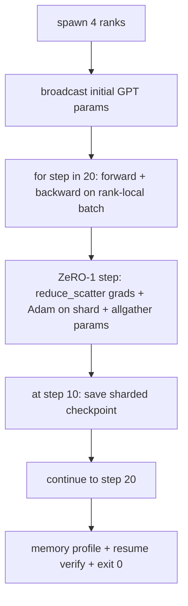

# Kompleksowy Trening Rozproszony

> Lekcje 76–80 zbudowały każda jeden element. To jest złożenie: mały GPT trenowany na 4 symulowanych rangach z DDP do synchronizacji gradientów, ZeRO-1 do shardowania stanu optymalizatora i shardowany punkt kontrolny w połowie trasy. Demo uruchamia 20 kroków, samo się kończy, wypisuje krzywą straty plus profil pamięci i zapisuje możliwy do wznowienia punkt kontrolny.

**Typ:** Budowa
**Języki:** Python
**Wymagania wstępne:** Faza 19, ścieżka C, lekcje 42–49
**Czas:** ~90 min

## Cele nauczania

- Złóż DDP (lekcja 77) plus ZeRO-1 (lekcja 78) plus shardowane punkty kontrolne (lekcja 80) w jedną pętlę treningową.
- Trenuj 2-warstwowy transformerowy model językowy na małym syntetycznym korpusie przez 20 kroków na 4 symulowanych rangach.
- Wypisz tabelę straty na krok, profil pamięci na rangę i manifest punktu kontrolnego, który wznawia bajt po bajcie przy tym samym rozmiarze świata.
- Uzasadnij złożenie: każdy element jest niezależnie testowalny we wcześniejszych lekcjach, a ta lekcja dowodzi, że się składają.

## Problem

Praca końcowa jest dowodem, że elementy do siebie pasują. Lekcja 76 zaimplementowała kolektywy. Lekcja 77 opakowała je w DDP. Lekcja 78 shardowała stan optymalizatora przez reduce_scatter. Lekcja 79 przeanalizowała potok. Lekcja 80 zapisała shardowany punkt kontrolny. Każda lekcja stała samodzielnie z własnym testem. Prawdziwe uruchomienie treningowe używa każdego prymitywu jednocześnie; jeśli złożenie jest błędne, strata się rozbiega, punkt kontrolny odmawia wznowienia lub pamięć na rangę rośnie, gdy powinna maleć.

Ta lekcja uruchamia kompleksowe demo i weryfikuje cztery niezmienniki: (a) strata maleje monotonicznie w ciągu 20 kroków w granicach szumu float, (b) każda ranga ma tę samą normę parametrów na każdym kroku, (c) pamięć optymalizatora na rangę odpowiada wzorowi ZeRO-1 12P/N bajtów, oraz (d) punkt kontrolny z kroku 10 ładuje się bajt po bajcie przy restarcie. Demo samo się kończy: 20 kroków, pojedyncze polecenie, exit 0.

## Koncepcja



### Mini GPT

Model jest celowo mały: 2 bloki transformera, wymiar osadzania 32, 4 głowy uwagi, słownik 64, długość sekwencji 16, partia 4. Kilka tysięcy parametrów. Wystarczająco duży, aby ćwiczyć każdą decyzję dotyczącą okablowania (wielogłowa uwaga uruchamia standardową ścieżkę maskowaną; LayerNorm ma wagi do synchronizacji; głowa LM to osobna projekcja liniowa z powrotem do słownika). Wystarczająco mały, że 20 kroków na 4 rangach CPU kończy się w sekundach.

### Reguły składania

| Element lekcji | Co jest właścicielem | Co pozostawia pętli |
|---|---|---|
| DDP broadcast | Synchronizacja początkowych parametrów | Jedno wywołanie w czasie konstrukcji |
| ZeRO-1 step | Synchronizacja gradientów, aktualizacja master copy, nadawanie parametrów | Jedno wywołanie na krok zastępujące optimiser.step |
| Shardowany punkt kontrolny | Utrwalenie stanu na rangę, manifest z sha256 | Wywołane na randze 0 ze stanem zebranym przez allgather |
| Pętla treningowa | Forward, backward, logowanie straty | Wywołuje trzy powyższe w kolejności |

Pętla nie wie o reduce_scatter ani plikach rendez-vous. Moduły ZeRO i punktu kontrolnego udostępniają wąskie interfejsy, które pętla składa.

### Dlaczego mały GPT, a nie tylko MLP

MLP z lekcji 77 było wystarczające do weryfikacji synchronizacji gradientów. Mały GPT dodaje trzy rzeczy: oddzielną głowę LM nad słownikiem (w tej lekcji odłączoną dla jasności; pełny GPT zazwyczaj łączy głowę z osadzaniem tokenów), softmax + cross-entropia jako strata (więcej numerycznych przypadków brzegowych niż MSE) i asymetryczny forward (osadzanie, potem uwaga, potem MLP na warstwę). Zatrzymanie się na MLP dla pracy końcowej ukryłoby, czy złożenie poprawnie obsługuje LayerNorm lub kształt gradientu warstwy osadzania.

### Samo kończące oznacza exit 0

Pętla uruchamia ustalone 20 kroków i kończy. Bez `while True`, bez interwencji człowieka, bez wznawiania ze stanu zewnętrznego. Praca końcowa, którą możesz zostawić bez nadzoru i znaleźć kompletny log po zakończeniu, jest pracą końcową, która dowodzi, że system jest poprawnie okablowany. Jeśli jakikolwiek element się zablokuje, demo nigdy nie wróci, a stanowisko testowe to wychwyci.

## Zbuduj To

`code/main.py` implementuje:

- `MiniGPT`: 2-warstwowy transformer z maskowaną samouwagą i oddzielną głową LM.
- `make_corpus(seed, total_tokens)`: deterministyczne dane predykcji następnego tokena.
- `_train_worker`: uruchomiony na rangę; nadaje początkowe parametry, uruchamia pętlę, wywołuje krok ZeRO, zapisuje shardowany punkt kontrolny na kroku 10.
- `verify_resume`: po głównym uruchomieniu przeładowuje punkt kontrolny z kroku 10 w procesie i asertywnie sprawdza, czy zapisane fragmenty główne zgadzają się z migawką w pamięci bajt po bajcie.
- `main`: orkiestruje całe demo, wypisuje tabelę straty, profil pamięci i wynik weryfikacji.

Uruchom:

```bash
python3 code/main.py
```

Wynik: 20-wierszowa tabela straty, 4-wierszowy profil pamięci na rangę, manifest punktu kontrolnego i linia "RESUME VERIFIED" w przypadku sukcesu.

## Wzorce produkcyjne w praktyce

Trzy wzorce uzupełniają złożenie dla prawdziwych uruchomień.

**Punkt kontrolny co K minut, nie co K kroków.** Czas kroku zmienia się wraz z długością sekwencji i liczbą mikro-partii. Kadencja punktu kontrolnego co 10 minut wychwytuje tę samą ilość obliczeń niezależnie od rozmiaru modelu. Lekcja używa kadencji opartej na krokach dla uproszczenia; produkcja używa kadencji opartej na czasie ściennym.

**Wykrywaj rozbieżność wcześnie.** Produkcyjne uruchomienia dodają strażnika NaN po backward i detektor skoku straty; jeśli strata skoczy o więcej niż 2x w jednym kroku, wróć do poprzedniego punktu kontrolnego zamiast pozwolić optymalizatorowi wejść w stan zdegenerowany. Krzywa straty w lekcji jest gładka, więc strażnik jest nieużywany, ale hak pozostaje.

**Agreguj profil pamięci między rangami.** Pamięć na rangę różni się w zależności od rangi w prawdziwych uruchomieniach (ranga z największym etapem potoku przechowuje więcej aktywacji). Produkcja rejestruje maksimum między rangami plus średnią; lekcja wypisuje na rangę, aby pokazać, że wzór się zgadza.

## Użyj Tego

Wzorce produkcyjne:

- **DeepSpeed.** Łączy DDP + ZeRO + potok + punktowanie kontrolne aktywacji pod jedną konfiguracją. Złożenie lekcji to kształt DeepSpeed w miniaturze.
- **PyTorch FSDP.** Natywny odpowiednik. `FullyShardedDataParallel` z `ShardingStrategy.SHARD_GRAD_OP` to ZeRO-2.
- **NeMo i Megatron-LM.** Dodają równoległość tensorową dla największych modeli; w przeciwnym razie złożenie ma ten sam kształt.

## Wdróż To

Pełna ścieżka kończy się tutaj. 6 lekcji razem to podsystem treningu rozproszonego, który prawdziwy zespół zbudowałby przed przyjęciem DeepSpeed; abstrakcja została udowodniona względem gloo, a tryby awarii zostały przećwiczone. Faza 17 (infrastruktura i produkcja) jest miejscem, aby zabrać to na prawdziwy klaster.

## Ćwiczenia

1. Dodaj podział równoległości tensorowej głowy uwagi i zweryfikuj, że strata zgadza się z bazową pojedynczą rangą. Dwie rangi: połowa głów na rangę, allreduce wyjścia uwagi.
2. Dodaj akumulację gradientów przez 4 mikro-partie i udowodnij, że gradient jest równy gradientowi jednej dużej partii.
3. Dodaj ścieżkę wznowienia z kroku 10, która faktycznie kontynuuje trening do kroku 20 i daje tę samą końcową stratę, co oryginalne uruchomienie.
4. Dodaj eksport metryk (strata, norma gradientu, czas kroku) do JSONL, aby uruchomienie mogło być wizualizowane po fakcie.
5. Dodaj strażnika NaN, który wraca do poprzedniego punktu kontrolnego po skoku straty, i wymuś skok za pomocą jednokrokowego mnożnika LR, aby ćwiczyć wycofanie.

## Kluczowe Terminy

| Termin | Co ludzie mówią | Co to naprawdę znaczy |
|---|---|---|
| Kompleksowy | "Połącz to wszystko" | Jedno uruchomienie składa każdy element, a nie test jednostkowy na element |
| Profil pamięci | "GB na rangę" | Bajty przechowywane na każdej randze dla parametrów, gradientów, stanu optymalizatora |
| Umowa wznowienia | "Zapisz i załaduj" | Stan na rangę bajt po bajcie po podróży w obie strony punktu kontrolnego |
| Samo kończący | "Ograniczone uruchomienie" | Stała liczba kroków, exit 0 po zakończeniu, brak człowieka w pętli |

## Dalsza Lektura

- [DeepSpeed end-to-end training tutorial](https://www.deepspeed.ai/getting-started/)
- [PyTorch FSDP advanced tutorial](https://pytorch.org/tutorials/intermediate/FSDP_advanced_tutorial.html)
- [Megatron-LM training script reference](https://github.com/NVIDIA/Megatron-LM)
- Faza 19, Lekcje 76–80 — każdy element, który ta lekcja składa
- Faza 17 — przeniesienie złożenia na prawdziwy klaster