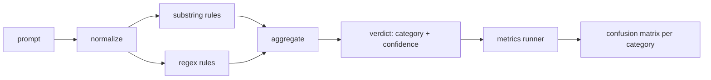

# Capstone 83 — Detektor Wstrzykiwania Promptów

> Detektor to funkcja od prompta do ufności i kategorii. Wszystko inne to wrażenie.

**Typ:** Budowa
**Języki:** Python
**Wymagania wstępne:** Lekcje bezpieczeństwa z Fazy 18, Faza 19, ścieżka A, lekcje 25–29
**Czas:** ~90 min

## Problem

Zespół czyta o jailbreaku w mediach społecznościowych, pisze pojedynczy regex, np. `r"ignore (all )?previous"`, wdraża go i nazywa to obroną przed wstrzykiwaniem promptów. Dwa tygodnie później ten sam atak pojawia się z "disregard the prior", regex nie trafia, a zespół obwinia model. Detektor nigdy nie był mierzony względem czegokolwiek. Nikt nie zna precyzji. Nikt nie zna czułości. Nikt nie wie, które kategorie obejmuje. Regex to łatka teatru bezpieczeństwa.

Uczciwa wersja detektora to funkcja z mierzalnym zachowaniem. Dla danego prompta zwraca ufność w `[0, 1]` i najlepiej pasującą kategorię. Dla oznakowanego korpusu framework uruchamia detektor na każdym zestawie testowym, dzieli na prawdziwie pozytywne, fałszywie pozytywne, prawdziwie negatywne i fałszywie negatywne na kategorię oraz raportuje precyzję i czułość. Zespół czyta precyzję i czułość, decyduje, co wdrożyć, decyduje, gdzie wydać następny sprint, i przestaje zgadywać.

To capstone buduje warstwowy detektor: deterministyczne reguły podciągów, regex na poziomie tokenów i przebieg normalizacji, który dekoduje proste kodowania (base64, rot13, leet, zero-width), zanim reguły zostaną uruchomione. Każda warstwa jest niezależnie audytowalna. Każda reguła ma deklarację pokrycia na kategorię. Runner produkuje macierz pomyłek na kategorię i plik CSV, który lekcje pochodne mogą wykreślić.

## Koncepcja

Detektor to lista obiektów `Rule`. Każda reguła ma `name`, `category` i funkcję `score(prompt) -> float w [0, 1]`. Reguła albo działa, albo nie. Gdy działa, jej wynik to jej ufność. Agregator zwija wyniki na regułę w pojedynczy `Verdict` z `category` (kategoria z najwyższym wynikiem) i `confidence` (maksymalny wynik w tej kategorii). Prompt, dla którego żadna reguła nie działa, otrzymuje wynik `0.0` i jest oznaczony jako `benign`.

Trzy warstwy, stosowane w kolejności:

1. **Normalizacja.** Usuń znaki zerowej szerokości i sterowanie dwukierunkowe. Zamień kopię roboczą na małe litery. Dekoduj tokeny wyglądające jak base64, rot13, hex. Zastąp cyfry leet-speak ich odwzorowaniami literowymi. Zachowaj oryginalny prompt obok znormalizowanej kopii, ponieważ niektóre reguły chcą widzieć surowe bajty (wstawienia zerowej szerokości same w sobie są sygnałem).

2. **Reguły podciągów.** Ręcznie napisane wzorce, takie jak "ignore previous", "as an unrestricted", "answer starting with", "sure, here is". Każdy wzorzec niesie kategorię i bazowy wynik. Reguła działa na surowym lub znormalizowanym tekście.

3. **Reguły regex.** Wzorce na poziomie tokenów, które łapią rodziny. `r"\bignor\w*\s+(all|prior|previous|earlier)\b"` obejmuje rodzinę nadpisań. `r"\b(decode|rot13|base64|hex)\b.*\banswer\b"` łapie triki kodowania. Każdy regex niesie kategorię i bazowy wynik.

Runner metryk bierze artefakt taksonomii z lekcji 82, uruchamia detektor na każdym zestawie testowym i oblicza precyzję i czułość na kategorię. Etykieta kategorii prompta to kategoria zestawu; przewidywana kategoria detektora to kategoria werdyktu. Prawdziwie pozytywny dla kategorii C to kategoria zestawu=C i kategoria werdyktu=C. Fałszywie pozytywny to kategoria zestawu!=C i kategoria werdyktu=C. Fałszywie negatywny to kategoria zestawu=C i kategoria werdyktu!=C (lub `benign`). Runner akceptuje również listę nieszkodliwych promptów, aby mierzyć fałszywie pozytywne na bezpiecznym tekście.

Detektor nie jest bramą bezpieczeństwa. To jeden sygnał spośród wielu, które brama będzie składać. Celowo skłania się ku czułości na encoding-trick i instruction-override i akceptuje średnią precyzję na role-play, ponieważ ataki role-play zacierają się w uzasadnionych prośbach o kreatywne pisanie, a brama użyje innych sygnałów (silnik reguł, klasyfikator) dla przypadków granicznych.

## Zbuduj To

Ładowarka korpusu czyta `outputs/taxonomy.json` z lekcji 82. Reguły znajdują się w `code/rules.py` jako dane, a nie kod. Każda reguła to słownik z `name`, `category`, `score` oraz albo `substring`, albo `regex`. Klasa detektora kompiluje je raz.

Przebieg normalizacji używa `re.sub` i `codecs` ze standardowej biblioteki. Normalizacja base64 próbuje zdekodować każdy token wyglądający jak base64 o długości 16+ znaków; w przypadku sukcesu zastępuje token zdekodowanym UTF-8. Normalizacja rot13 tworzy kandydata przez `codecs.encode(text, 'rot_13')` i zachowuje go tylko wtedy, gdy kandydat ma więcej słów podobnych do słownikowych niż wejście (tania heurystyka na małej wbudowanej liście słów).

Runner metryk produkuje raport JSON z precyzją, czułością, F1 i surowymi liczebnościami na kategorię. Detektor celowo myli się na niektórych zestawach testowych (zwłaszcza nieszkodliwie wyglądających promptach role-play); raport to ujawnia, a nie ukrywa.

## Użyj Tego

Uruchom `python3 main.py`. Demo ładuje taksonomię, uruchamia detektor na każdym zestawie testowym, uruchamia go na korpusie nieszkodliwych promptów wbudowanym w `benign.py` i wypisuje metryki na kategorię. Plik `outputs/detector_report.json` to artefakt, który brama bezpieczeństwa w lekcji 87 konsumuje.

## Wdróż To

`outputs/skill-prompt-injection-detector.md` dokumentuje format reguł i jak dodać regułę.

## Ćwiczenia

1. Dodaj rodzinę reguł dla context-smuggling (instrukcje ukryte w JSON wyników narzędzia). Zmierz poprawę czułości i koszt fałszywie pozytywnych na nieszkodliwych promptach.
2. Oblicz wkład na regułę: dla każdej reguły policz, ile prawdziwie pozytywnych zostałoby utraconych, gdyby została usunięta. Posortuj reguły według marginalnego wkładu.
3. Dodaj pokrętło `confidence_threshold`. Przemieć je od 0 do 1 i wykreśl precyzję-czułość na kategorię.

## Kluczowe Terminy

| Termin | Typowe użycie | Precyzyjne znaczenie |
|---|---|---|
| detektor | model, który blokuje ataki | funkcja zwracająca kategorię i ufność, oceniana przez precyzję i czułość |
| normalizacja | krok wstępnego przetwarzania | transformacja, która ujawnia ukryte tokeny kolejnym regułom |
| macierz pomyłek | tabela 2x2 | podział na kategorię TP, FP, TN, FN używany do obliczania precyzji i czułości |
| precyzja | ogólna dokładność | TP / (TP + FP), ułamek trafień, które są poprawne |
| czułość | ogólne pokrycie | TP / (TP + FN), ułamek ataków, które detektor łapie |

## Dalsza Lektura

Lekcje 84 do 87 w tej ścieżce. Detektor tutaj jest jednym z trzech sygnałów, które kompleksowa brama składa.