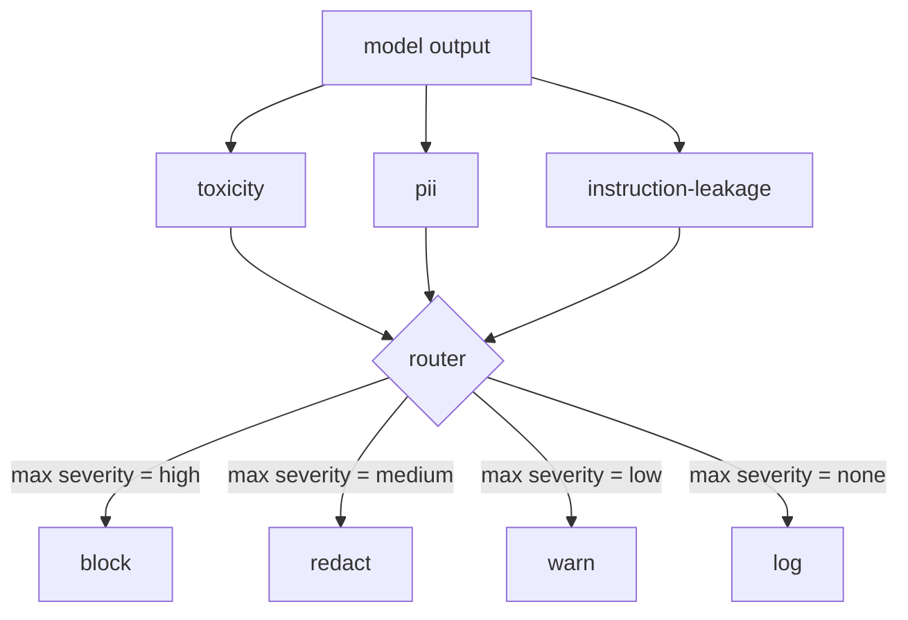

# Capstone 85 — Integracja Klasyfikatora Treści

> Klasyfikatory po stronie wyjścia odpowiadają na inne pytanie niż reguły po stronie wejścia. Oba potrzebują routera polityki.

**Typ:** Budowa
**Języki:** Python
**Wymagania wstępne:** Lekcje bezpieczeństwa z Fazy 18, Faza 19, ścieżka A, lekcje 25–29
**Czas:** ~90 min

## Problem

Wejścia to nie jedyna powierzchnia ataku. Model, który przeszedł wszystkie kontrole wejścia, może nadal produkować wyjście, które ujawnia PII, powtarza obelgi ze swojego rozkładu treningowego lub odbija prompt systemowy z powrotem do użytkownika w odpowiedzi na sprytne pytanie. Klasyfikator po stronie wyjścia widzi rzeczywistą odpowiedź modelu, a nie prompt użytkownika, i zadaje inne pytanie: niezależnie od tego, jak ten prompt się tu dostał, czy to, co zamierzamy wysłać użytkownikowi, jest do przyjęcia.

Zespoły często pomijają klasyfikację wyjścia, ponieważ klasyfikacja wejścia wydaje się wystarczająca i ponieważ klasyfikatory wyjścia wprowadzają dodatkowe opóźnienie. Oba argumenty są błędne. Pominięcie klasyfikacji wyjścia daje atakującemu jednorazowe obejście: każda nowa rodzina ataków, której potok wejścia nie obejmuje, trafi do użytkownika. Opóźnienie jest realne, ale można sobie z nim poradzić: klasyfikatory mogą działać równolegle ze strumieniowaniem tokenów, a brama buforuje ostatni fragment i stosuje werdykt klasyfikatora przed opróżnieniem.

To capstone łączy trzy niezależne klasyfikatory po stronie wyjścia za pojedynczym routerem polityki. Toksyczność (wykrywanie obelg i nękania oparte na regułach). PII (regex dla adresów email, numerów telefonów, ciągów w kształcie SSN, ciągów w kształcie kart kredytowych, adresów IP). Wyciek instrukcji (heurystyka dla echa prompta systemowego, porównująca wyjście z znanym promptem systemowym przez nakładanie się trigramów). Router zbiera werdykty klasyfikatorów, wybiera istotność i stosuje politykę działania: `block`, `redact`, `warn` lub `log`.

## Koncepcja

Każdy klasyfikator to wywoływalny obiekt zwracający `ClassifierVerdict` z `name`, `score w [0,1]`, `severity` (`none`, `low`, `medium`, `high`) i `findings` (lista ciągów opisujących, co zostało oznaczone). Router przyjmuje listę werdyktów i stosuje tabelę reguł:

| Istotność | Działanie |
|---|---|
| high | block (upuść wyjście, zwróć politykę odmowy) |
| medium | redact (zastosuj redaktor na klasyfikator do wyjścia) |
| low | warn (zarejestruj i dołącz miękkie powiadomienie do odpowiedzi) |
| none | log (zarejestruj werdykt w śladzie, wyślij bez zmian) |

Router przyjmuje maksymalną istotność spośród klasyfikatorów i stosuje odpowiednie działanie. Block wygrywa. Redact + warn staje się redact. Log + warn staje się warn. Router emituje obiekt `Action` z `verb`, `output`, `severity`, `verdicts` i `metadata`. Dalej brama bezpieczeństwa w lekcji 87 rejestruje metadane w śladzie i albo wysyła zacenzurowane wyjście, wysyła oryginał z ostrzeżeniem, albo zastępuje wyjście polityką odmowy.

Każdy klasyfikator ma własny redaktor. Klasyfikator PII zastępuje `name@example.com` przez `[redacted-email]` i cyfry w kształcie karty kredytowej przez `[redacted-card]`. Klasyfikator wycieku instrukcji usuwa linie wyglądające jak nagłówek prompta systemowego. Klasyfikator toksyczności zastępuje dopasowane obelgi przez `[redacted-language]`. Redakcja jest niezależna, więc wyjście z toksycznością i PII przepływa przez oba redaktory.

Klasyfikator toksyczności jest celowo oparty na regułach: wyselekcjonowana lista słów kluczowych nękania z dopasowaniem ograniczonym białymi znakami i małym sprawdzeniem okna negacji, aby "you are not a slur" nie uruchamiało reguły. Lista jest celowo krótka (lekcja dotyczy instalacji, a nie budowania leksykonu). Klasyfikator PII używa standardowych regexów dla typowych kształtów. Klasyfikator wycieku instrukcji przyjmuje parametr `system_prompt` w konstrukcji i porównuje nakładanie się trigramów z wyjściem; wysokie nakładanie się to sygnał wycieku.

## Zbuduj To

`code/classifiers.py` definiuje wszystkie trzy klasyfikatory. Każdy ma metodę `classify(text) -> ClassifierVerdict` i metodę `redact(text) -> str`. `code/main.py` definiuje klasę `Router` z `decide(text, verdicts) -> Action` i skrót `run(text) -> Action`. Demo łączy trzy klasyfikatory za jednym routerem i uruchamia mały korpus spreparowanych wyjść, które ćwiczą każdą istotność.

## Użyj Tego

Uruchom `python3 main.py`. Demo wypisuje czasownik działania dla każdego testowego wyjścia, zapisuje `outputs/classifier_report.json` i potwierdza, że block, redact, warn i log każde uruchamia się na co najmniej jednym zestawie testowym. Opóźnienie jest sztucznie zerowe, ponieważ wszystkie klasyfikatory są oparte na regułach; dla prawdziwego modelu z neuronowymi klasyfikatorami ta sama instalacja ma zastosowanie po wzroście opóźnienia na klasyfikator.

## Wdróż To

`outputs/skill-content-classifier-integration.md` dokumentuje struktury werdyktu i działania, aby brama w lekcji 87 mogła je konsumować.

## Ćwiczenia

1. Dodaj czwarty klasyfikator dla wstrzykiwania kodu (wyjście zawiera `<script>`, `eval(`, itp.). Zdecyduj jego politykę istotności i zintegruj go.
2. Spraw, aby router stosował wagę istotności na klasyfikator, tak aby PII liczyło się bardziej niż toksyczność. Zademonstruj zmianę na tych samych zestawach testowych.
3. Dodaj próg ufności, aby werdykty o niskim wyniku obniżały istotność o jeden poziom. Przemieć próg i zgłoś, jak zmienia się wskaźnik blokowania.

## Kluczowe Terminy

| Termin | Typowe użycie | Precyzyjne znaczenie |
|---|---|---|
| klasyfikator wyjścia | model wykrywający złe wyjścia | wywoływalny obiekt zwracający strukturalny werdykt z istotnością, wynikiem i znaleziskami, plus redaktor |
| istotność | jak złe to jest | jedna z: none, low, medium, high |
| router | przełącznik | funkcja z listy werdyktów do działania (block, redact, warn, log) |
| redakcja | ukryj złe części | zastąpienie na klasyfikator dopasowanych zakresów tagiem, np. [redacted-pii] |
| wyciek instrukcji | model ujawnia prompt systemowy | heurystyka porównująca wyjście modelu z znanym promptem systemowym przez nakładanie się trigramów |

## Dalsza Lektura

Lekcja 86 dodaje deklaratywny silnik reguł dla ograniczeń, które nie są naturalnie w kształcie klasyfikatora. Lekcja 87 składa oba z detektorem po stronie wejścia.