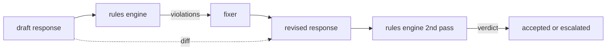

# Capstone 86 — Silnik Reguł Konstytucyjnych

> Reguła to nazwa, predykat i wyjaśnienie. Wszystko, czemu brakuje jednego z tych trzech, to wrażenie, a nie reguła.

**Typ:** Budowa
**Języki:** Python, YAML
**Wymagania wstępne:** Lekcje bezpieczeństwa z Fazy 18, Faza 19, ścieżka A, lekcje 25–29
**Czas:** ~90 min

## Problem

Klasyfikatory obejmują rozpoznawalne awarie. Silniki reguł obejmują umowne. Zespół piszący asystenta kodowania chce ograniczenia: "każda odpowiedź zawierająca kod musi kończyć się wykonywalnym blokiem lub zadeklarowanym założeniem". Zespół prowadzący bota obsługi klienta chce: "każda odmowa musi oferować następny krok". Te ograniczenia nie są naturalnymi celami klasyfikatorów. Są predykatami dotyczącymi odpowiedzi, konwersacji i polityki systemowej i muszą być czytelne dla nie-inżyniera.

Uczciwą reprezentacją jest plik deklaratywny. Konstytucja żyje w YAML obok kodu, w systemie kontroli wersji, z oddzielnym procesem recenzji. Każda reguła ma `name`, `predicate`, `severity` i szablon `explanation`. Silnik ładuje plik, ocenia każdą regułę względem wyjścia kandydata i zwraca strukturalne `Violation` na każdą regułę, która zadziałała. Silnik reguł w tym capstone składa predykaty z `all_of`, `any_of` i `not_`, aby pojedyncza reguła mogła wyrazić "jeśli odpowiedź zawiera kod, musi kończyć się wykonywalnym blokiem ORAZ nie odwoływać się do biblioteki tylko wewnętrznej".

Drugą połową lekcji jest rewizja. Silnik reguł, który tylko blokuje, jest w połowie zbudowany. Silnik reguł, który proponuje poprawkę, jest operacyjnie użyteczny: asystent szkicuje odpowiedź, silnik flaguje naruszenia, poprawiacz produkuje poprawioną odpowiedź, a silnik potwierdza, że rewizja spełnia reguły. Lekcja dostarcza minimalny poprawiacz (zastąpienie regex na regułę) i strukturalną różnicę (dodania, usunięcia, edycje linia po linii) między szkicem a poprawionym.

## Koncepcja



Reguła ma kształt:

```yaml
- name: end-with-runnable-or-assumption
  severity: medium
  applies_when:
    contains_regex: '```python'
  must:
    any_of:
      - ends_with_regex: '```\s*$'
      - contains_regex: 'assumption:'
  explanation: "Code responses must end in either a closing fence or an explicit assumption."
  fix:
    append_if_missing: "\n\nAssumption: example inputs are valid."
```

Predykaty są atomowe: `contains_regex`, `not_contains_regex`, `ends_with_regex`, `starts_with_regex`, `max_words`, `min_words`. Kompozycje to `all_of`, `any_of`, `not_`. Silnik ocenia najpierw `applies_when`; jeśli reguła nie ma zastosowania, naruszenie jest rejestrowane jako `not_applicable`. W przeciwnym razie silnik ocenia `must` i produkuje albo `pass`, albo `violation`.

Istotności to `low`, `medium`, `high`, odzwierciedlając lekcję 85. Brama niższego poziomu (lekcja 87) traktuje naruszenie reguły `high` tak samo jak werdykt klasyfikatora `high`: blokuj.

Poprawiacz to lista deklaratywnych operacji: `append_if_missing`, `prepend_if_missing`, `replace_regex`. Każda operacja mapuje regułę po nazwie na transformację. Poprawiacz jest celowo ograniczony do lokalnych edycji; strukturalne przepisania należą do oddzielnej warstwy odmowy i pomocy, która nie jest tutaj objęta.

Różnica jest obliczana względem oryginału i poprawionego. To lista rekordów `Change` z `op` (add, remove, edit) i odpowiednim tekstem. Brama niższego poziomu może rejestrować różnicę, aby ludzki recenzent audytował zachowanie poprawiacza w czasie.

## Zbuduj To

`code/rules.yml` przechowuje konstytucję. Ładowarka w `code/main.py` akceptuje albo plik YAML (gdy PyYAML jest dostępny), albo plik JSON (wbudowany). Lekcja dostarcza `rules.yml`, który testy lekcji parsują przez obie ścieżki kodu. `code/main.py` definiuje klasy `Engine` i `Fixer` oraz funkcję `diff`. Kompozycje są oceniane rekurencyjnie z zwarciem na `any_of`.

Konstytucja w dostarczonej formie:

- `no-empty-refusal` (medium) — odmowa musi zawierać albo sugestię, albo przekierowanie
- `end-with-runnable-or-assumption` (medium) — odpowiedzi z kodem muszą kończyć się czysto
- `no-pii-in-examples` (high) — dane przykładowe nie mogą zawierać emaili ani kształtów telefonów
- `cite-when-asserting-fact` (low) — linie zaczynające się od "According to" muszą zawierać cytat w nawiasie
- `no-internal-library-leak` (high) — słowa `internal-only` i `policybot-internal` nie mogą pojawić się w wyjściu
- `bounded-length` (low) — odpowiedzi nie mogą przekraczać 800 słów

## Użyj Tego

`python3 main.py`. Demo uruchamia trzy szkice odpowiedzi przez silnik, wypisuje naruszenia, uruchamia poprawiacz, wypisuje różnicę i zapisuje `outputs/rules_report.json`. Jeden zestaw testowy ma regułę, która nie ma zastosowania (brak bloku kodu w szkicu), a raport pokazuje `not_applicable` dla tej reguły, aby zespół widział, że silnik jawnie ją ocenił.

## Wdróż To

`outputs/skill-constitutional-rules-engine.md` dokumentuje gramatykę reguł i operacje poprawiacza.

## Ćwiczenia

1. Dodaj regułę wymagającą, aby każda odpowiedź zawierała frazę "If this is urgent", gdy prompt wspomina o bezpieczeństwie. Użyj kompozycji.
2. Zastąp poprawiacz regex poprawiaczem szablonowym, który przyjmuje nazwane sloty. Zademonstruj jedną regułę przepisaną w nowym projekcie.
3. Dodaj punkt końcowy metryk, który, mając korpus szkiców, zwraca wskaźnik naruszenia na regułę, aby zespół mógł zobaczyć, która reguła nadmiernie działa.

## Kluczowe Terminy

| Termin | Typowe użycie | Precyzyjne znaczenie |
|---|---|---|
| konstytucja | niejasny dokument polityki | plik YAML z regułami mającymi predykaty, istotności i wyjaśnienia |
| predykat | sprawdzenie | wywoływalny obiekt z tekstu na bool, atomowy lub złożony przez all_of/any_of/not_ |
| naruszenie | awaria | strukturalny rekord z nazwą reguły, istotnością, wyjaśnieniem i dopasowanym zakresem |
| poprawiacz | dostrojenie modelu | deterministyczna transformacja na regułę mapująca szkic na poprawiony |
| różnica | porównanie ciągów | strukturalna lista operacji add, remove, edit między szkicem a poprawionym |

## Dalsza Lektura

Lekcja 87 składa ten silnik z detektorem po stronie wejścia i klasyfikatorem po stronie wyjścia w pojedynczą bramę bezpieczeństwa.