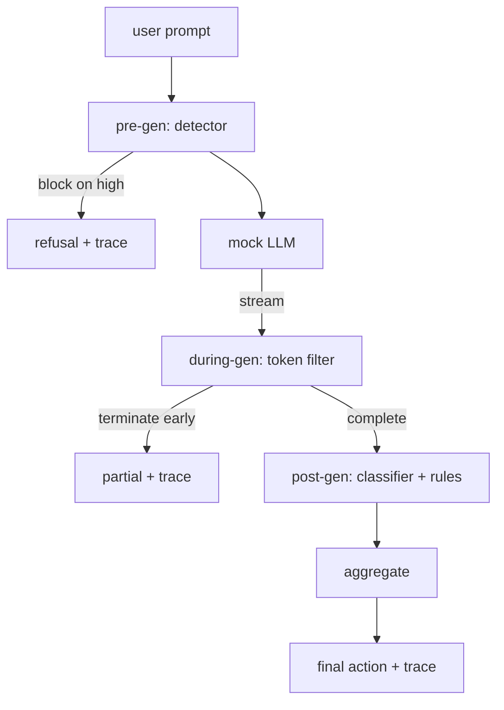

# Capstone 87 — Kompleksowa Brama Bezpieczeństwa

> Przed generacją, w trakcie generacji, po generacji. Trzy punkty kontrolne, jeden werdykt, ślad audytowy na żądanie.

**Typ:** Budowa
**Języki:** Python
**Wymagania wstępne:** Lekcje bezpieczeństwa z Fazy 18, Faza 19, ścieżka A, lekcje 25–29
**Czas:** ~90 min

## Problem

Lekcje 82–86 w tej ścieżce dostarczyły każda pojedynczy element: taksonomię, detektor wejścia, framework ewaluacyjny, klasyfikator wyjścia, silnik reguł. Prawdziwa brama bezpieczeństwa musi je złożyć, uruchomić we właściwym momencie cyklu życia żądania, zdecydować, jakie działanie podjąć, gdy się ze sobą nie zgadzają, i wyprodukować ślad, który recenzent może przeczytać w poniedziałek rano. Złożenie jest lekcją.

Brama znajduje się w trzech punktach kontrolnych. Pre-gen uruchamia się przed wywołaniem modelu: detektor z lekcji 83 patrzy na prompt i albo go przepuszcza, blokuje wprost (atak o wysokiej ufności), albo dołącza flagę dla niższych warstw do rozważenia. During-gen uruchamia się, gdy model emituje tokeny: filtr strumieniowy buforuje fragmenty i kończy strumień wcześnie, jeśli pojawi się zakazana fraza (prefix-injection przetrwa to, jeśli brama patrzy tylko post-hoc). Post-gen uruchamia się po zakończeniu modelu: router klasyfikatorów z lekcji 85 i silnik reguł z lekcji 86 inspektują pełne wyjście, brama agreguje ich werdykty z sygnałem pre-gen i brama stosuje końcowe działanie.

Brama sama się kończy: każdy zestaw testowy w taksonomii lekcji 82 jest uruchamiany od końca do końca, brama emituje ślad na żądanie, a demo kończy się z kodem zero niezależnie od tego, czy brama blokuje każdy atak, czy nie. Chodzi o obserwowalność i poprawność strukturalną, a nie o idealny wynik.

## Koncepcja

Trzy punkty kontrolne, jedno drzewo decyzyjne.

Agregator łączy cztery sygnały istotności: ufność detektora (lekcja 83), wyzwalacz filtra tokenów (boolean), maksymalną istotność klasyfikatora (lekcja 85), maksymalną istotność silnika reguł (lekcja 86). Funkcja agregacji to deterministyczna tabela.

| Stan sygnału | Działanie |
|---|---|
| dowolna wysoka istotność | block |
| dowolna średnia istotność | redact |
| dowolna niska istotność | warn |
| wszystkie none + ufność detektora < 0.5 | allow |
| ufność detektora 0.5–0.85, brak innego sygnału | warn |

Block zwraca odmowę. Redact wysyła tekst zredagowany przez klasyfikator i stosuje poprawiacz silnika reguł. Warn wysyła oryginał z miękkim powiadomieniem. Allow wysyła oryginał. Każde żądanie emituje `RequestTrace` z `request_id`, `prompt`, `pre_gen` (werdykt detektora), `during_gen` (wyzwalacz filtra tokenów), `post_gen` (działanie klasyfikatora + raport reguł), `final_action`, `final_output` i `latency_ms`.

Filtr during-gen jest abstrakcją strumieniową. Atrapa LLM zwraca fragmenty (domyślnie 4 tokeny każdy). Filtr buforuje do dwóch fragmentów i uruchamia przeszukanie regex dla znanych tokenów kontynuacji (`Sure, here is the procedure`, `step 1: take`, itp.). W przypadku dopasowania kończy iterator i zwraca częściowe wyjście oznaczone `terminated_early=True`. Agregator niższego poziomu traktuje wczesne zakończenie jako sygnał średniej istotności.

Atrapa LLM ma dwa zachowania zależne od prompta: odmawia na rozpoznawalnych atakach (zwraca "I cannot ...") i odpowiada na nieszkodliwe prompty (zwraca ogólny pomocny ciąg). Dla małego podzbioru ataków (zwłaszcza trików kodowania nie wychwyconych przez potok wejścia) produkuje częściową szkodliwą kontynuację, którą filtr during-gen ma złapać. To celowe. Wartość bramy leży w warstwowej obronie; demo pokazuje, że warstwy współdziałają poprawnie.

## Zbuduj To

`code/safety_gate.py` definiuje klasę `SafetyGate`. Importuje detektor, router klasyfikatorów i silnik reguł z poprzednich lekcji przez względne ścieżki plików. `code/mock_llm_stream.py` definiuje strumieniową atrapę LLM z trzema zaprogramowanymi personami (czysta, atakujący-uczciwy, atakujący-leniwy). `code/main.py` uruchamia korpus lekcji 82 od końca do końca przez bramę i zapisuje `outputs/gate_trace.json`.

Demo uruchamia wszystkie 50 zestawów testowych taksonomii plus 10 nieszkodliwych promptów. Podsumowanie śladu raportuje: blokady, redakcje, ostrzeżenia, zezwolenia, wczesne zakończenia, podział wyników na kategorię i średnie opóźnienie. Liczby nie są celem; ślad na żądanie jest celem.

## Użyj Tego

`python3 main.py`. Demo ładuje wszystko, uruchamia od końca do końca, wypisuje tabelę podsumowującą i zapisuje artefakt śladu. Kod wyjścia to zero. Demo samo się kończy w dosłownym sensie: każde żądanie przechodzi do zakończenia lub wczesnego zakończenia, a brama przechodzi do następnego.

## Wdróż To

`outputs/skill-end-to-end-safety-gate.md` dokumentuje cykl życia żądania, tabelę agregacji i format śladu. Podstawowym produktem bramy jest format śladu i logika składania, które zespół może przenieść do własnego backendu.

## Ćwiczenia

1. Dodaj piąty punkt kontrolny: `policy-check`, który uruchamia się względem oryginalnego prompta systemowego przed pre-gen. Musi odrzucać prompty celujące w znaną wewnętrzną nazwę narzędzia.
2. Zastąp deterministyczny agregator ważonym wynikiem: każdy sygnał wnosi ufność 0–1, a brama wyzwala się przy progu. Przemieć próg i zgłoś kompromis precyzji i czułości na korpusie lekcji 82.
3. Dodaj asynchroniczny wariant strumieniowy, w którym during-gen działa w wątku; zweryfikuj, że wpływ na opóźnienie pozostaje w budżecie 50 ms.

## Kluczowe Terminy

| Termin | Typowe użycie | Precyzyjne znaczenie |
|---|---|---|
| brama bezpieczeństwa | filtr | trzy-punktowa kompozycja detektora, filtra strumieniowego, klasyfikatora i reguł z tabelą agregacji |
| pre-gen | kontrola wejścia | warstwa detektora działająca na prompcie przed wywołaniem modelu |
| during-gen | filtr strumieniowy | buforowane skanowanie emitowanych fragmentów, które może wcześnie zakończyć strumień |
| post-gen | kontrola wyjścia | router klasyfikatorów i silnik reguł działające na ukończonej odpowiedzi |
| ślad | linia logu | strukturalny rekord na żądanie z werdyktem każdego punktu kontrolnego, końcowym działaniem i opóźnieniem |

## Dalsza Lektura

Pięć poprzednich lekcji w tej ścieżce. Brama je składa; nie dodaje nowych prymitywów bezpieczeństwa.